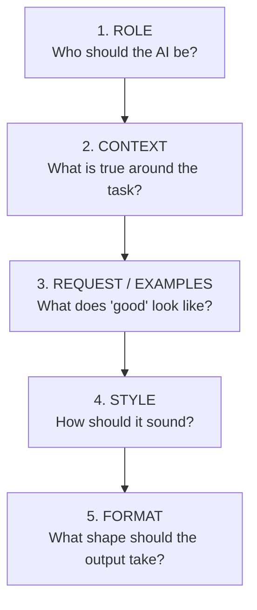
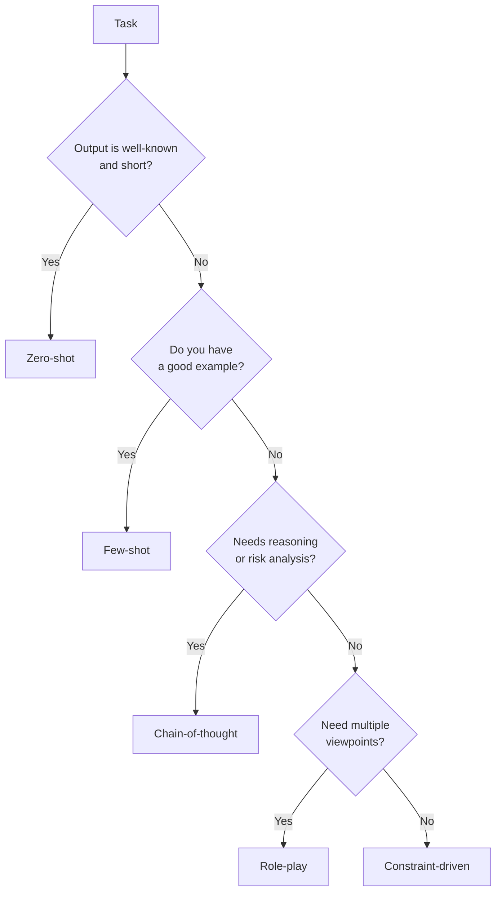
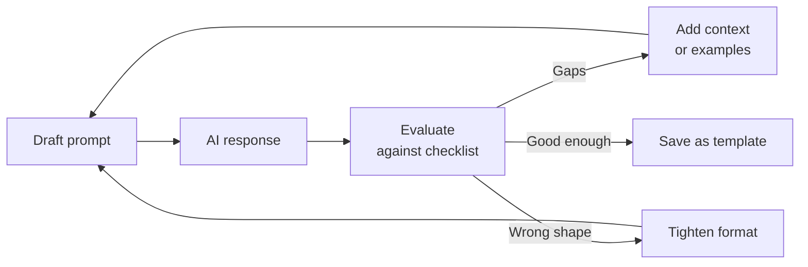
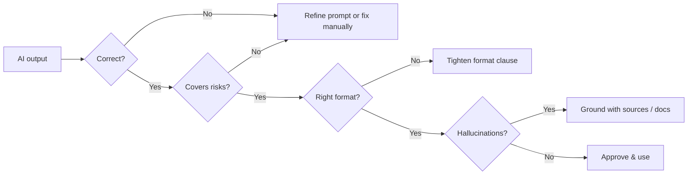

# 🧠 AI Prompts for QA — A Complete Guide

> *"A great test starts with a great question. A great AI answer starts with a great prompt."*

This guide teaches QA engineers how to **design, refine, and evaluate prompts** for AI assistants across the full testing lifecycle — not just test case generation. It covers the **Prompt Pyramid**, the **scenarios where AI helps QA most**, **prompt patterns** (zero-shot, few-shot, chain-of-thought, role-play), **iteration workflows**, **anti-patterns**, **privacy/security guardrails**, and **ready-to-copy templates**.

---

## 📚 Table of Contents

1. [🎯 Why Prompt Engineering Matters for QA](#-why-prompt-engineering-matters-for-qa)
2. [🏛️ The Prompt Pyramid](#-the-prompt-pyramid)
3. [🧰 QA Scenarios Where AI Helps](#-qa-scenarios-where-ai-helps)
4. [🧩 Core Prompt Patterns](#-core-prompt-patterns)
5. [🔁 The Iteration Loop](#-the-iteration-loop)
6. [📐 Ready-to-Copy Templates](#-ready-to-copy-templates)
7. [🧪 Worked Example — From Vague to Excellent](#-worked-example--from-vague-to-excellent)
8. [✅ Evaluating AI Output](#-evaluating-ai-output)
9. [🛡️ Privacy, Security & Compliance](#-privacy-security--compliance)
10. [⚠️ Common Anti-Patterns](#-common-anti-patterns)
11. [📋 Prompt Quality Checklist](#-prompt-quality-checklist)
12. [✅ Best Practices](#-best-practices)
13. [📚 References](#-references)

---

## 🎯 Why Prompt Engineering Matters for QA

AI assistants are now part of the QA toolbox — they draft test cases, suggest edge cases, scaffold automation, summarize bug reports, and even review pull requests. The **quality of the output is bounded by the quality of the prompt**.

A disciplined prompting practice gives QA teams:

- 🚀 **Speed** — drafts in seconds instead of hours.
- 🎯 **Coverage** — AI surfaces edge cases humans miss (and vice versa).
- 🔁 **Consistency** — same prompt template produces comparable artifacts.
- 🧭 **Onboarding leverage** — junior QAs reach senior-level drafts faster.
- 📊 **Traceability** — well-structured prompts map cleanly to requirements.
- 🛡️ **Risk reduction** — explicit context prevents hallucinated assumptions.

> ⚠️ **AI augments — it does not replace.** A QA engineer must always **verify, contextualize, and approve** every AI-generated artifact.

---

## 🏛️ The Prompt Pyramid

The **Prompt Pyramid** is a five-layer structure that makes any QA prompt predictable and reviewable.

<br>

<br>



| Layer              | Question it answers              | Why it matters                                                                 |
| ------------------ | -------------------------------- | ------------------------------------------------------------------------------ |
| **1. Role**        | *Who* should the AI be?          | Seniority, domain, and perspective steer vocabulary and depth.                 |
| **2. Context**     | *What* is true around the task?  | Constraints, environment, audience, and the *why* prevent generic answers.     |
| **3. Request / Examples** | *What* does good look like? | A concrete pattern beats any adjective — one good example > a paragraph of rules. |
| **4. Style**       | *How* should it sound?           | Tone, formality, language, emoji policy.                                       |
| **5. Format**      | *What shape* should it take?     | Markdown, table, JSON, max length, required fields — your acceptance criteria. |

### Minimal Pyramid Skeleton

```text
Role:    You are a [seniority] [discipline] working in [domain].
Context: I need help with [task] for [feature/system]. Constraints: [list].
Request: Produce [artifact] following [pattern/example].
Style:   Use [tone], [language], [reading level].
Format:  Output as [structure], max [length], include fields [list].
```

---

## 🧰 QA Scenarios Where AI Helps

AI is useful well beyond test-case writing. Each row below maps to a template later in this guide.

| QA Activity                       | What AI Can Draft                                                   |
| --------------------------------- | ------------------------------------------------------------------- |
| **Test case design**              | Positive, negative, boundary, and edge-case scenarios.              |
| **Test data generation**          | Realistic, diverse, locale-aware fixtures and CSV/JSON datasets.    |
| **Exploratory test charters**     | Mission, areas, risks, and time-boxed heuristics.                   |
| **Bug reports**                   | Clear title, steps, expected vs actual, severity rationale.         |
| **Test plan outlines**            | Scope, risks, entry/exit criteria, resourcing skeleton.             |
| **Automation scaffolding**        | Page Object skeletons, fixtures, helper utilities.                  |
| **Code review for tests**         | Readability, brittleness, missing assertions, anti-patterns.        |
| **Requirements analysis**         | Ambiguities, missing acceptance criteria, testability concerns.     |
| **RCA / 5 Whys**                  | Branching cause hypotheses for a given failure description.         |
| **Release notes & QA summaries**  | Stakeholder-friendly recap of what shipped and what was tested.     |

📖 See also: [aiTestingAssistant.md](aiTestingAssistant.md) · [xRayTestCase.md](xRayTestCase.md) · [bugLifeCycle.md](bugLifeCycle.md) · [testPlan.md](testPlan.md)

---

## 🧩 Core Prompt Patterns

Different tasks call for different prompt shapes. Master these five.

### 1. Zero-Shot
Ask directly with no examples. Best for simple, well-known tasks.
> *"List five negative test cases for a credit-card form."*

### 2. Few-Shot
Provide 1–3 examples of the desired output, then ask for more.
> *"Here is one bug report in our format: [example]. Write the same format for this defect: [description]."*

### 3. Chain-of-Thought (CoT)
Ask the model to reason step-by-step before answering. Great for risk analysis and edge-case discovery.
> *"Think step by step about what could fail in this checkout flow, then list the test cases."*

### 4. Role-Play / Multi-Perspective
Have the AI adopt several personas to widen coverage.
> *"As a security tester, then as a performance tester, then as an accessibility tester, list three risks each for this API."*

### 5. Constraint-Driven
Force the answer into a strict shape (length, fields, schema). Best for automation pipelines.
> *"Return ONLY valid JSON matching this schema: {…}. No prose."*

### Choosing a Pattern



---

## 🔁 The Iteration Loop

A first prompt is a **draft**, not a deliverable. Treat prompting like test design — iterate.



### Refinement Levers (in order to try)

1. **Add missing context** — environment, audience, constraints.
2. **Add a positive example** — show the exact shape you want.
3. **Add a negative example** — *"do not do X"*.
4. **Tighten the format** — explicit fields, max length, schema.
5. **Decompose** — split into smaller prompts chained together.
6. **Change the pattern** — switch zero-shot → few-shot, or add CoT.

---

## 📐 Ready-to-Copy Templates

### Template A — Test Case (Academy TestRail-style)

```text
Role:    You are a Senior QA Engineer in the [domain] industry.
Context: I am testing [feature] on [environment]. Acceptance criteria: [paste].
Request: Generate test cases using:
         - Title
         - Precondition
         - Up to 5 numbered Steps
         - Up to 5 Expected Results (one per step)
         Cover: happy path, negative, boundary, and one accessibility case.
Style:   Formal, concise, professional. Light emoji on section headers only.
Format:  Markdown table per test case. No prose outside the table.
```

### Template B — Bug Report

```text
Role:    You are a QA engineer writing a defect report for engineering triage.
Context: Product: [name]. Build: [version]. Environment: [OS/browser/device].
         Observed behavior: [what happened]. Expected behavior: [what should happen].
         Logs/console output: [paste sanitized].
Request: Produce a bug report with:
         - Title (symptom-based, not cause)
         - Severity + Priority with one-line rationale
         - Numbered repro steps
         - Expected vs Actual
         - Evidence checklist (screenshot, video, HAR, trace)
         - Suggested area owner
Style:   Neutral, factual, no blame.
Format:  Markdown. Title as H2. One short paragraph per section.
```

### Template C — Exploratory Test Charter

```text
Role:    You are an exploratory testing coach.
Context: Feature under test: [name]. Recent changes: [PRs/tickets].
         Known risks: [list]. Time-box: [e.g., 60 min].
Request: Produce a session charter:
         - Mission (one sentence)
         - Areas to cover
         - Heuristics to apply (e.g., SFDIPOT, CRUSSPIC STMPL)
         - Data variations to try
         - Stop criteria
Style:   Action-oriented, second person ("you will…").
Format:  Markdown with H3 sections.
```

### Template D — Test Data Generation

```text
Role:    You are a test data engineer.
Context: I need [N] records for [entity] with the following schema: [paste].
         Locales: [list]. Distribution: [e.g., 70% valid, 20% edge, 10% invalid].
         Constraints: no real PII, deterministic seed = [seed].
Request: Generate the dataset including at least these edge cases: [list].
Style:   Machine-readable.
Format:  Return ONLY a valid [JSON / CSV] payload — no commentary, no code fences.
```

### Template E — Automation Scaffolding (Playwright)

```text
Role:    You are a Playwright automation engineer.
Context: Repo uses TypeScript, Page Object Model in `pages/`, fixtures in `fixtures/`.
         Selectors prefer getByRole / getByLabel / getByTestId.
         Tests are tagged with @smoke, @regression.
Request: Generate:
         - A Page Object for [page] with the methods I list: [list]
         - A spec file `tests/[name].spec.ts` covering [scenarios]
         - Reuse the existing `authedUser` fixture for login
Style:   Idiomatic Playwright, no waitForTimeout, web-first assertions only.
Format:  Two code blocks: one for the POM, one for the spec. No explanation.
```

### Template F — Requirements / AC Review

```text
Role:    You are a senior QA reviewing a user story for testability.
Context: [paste user story and acceptance criteria]
Request: Identify:
         - Ambiguities (quote the phrase + why)
         - Missing acceptance criteria
         - Non-functional gaps (perf, a11y, security, i18n)
         - Suggested clarifying questions for the PO
Style:   Constructive, specific, blameless.
Format:  Markdown table with columns: Concern | Quote | Why it matters | Suggestion.
```

📖 See also: [aiTestingAssistant.md](aiTestingAssistant.md) · [xRayTestCase.md](xRayTestCase.md)

---

## 🧪 Worked Example — From Vague to Excellent

### ❌ Vague Prompt
> *"Write test cases for login."*

**Result:** Generic, browser-agnostic, no edge cases, wrong format.

### ⚠️ Better Prompt
> *"Write 5 test cases for the login page of a web app, including invalid credentials."*

**Result:** Closer, but no context, no format contract, no edge focus.

### ✅ Excellent Prompt (full Prompt Pyramid)

```text
Role:    You are a Senior QA Engineer in the iGaming industry.
Context: I am testing the login page of "MyCasino" web app on Chrome (latest)
         and Safari on iOS 17. The auth API enforces a 5-attempt lockout per IP
         in 15 minutes. Users can sign in with email + password or with a magic link.
         GDPR applies; we must not log passwords.
Request: Produce 8 test cases covering:
         - 2 happy-path (email/password, magic link)
         - 3 negative (wrong password, locked account, expired magic link)
         - 2 boundary (5th-attempt lockout trigger, exactly-at-15-min reset)
         - 1 accessibility (full keyboard navigation, screen reader labels)
         Use the format: Title | Precondition | Steps (≤5) | Expected (≤5) | Tags.
Style:   Formal, no fluff. Emojis only on the Title column.
Format:  Single Markdown table. No prose before or after the table.
```

**Result:** Coverage-driven, environment-specific, compliance-aware, ready to paste into Jira/Xray.

---

## ✅ Evaluating AI Output

Never ship AI output unreviewed. Run every artifact through this rubric.

| Dimension          | Question to ask                                                                  |
| ------------------ | -------------------------------------------------------------------------------- |
| **Correctness**    | Does it reflect the actual requirements and system behavior?                     |
| **Coverage**       | Does it cover happy, negative, boundary, and at least one non-functional angle?  |
| **Specificity**    | Are steps deterministic and reproducible? Any vague verbs ("verify it works")?   |
| **Traceability**   | Does each case link to a requirement, story, or risk?                            |
| **Format fidelity**| Does it match the agreed template (fields, length, schema)?                      |
| **Hallucinations** | Any invented endpoints, status codes, selectors, or features?                    |
| **Bias / Safety**  | Any inappropriate assumptions about users, regions, accessibility?               |
| **Tone**           | Neutral, professional, blameless?                                                |

### Quick Acceptance Heuristic



---

## 🛡️ Privacy, Security & Compliance

QA work touches real systems, real users, and real secrets. Prompts can leak data **outside your perimeter** if you are not careful.

### Never Paste Into a Prompt

- 🔐 Production credentials, API keys, JWT tokens, OAuth secrets.
- 👤 Real user PII (names, emails, phone numbers, addresses, government IDs).
- 💳 Cardholder data, banking details, health records (PCI / HIPAA / GDPR scope).
- 🏢 Confidential source code unless your AI tool is approved for it.
- 📜 Unpublished legal, financial, or M&A material.
- 🧪 Real test data that mirrors production identifiers.

### Safe Substitutes

| Instead of…                    | Use…                                          |
| ------------------------------ | --------------------------------------------- |
| Real email `john@acme.com`     | `user1@example.com`                           |
| Real card `4111 1111 1111 1111`| Stripe test card placeholder `<TEST_CARD>`    |
| Production URL                 | `https://staging.example.com`                 |
| Real stack trace with paths    | Sanitized snippet, paths replaced with `<...>`|
| Real JWT                       | `<TOKEN>`                                     |

### Tool-Level Guardrails

- ✅ Prefer **enterprise / workspace-scoped** AI tools that exclude your data from training.
- ✅ Review your organization's **AI usage policy** before using a new tool.
- ✅ When unsure, **mask first, prompt second**.

📖 See also: [bugLifeCycle.md](bugLifeCycle.md) · [traceability.md](traceability.md)

---

## ⚠️ Common Anti-Patterns

| Anti-pattern                                              | Better approach                                                  |
| --------------------------------------------------------- | ---------------------------------------------------------------- |
| "Write tests for my app."                                 | Provide feature, environment, AC, and format.                    |
| Asking for 50 test cases in one go.                       | Ask for 10, review, then iterate per area.                       |
| Accepting the first answer.                               | Always run the evaluation rubric.                                |
| No format contract → unparseable output.                  | Specify fields, length, and schema explicitly.                   |
| Pasting raw production logs / PII.                        | Sanitize first; use placeholders.                                |
| Treating AI as the source of truth for system behavior.   | AI drafts; the **spec**, **code**, and **tester** verify.        |
| Reusing one mega-prompt for every task.                   | Maintain a small library of focused templates.                   |
| No role + no context → generic textbook answer.           | Always set Role and Context, even briefly.                       |
| Letting AI invent selectors or API endpoints.             | Ground prompts in real DOM / OpenAPI snippets you provide.       |

---

## 📋 Prompt Quality Checklist

Run this checklist on every non-trivial prompt **before** you press enter.

- [ ] **Role** is set with seniority and domain.
- [ ] **Context** lists environment, constraints, audience, and the *why*.
- [ ] **Request** specifies the exact artifact and coverage expectations.
- [ ] At least one **example** or explicit pattern is provided.
- [ ] **Style** clause covers tone, language, and emoji policy.
- [ ] **Format** clause specifies structure, fields, and max length.
- [ ] **No secrets, PII, or unsafe data** are pasted.
- [ ] Output **acceptance criteria** are explicit ("must contain", "must not contain").
- [ ] You know how you will **evaluate** the response.
- [ ] You have a **plan to iterate** if the first answer falls short.

---

## ✅ Best Practices

- 🏛️ **Use the Pyramid every time** — Role → Context → Request → Style → Format.
- 🎯 **Be specific** — vague prompts produce vague tests.
- 🪜 **Show, don't just tell** — one good example beats a paragraph of rules.
- 🧠 **Ask for reasoning** when discovering risks ("think step by step").
- 🧪 **Decompose** — chain small prompts instead of one giant one.
- 🔁 **Iterate** — first answers are drafts.
- 📏 **Constrain the format** — your reviewer (and your pipeline) will thank you.
- 🛡️ **Sanitize before sending** — never paste secrets or real PII.
- 🧾 **Save winning prompts as templates** — reuse beats reinvention.
- 🤝 **Pair AI with judgment** — every AI artifact gets a human reviewer.
- 📚 **Ground in real docs** — paste the OpenAPI, the AC, the DOM — don't let the AI guess.
- 🏷️ **Tag and trace** — link AI-generated artifacts to the requirement and the prompt used.

---

## 📚 References

- Academy TestRail — [academy.testrail.com](https://academy.testrail.com/)
- OpenAI — [Prompt engineering guide](https://platform.openai.com/docs/guides/prompt-engineering)
- Anthropic — [Prompt engineering overview](https://docs.anthropic.com/claude/docs/prompt-engineering)
- Google — [Introduction to prompt design](https://ai.google.dev/docs/prompt_best_practices)
- ISTQB® — [AI Testing syllabus](https://www.istqb.org/certifications/certified-tester-ai-testing-ct-ai)
- Related docs: [aiTestingAssistant.md](aiTestingAssistant.md) · [xRayTestCase.md](xRayTestCase.md) · [bugLifeCycle.md](bugLifeCycle.md) · [testPlan.md](testPlan.md) · [traceability.md](traceability.md)
