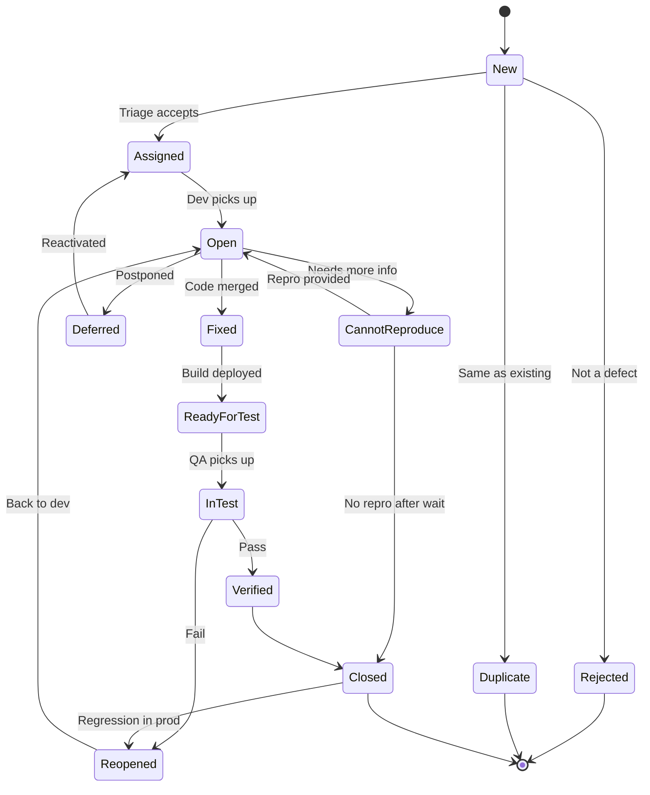
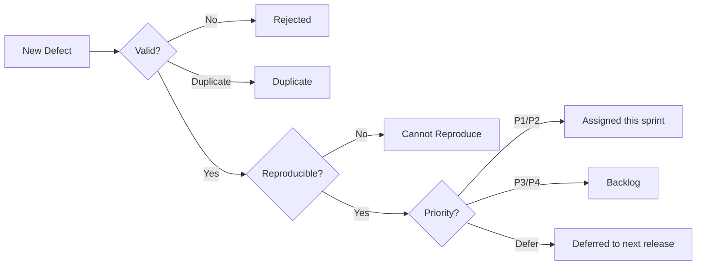
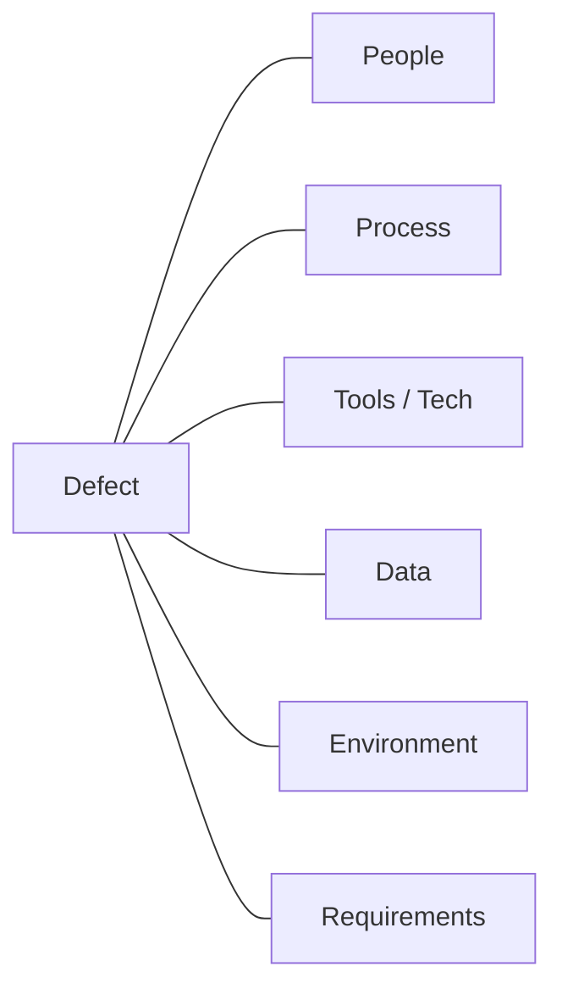
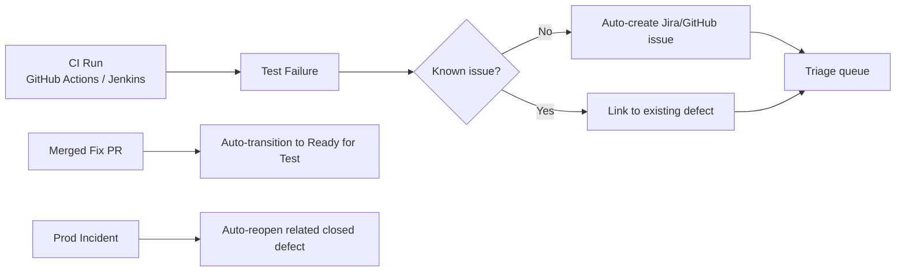

# 🐞 Bug / Defect Life Cycle — A Complete Guide

> *"A bug well tracked is a bug already half fixed."*

This guide covers the **defect life cycle from end to end**: ISTQB terminology, every state and transition, workflow mappings for **Jira, Xray, Azure DevOps, Bugzilla, GitHub Issues**, triage practices, severity vs priority, **root-cause analysis (RCA)**, **metrics & KPIs**, and **automation/integration** with CI pipelines.

---

## 📚 Table of Contents

1. [ISTQB Terminology You Must Know](#-istqb-terminology-you-must-know)
2. [Why a Defect Life Cycle Matters](#-why-a-defect-life-cycle-matters)
3. [🔄 Standard Life Cycle States](#-standard-life-cycle-states)
4. [🗺️ State Diagram](#-state-diagram)
5. [🚦 Transitions & Decision Points](#-transitions--decision-points)
6. [⚖️ Severity vs Priority](#-severity-vs-priority)
7. [🧭 Triage Process](#-triage-process)
8. [🛠️ Workflow Mapping by Tool](#-workflow-mapping-by-tool)
9. [🔍 Root Cause Analysis (RCA)](#-root-cause-analysis-rca)
10. [🤖 Automation & CI Integration](#-automation--ci-integration)
11. [📐 Useful Defect Metrics & KPIs](#-useful-defect-metrics--kpis)
12. [✅ Best Practices](#-best-practices)
13. [📚 References](#-references)

---

## 📖 ISTQB Terminology You Must Know

Aligning on vocabulary keeps the workflow unambiguous across QA, Dev, and Product.

| Term             | ISTQB Definition (paraphrased)                                                                                |
| ---------------- | -------------------------------------------------------------------------------------------------------------- |
| **Error**        | A human action that produces an incorrect result (e.g., a developer's mistake).                                |
| **Defect / Bug** | A flaw in a component or system that can cause it to fail to perform its required function.                    |
| **Failure**      | An event where a component or system does not perform a required function within specified limits.             |
| **Incident**     | Any event occurring during testing that requires investigation.                                                |
| **Anomaly**      | Any condition that deviates from expectations.                                                                 |
| **Severity**     | The degree of impact of a defect on the system or stakeholders (**technical** dimension).                      |
| **Priority**     | The level of business importance assigned to fixing the defect (**business** dimension).                       |
| **Root Cause**   | The earliest cause such that, if removed, the defect would not have occurred.                                  |
| **Defect Report**| A document reporting on any flaw in a component or system that can cause it to fail to perform its function.   |
| **Defect Triage**| A process to prioritize defects based on severity, priority, risk, and effort.                                 |
| **Confirmation Testing** | Re-execution of a test that previously failed, to verify a defect has been fixed.                      |
| **Regression Testing**   | Testing of a previously tested component after modification, to confirm no new defects were introduced.|

> 💡 **Error → Defect → Failure**: a human *error* introduces a *defect* in the artifact; when executed, the defect causes a *failure*.

---

## 🎯 Why a Defect Life Cycle Matters

A defined life cycle gives the team a **shared contract** for how bugs flow from discovery to closure. It delivers:

- 🔄 **Predictable handoffs** between QA, Dev, and Product.
- 📊 **Reliable metrics** (DDP, DRE, MTTR) because every defect passes through the same states.
- 🧭 **Faster triage** — everyone knows what each state means.
- 🔗 **Traceability** — defect ↔ requirement ↔ test case ↔ build.
- 🛡️ **Audit & compliance** — required by ISO 9001, IEEE 1044, regulated industries.

---

## 🔄 Standard Life Cycle States

| State          | Owner          | Description                                                                                       |
| -------------- | -------------- | ------------------------------------------------------------------------------------------------- |
| **New**        | Reporter (QA)  | Defect just logged. Awaits initial review.                                                        |
| **Assigned**   | Triage / Lead  | Reviewed, accepted, and assigned to a developer.                                                  |
| **Open / In Progress** | Developer | Developer is actively investigating and coding the fix.                                       |
| **Fixed**      | Developer      | Code change merged; awaits QA validation.                                                         |
| **Ready for Test** | QA         | Build with the fix is deployed to a test environment.                                             |
| **Retest / In Test** | QA       | QA executes confirmation + regression tests.                                                      |
| **Verified**   | QA             | Fix confirmed; no regressions found.                                                              |
| **Closed**     | QA / Lead      | Final state. Defect fully resolved and documented.                                                |
| **Reopened**   | QA             | Fix did not resolve the issue, or the defect reappeared.                                          |
| **Rejected**   | Triage / Dev   | Not a defect (works as designed, user error, out of scope).                                       |
| **Duplicate**  | Triage         | Same defect already exists; linked to the original.                                               |
| **Deferred**   | Product / PM   | Valid defect, postponed to a later release.                                                       |
| **Cannot Reproduce** | Developer | Steps don't reliably reproduce the failure; needs more info.                                     |

> 📝 Different tools use slightly different names (e.g., Jira uses **To Do / In Progress / In Review / Done**), but the **semantics** are the same.

---

## 🗺️ State Diagram



---

## 🚦 Transitions & Decision Points

| From → To                | Trigger                                       | Who decides     | Required artifact                          |
| ------------------------ | --------------------------------------------- | --------------- | ------------------------------------------ |
| New → Assigned           | Triage approves                               | QA Lead / PO    | Severity, priority, assignee set           |
| New → Rejected           | Not reproducible / WAD / out of scope         | Triage          | Justification comment                      |
| New → Duplicate          | Existing defect found                         | Triage          | Link to original                           |
| Open → Fixed             | PR merged                                     | Developer       | Commit / PR link, build number             |
| Fixed → Ready for Test   | Build deployed to test env                    | CI / Release    | Build version, environment                 |
| In Test → Verified       | Confirmation + regression pass                | QA              | Test execution evidence                    |
| In Test → Reopened       | Defect still present or new issue introduced  | QA              | New repro steps, attachments               |
| Open → Deferred          | Risk/effort > value for this release          | Product / PM    | Target release, justification              |
| Closed → Reopened        | Found again in production                     | QA / Support    | Production evidence, incident ID           |

---

## ⚖️ Severity vs Priority

These are **independent** dimensions. A defect can be high-severity but low-priority (rare data corruption in a deprecated feature) or low-severity but high-priority (typo in CEO's name on landing page).

| Severity ↓ / Priority → | **P1 (Now)**          | **P2 (Next sprint)**     | **P3 / P4 (Backlog)**     |
| ----------------------- | --------------------- | ------------------------ | ------------------------- |
| **Critical**            | Production outage      | Rare combination          | Almost never              |
| **High**                | Major feature broken   | Important workaround      | Edge case                 |
| **Medium**              | Annoying but workable  | Common                    | Cosmetic with frequency   |
| **Low**                 | Rare                   | Sometimes                 | Typo, minor UI            |

### Severity Definitions

| Severity     | Meaning                                                                                  |
| ------------ | ---------------------------------------------------------------------------------------- |
| **Critical** | System unusable, data loss/corruption, security breach, no workaround.                   |
| **High**     | Major feature broken; workaround exists but is costly or non-obvious.                    |
| **Medium**   | Minor feature broken or major feature partially impaired; reasonable workaround exists.  |
| **Low**      | Cosmetic, typo, minor UX nit; does not affect functionality.                             |

📖 See also: [prioritization.md](prioritization.md)

---

## 🧭 Triage Process

Triage is a **recurring meeting** (often daily during stabilization, weekly during normal sprints) where new and aging defects are reviewed.

### Participants

- QA Lead (facilitator)
- Tech Lead / Engineering Manager
- Product Owner
- (Optional) Support, Security, SRE

### Triage Checklist

- [ ] Is it a real defect? (else → Rejected / Duplicate)
- [ ] Is severity correctly set? (technical impact)
- [ ] Is priority correctly set? (business impact)
- [ ] Are reproduction steps clear and deterministic?
- [ ] Are logs, screenshots, environment, build version attached?
- [ ] Is it linked to a requirement, user story, and test case?
- [ ] Should it block the current release? (Go/No-Go input)
- [ ] Assigned to the right team / developer?



---

## 🛠️ Workflow Mapping by Tool

Most tools implement the same life cycle with different state names.

| Standard State        | **Jira (default)**   | **Xray (in Jira)**    | **Azure DevOps**       | **Bugzilla**         | **GitHub Issues**      |
| --------------------- | -------------------- | --------------------- | ---------------------- | -------------------- | ---------------------- |
| New                   | To Do                | Open / To Do          | New                    | UNCONFIRMED / NEW    | `open` + `bug` label   |
| Assigned              | To Do (assignee set) | To Do (assignee set)  | Active                 | ASSIGNED             | `triaged` label        |
| Open / In Progress    | In Progress          | In Progress           | Active / Committed     | IN_PROGRESS          | `in-progress` label    |
| Fixed                 | In Review / Done     | In Review             | Resolved               | RESOLVED FIXED       | PR linked, `fixed`     |
| Ready for Test        | Ready for QA         | Ready for Test        | Resolved               | RESOLVED             | `needs-qa` label       |
| In Test / Retest      | In QA / Testing      | Executing             | Resolved (QA)          | VERIFIED in progress | `qa-in-progress`       |
| Verified              | Done                 | Pass                  | Closed (Verified)      | VERIFIED             | `verified` label       |
| Closed                | Done                 | Closed                | Closed                 | CLOSED               | `closed`               |
| Reopened              | Reopened             | Reopened              | Active                 | REOPENED             | reopened issue         |
| Rejected              | Won't Do             | Won't Do              | Closed (Not a Bug)     | RESOLVED INVALID     | `wontfix` / `invalid`  |
| Duplicate             | Duplicate            | Duplicate             | Closed (Duplicate)     | RESOLVED DUPLICATE   | `duplicate`            |
| Deferred              | Backlog              | Deferred              | Removed / Backlog      | RESOLVED LATER       | milestone moved        |

> 💡 In **Jira**, customize the workflow scheme so transitions match the diagram above. Use **screens** to enforce required fields (e.g., root cause on close).

📖 See also: [qaTestingReport.md](qaTestingReport.md) · [xRayTestCase.md](xRayTestCase.md)

---

## 🔍 Root Cause Analysis (RCA)

When a defect is closed (especially **Critical / High**), record the **root cause** to enable trend analysis.

### Common Root-Cause Categories

| Category         | Example                                                            |
| ---------------- | ------------------------------------------------------------------ |
| **Code**         | Logic error, null reference, off-by-one, race condition.            |
| **Requirement**  | Ambiguous, missing, or contradictory specification.                 |
| **Design**       | Architectural flaw, wrong API contract, poor error handling design. |
| **Configuration**| Wrong env var, feature flag, infra setting.                         |
| **Data**         | Bad test data, migration issue, missing seed.                       |
| **Environment**  | Network, browser-specific, OS-specific, third-party outage.         |
| **Process**      | Missed code review, skipped regression, no CI gate.                 |
| **Documentation**| Outdated docs led to incorrect implementation.                      |

### 5 Whys — Quick Example

> **Defect:** Checkout fails for users in Brazil.
> 1. **Why?** The API returns 500.
> 2. **Why?** The currency formatter throws on `BRL`.
> 3. **Why?** The locale list was hard-coded with only `USD` and `EUR`.
> 4. **Why?** No spec listed the supported currencies.
> 5. **Why?** Requirement was written before the LATAM rollout decision.
>
> **Root Cause:** Requirement gap. **Action:** Add a currency-matrix acceptance criterion to the *Definition of Ready*.

### Fishbone (Ishikawa) Categories



---

## 🤖 Automation & CI Integration

Modern teams **auto-create, auto-link, and auto-close** defects from the pipeline.



### Examples

**Auto-create a Jira defect from a failing test (GitHub Actions):**

```yaml
- name: Create Jira bug on failure
  if: failure()
  uses: atlassian/gajira-create@v3
  with:
    project: WEB
    issuetype: Bug
    summary: "[CI] ${{ github.workflow }} failed on ${{ github.ref_name }}"
    description: |
      Run: ${{ github.server_url }}/${{ github.repository }}/actions/runs/${{ github.run_id }}
      Commit: ${{ github.sha }}
  env:
    JIRA_BASE_URL: ${{ secrets.JIRA_BASE_URL }}
    JIRA_USER_EMAIL: ${{ secrets.JIRA_USER_EMAIL }}
    JIRA_API_TOKEN: ${{ secrets.JIRA_API_TOKEN }}
```

**Auto-transition on PR merge (Jira Smart Commits):**

```bash
git commit -m "WEB-1284 #close Fix optional phone validation on signup"
```

**Close a GitHub issue from a PR:**

```text
Fixes #482
```

📖 See also: [pwRepoIntegration.md](pwRepoIntegration.md) · [qaTestingReport.md](qaTestingReport.md)

---

## 📐 Useful Defect Metrics & KPIs

| Metric                                | Formula / Definition                                                |
| ------------------------------------- | ------------------------------------------------------------------- |
| **Defect Density**                    | Defects / KLOC (or per module / per story point).                    |
| **Defect Detection Percentage (DDP)** | Defects found in testing / (testing + production) × 100.             |
| **Defect Removal Efficiency (DRE)**   | Pre-release defects / total defects × 100.                           |
| **Defect Leakage**                    | Defects found in later phase / total defects × 100.                  |
| **Defect Age**                        | Time from `New` to `Closed`.                                         |
| **Mean Time to Detect (MTTD)**        | Avg. time from defect introduction to discovery.                     |
| **Mean Time to Resolve (MTTR)**       | Avg. time from `New` to `Verified`.                                  |
| **Reopen Rate**                       | Reopened defects / total defects × 100.                              |
| **Rejection Rate**                    | Rejected defects / reported defects × 100 (high = noisy reporting).  |
| **Escaped Defects**                   | Defects found in production after release.                           |
| **Severity Index**                    | Weighted sum: Σ(severity weight × count).                            |

### Snapshot Example

| Metric                  | Target  | Sprint 24 | Status |
| ----------------------- | ------- | --------- | ------ |
| DDP                     | ≥ 95%   | 96.8%     | 🟢     |
| Reopen rate             | < 5%    | 3.1%      | 🟢     |
| MTTR (P1/P2)            | < 48h   | 36h       | 🟢     |
| Critical escaped        | 0       | 0         | 🟢     |
| Rejection rate          | < 10%   | 14%       | 🟡     |

---

## ✅ Best Practices

- 📌 **One defect, one report** — don't bundle unrelated issues.
- 🎯 **Write the title as a symptom**, not a guess at the cause (`[Signup] Submit fails when phone is empty`).
- 🔁 **Deterministic repro steps** — numbered, environment specified, data noted.
- 📷 **Attach evidence** — screenshots, videos, HARs, logs, traces, console output.
- ⚖️ **Distinguish severity from priority** — they are independent dimensions.
- 🧭 **Triage early, triage often** — stale `New` defects rot.
- 🚫 **Never close without retest** — `Fixed` ≠ `Verified`.
- 🔍 **Record root cause on close** — feeds RCA and prevention.
- 🔗 **Link traceability** — defect ↔ requirement ↔ test case ↔ build/PR.
- 🧪 **Add a regression test** for every confirmed defect.
- 📊 **Track reopen and rejection rates** — they reveal process gaps.
- 🗣️ **Communicate respectfully** — report the bug, not the person.
- 🤖 **Automate the boring parts** — auto-create, auto-link, auto-transition.

---

## 📚 References

- ISTQB® **Foundation Level Syllabus** — Defect management, incident reporting
- ISTQB® **Glossary** — [glossary.istqb.org](https://glossary.istqb.org/)
- IEEE **1044-2009** — Standard Classification for Software Anomalies
- Atlassian — [Jira workflow best practices](https://www.atlassian.com/software/jira/guides/workflows/overview)
- Xray Docs — [docs.getxray.app](https://docs.getxray.app/)
- Related docs: [qaTestingReport.md](qaTestingReport.md) · [prioritization.md](prioritization.md) · [xRayTestCase.md](xRayTestCase.md) · [traceability.md](traceability.md)
