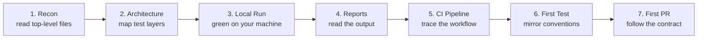
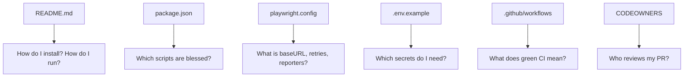
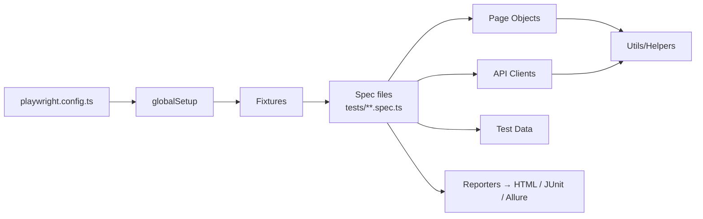
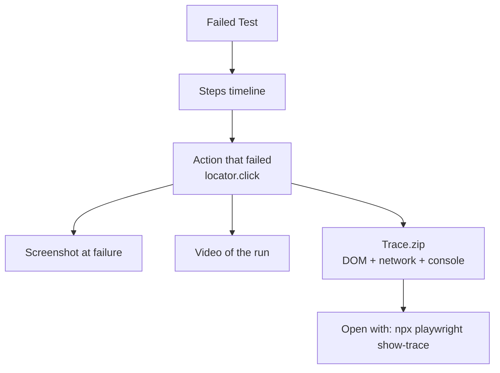
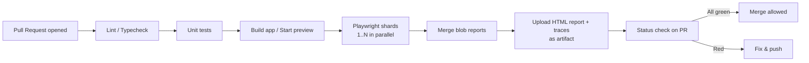
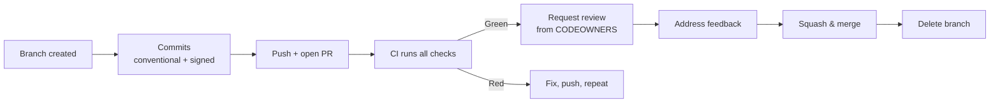

# 🧭 Onboarding to a New Playwright Test Repository — A QA Engineer's Guide

> *"You don't truly know a codebase until you can run its tests, read its reports, and ship a green PR."*

This guide is a **step-by-step playbook** for a QA engineer joining a new repository that uses **Playwright** as the test framework. It tells you **which files to open first and why**, how to **map the test architecture**, how to **understand the CI pipeline and reports**, how to **run tests locally**, and how to **open your first Pull Request** with confidence.

---

## 📚 Table of Contents

1. [🎯 Why a Structured Onboarding Matters](#-why-a-structured-onboarding-matters)
2. [🗺️ The 7-Phase Onboarding Roadmap](#-the-7-phase-onboarding-roadmap)
3. [📂 Phase 1 — Repository Reconnaissance](#-phase-1--repository-reconnaissance)
4. [🏗️ Phase 2 — Understand the Test Architecture](#-phase-2--understand-the-test-architecture)
5. [▶️ Phase 3 — Run the Tests Locally](#-phase-3--run-the-tests-locally)
6. [📊 Phase 4 — Read and Interpret the Test Report](#-phase-4--read-and-interpret-the-test-report)
7. [🤖 Phase 5 — Map the CI Pipeline](#-phase-5--map-the-ci-pipeline)
8. [✍️ Phase 6 — Write Your First Test (the right way)](#-phase-6--write-your-first-test-the-right-way)
9. [🔀 Phase 7 — Open Your First Pull Request](#-phase-7--open-your-first-pull-request)
10. [🧪 Onboarding Checklist](#-onboarding-checklist)
11. [⚠️ Common Onboarding Pitfalls](#-common-onboarding-pitfalls)
12. [✅ Best Practices](#-best-practices)
13. [📚 References](#-references)

---

## 🎯 Why a Structured Onboarding Matters

Jumping into an unfamiliar test repository without a plan leads to flaky PRs, duplicated helpers, broken CI runs, and misread reports. A structured onboarding gives you:

- 🧭 **A mental map** of where things live and why.
- 🛡️ **Safe first contributions** — you change what you understand.
- 🔄 **Predictable local runs** that match what CI does.
- 📊 **Confidence reading reports** — you know flaky from real failure.
- 🤝 **Faster trust** from devs and other QAs reviewing your PRs.

---

## 🗺️ The 7-Phase Onboarding Roadmap



> 💡 Do **not** skip phases. Each one builds the context required for the next.

---

## 📂 Phase 1 — Repository Reconnaissance

Before opening any test file, **read the repo from the outside in**. These files reveal intent, conventions, and contracts.

### Files to Open First (in order)

| # | File                              | Why it matters                                                                                       |
| - | --------------------------------- | ---------------------------------------------------------------------------------------------------- |
| 1 | `README.md`                       | Project purpose, scripts, prerequisites, quick-start commands.                                       |
| 2 | `CONTRIBUTING.md`                 | Branching model, commit style, PR template, review rules.                                            |
| 3 | `CODEOWNERS`                      | Who must review changes in which folders.                                                            |
| 4 | `package.json`                    | Scripts (`test`, `test:e2e`, `lint`), Playwright version, dependencies.                              |
| 5 | `playwright.config.ts` / `.js`    | Projects, browsers, baseURL, reporters, retries, timeouts, parallelism, global setup.                |
| 6 | `tsconfig.json` / `.eslintrc`     | TypeScript paths, lint rules — clues to import aliases (`@pages/...`).                               |
| 7 | `.env.example` / `.env.*`         | Required environment variables (URLs, credentials, feature flags).                                   |
| 8 | `.github/workflows/*.yml`         | CI jobs: when tests run, on which browsers, with which artifacts.                                    |
| 9 | `.github/pull_request_template.md`| What every PR must include (description, checklist, evidence).                                       |
|10 | `docs/` or `tests/README.md`      | Test strategy, page object guidelines, fixture rules.                                                |

### What to Extract From Each File



📖 See also: [pwRepoIntegration.md](pwRepoIntegration.md)

---

## 🏗️ Phase 2 — Understand the Test Architecture

A mature Playwright repo usually follows a **layered architecture**. Identify each layer before writing anything.

### Typical Layers

| Layer              | Folder (common names)                  | Responsibility                                                          |
| ------------------ | -------------------------------------- | ----------------------------------------------------------------------- |
| **Specs**          | `tests/`, `e2e/`, `specs/`             | The actual `test(...)` blocks — *what* is verified.                     |
| **Page Objects**   | `pages/`, `pom/`                       | Selectors and page-level actions — *how* the UI is driven.              |
| **Fixtures**       | `fixtures/`, `support/`                | Custom Playwright fixtures (auth, API clients, test data).              |
| **Helpers / Utils**| `utils/`, `helpers/`, `lib/`           | Pure functions: data builders, formatters, waits.                       |
| **API Layer**      | `api/`, `clients/`                     | Wrappers around backend calls used for setup/teardown.                  |
| **Test Data**      | `data/`, `fixtures/data/`              | Static JSON, factories, seed scripts.                                   |
| **Global Setup**   | `globalSetup.ts`, `globalTeardown.ts`  | One-time auth, DB seed, env validation.                                 |
| **Config**         | `playwright.config.ts`, `envs/`        | Environments (dev, staging, prod) and project matrices.                 |
| **Reports**        | `playwright-report/`, `reporters/`     | HTML report output, custom reporter implementations.                    |

### Architecture Map



### Questions to Answer Before Writing Code

- [ ] Where do new specs go? (folder + naming convention `*.spec.ts`)
- [ ] Is there a **Page Object Model**, or do specs use raw locators?
- [ ] How is **authentication** handled? (`storageState`, global setup, API login)
- [ ] How is **test data** created? (factories, API seeding, fixtures, DB)
- [ ] Are tests **parallel-safe**? (no shared state, unique users per worker)
- [ ] Which **projects/browsers** are configured? (`chromium`, `firefox`, `webkit`, mobile)
- [ ] Is there a **tagging strategy**? (`@smoke`, `@regression`, `@flaky`)

📖 See also: [pwRepoIntegration.md](pwRepoIntegration.md) · [traceability.md](traceability.md)

---

## ▶️ Phase 3 — Run the Tests Locally

A green local run is your **proof of understanding**. Match what CI does as closely as possible.

### Standard Bootstrap

```bash
# 1. Install dependencies
npm ci

# 2. Install Playwright browsers + OS deps
npx playwright install --with-deps

# 3. Copy and fill the environment file
cp .env.example .env
# edit .env with the values your lead/CI secrets provide

# 4. Run the full suite (or the smoke subset first)
npx playwright test --project=chromium --grep @smoke
```

### Useful Local Commands

| Goal                          | Command                                                            |
| ----------------------------- | ------------------------------------------------------------------ |
| Run one spec file             | `npx playwright test tests/login.spec.ts`                          |
| Run one test by title         | `npx playwright test -g "logs in with valid credentials"`          |
| Run in UI mode (debug)        | `npx playwright test --ui`                                         |
| Headed mode                   | `npx playwright test --headed`                                     |
| Debug with inspector          | `PWDEBUG=1 npx playwright test tests/login.spec.ts`                |
| Update snapshots              | `npx playwright test --update-snapshots`                           |
| Show last HTML report         | `npx playwright show-report`                                       |
| List tests without running    | `npx playwright test --list`                                       |
| Run a single project          | `npx playwright test --project=firefox`                            |

### Local-vs-CI Parity Checklist

- [ ] Same Node version (check `.nvmrc` / `engines` in `package.json`).
- [ ] Same Playwright version (`npx playwright --version`).
- [ ] Same browsers installed (`--with-deps`).
- [ ] Same env vars (especially `BASE_URL`, auth secrets).
- [ ] Same project flag used in CI (`--project=...`).

> ⚠️ If it passes locally but fails in CI, **parity is almost always the cause** — start with the checklist above.

---

## 📊 Phase 4 — Read and Interpret the Test Report

Reports turn raw failures into actionable insight. Learn the repo's reporter setup before you ever need to debug a failure.

### Identify the Reporters

Open `playwright.config.ts` and find the `reporter` field. Common setups:

```ts
reporter: [
  ['list'],                                       // console summary
  ['html', { outputFolder: 'playwright-report' }],// rich local HTML
  ['junit', { outputFile: 'results/junit.xml' }], // for CI dashboards
  ['blob', { outputDir: 'blob-report' }],         // for sharded merge
]
```

### What Each Report Tells You

| Reporter        | Best for                                   | Where to find it                          |
| --------------- | ------------------------------------------ | ----------------------------------------- |
| `list` / `line` | Quick console feedback during local runs   | Terminal output                           |
| `html`          | Step-by-step trace, screenshots, video     | `playwright-report/index.html`            |
| `junit`         | CI dashboards, test-management imports     | `results/junit.xml`                       |
| `blob`          | Merging sharded runs into one HTML report  | `blob-report/`                            |
| `allure`        | Historical trends, rich categorization     | `allure-results/`                         |
| Custom reporter | TestRail, Xray, Slack, internal dashboards | `reporters/` folder                       |

### Anatomy of a Failure in the HTML Report



### Triage Heuristics

| Symptom                                 | Likely cause                                              |
| --------------------------------------- | --------------------------------------------------------- |
| Passes locally, fails in CI             | Timing / viewport / env var / browser version drift       |
| Fails only on retry pass                | Flaky selector or race condition — investigate, don't ignore |
| Fails with `Timeout 30000ms exceeded`   | Wrong wait, slow backend, or selector never resolves      |
| Fails with `strict mode violation`      | Locator matches multiple elements — tighten the selector  |
| Network-dependent failure               | Add API mocking or a route handler                        |

📖 See also: [qaTestingReport.md](qaTestingReport.md) · [bugLifeCycle.md](bugLifeCycle.md)

---

## 🤖 Phase 5 — Map the CI Pipeline

CI is the **source of truth** for "is the suite healthy?". You must be able to read and reproduce what it does.

### Files to Read

| File / Folder                        | What you'll learn                                                |
| ------------------------------------ | ---------------------------------------------------------------- |
| `.github/workflows/*.yml`            | Triggers (PR, push, schedule), jobs, matrix, artifacts.          |
| `.github/actions/` (composite)       | Reusable steps shared across workflows.                          |
| `Dockerfile` / `docker-compose.yml`  | The container CI uses to run tests.                              |
| `Makefile` / `package.json` scripts  | The commands CI actually invokes.                                |
| Branch protection rules (repo UI)    | Which checks must pass before merge.                             |

### CI Flow at a Glance



### Questions to Answer

- [ ] When does the E2E suite run? (every PR, only `main`, nightly?)
- [ ] Which **browsers / projects** run in CI vs locally?
- [ ] Is the suite **sharded**? (look for `--shard=1/4` and matrix `shard: [1, 2, 3, 4]`)
- [ ] Where are **artifacts** uploaded? (HTML report, traces, videos)
- [ ] Is there a **flaky-retry** strategy? (`retries: 2` in CI only)
- [ ] Are tests **required** for merge? (branch protection rules)
- [ ] How are **secrets** injected? (`secrets.BASE_URL`, `secrets.AUTH_TOKEN`)

### Reading a Workflow — What to Look For

```yaml
on:
  pull_request:                  # triggers
  schedule: [{ cron: '0 2 * * *' }]
jobs:
  e2e:
    strategy:
      matrix:
        shard: [1, 2, 3, 4]      # parallel shards
        project: [chromium]      # browser projects
    steps:
      - uses: actions/checkout@v4
      - uses: actions/setup-node@v4
        with: { node-version-file: '.nvmrc' }
      - run: npm ci
      - run: npx playwright install --with-deps
      - run: npx playwright test --project=${{ matrix.project }} --shard=${{ matrix.shard }}/4
      - uses: actions/upload-artifact@v4
        if: always()
        with:
          name: report-${{ matrix.shard }}
          path: blob-report
```

📖 See also: [pwRepoIntegration.md](pwRepoIntegration.md)

---

## ✍️ Phase 6 — Write Your First Test (the right way)

Your first test should **mirror existing conventions**, not introduce new ones.

### Pre-flight Checklist

- [ ] I found a similar existing spec and copied its **structure** (imports, fixtures, tags).
- [ ] I used the project's **page objects** instead of raw selectors.
- [ ] I used the project's **fixtures** for auth and data — not custom logins.
- [ ] My selectors prefer **roles, labels, and test ids** over CSS/XPath.
- [ ] My test is **independent**: it sets up its own data and cleans up.
- [ ] My test has a **clear title** describing the behavior, not the steps.
- [ ] I tagged it appropriately (`@smoke`, `@regression`).
- [ ] I ran it **at least 3 times locally** to check for flakiness.

### Skeleton That Matches Most Repos

```ts
import { test, expect } from '@/fixtures'; // project's custom fixtures
import { LoginPage } from '@/pages/LoginPage';

test.describe('Login @smoke', () => {
  test('logs in with valid credentials', async ({ page, validUser }) => {
    const login = new LoginPage(page);
    await login.goto();
    await login.signIn(validUser.email, validUser.password);
    await expect(page.getByRole('heading', { name: /dashboard/i })).toBeVisible();
  });
});
```

📖 See also: [pwRepoIntegration.md](pwRepoIntegration.md) · [testCaseJira.md](testCaseJira.md)

---

## 🔀 Phase 7 — Open Your First Pull Request

A good first PR is **small, conventional, and well-evidenced**.

### Before You Push

```bash
# Branch from the default branch using the repo's convention
git checkout -b test/login-valid-credentials

# Run the linter / formatter the repo uses
npm run lint
npm run format

# Run only your test(s) plus the smoke suite
npx playwright test tests/login.spec.ts
npx playwright test --grep @smoke

# Sanity-check the report
npx playwright show-report
```

### PR Anatomy

| Section                  | What to include                                                                  |
| ------------------------ | -------------------------------------------------------------------------------- |
| **Title**                | `test(login): add valid-credentials smoke` — follow Conventional Commits.        |
| **Description**          | What is covered, why, linked ticket (`Closes JIRA-1234`).                        |
| **Scope**                | Files touched and reason for each — keep it small.                               |
| **How to verify**        | Exact commands a reviewer can run.                                               |
| **Evidence**             | Screenshot of green CI run, link to HTML report artifact.                        |
| **Risk / rollback**      | What could break, how to revert.                                                 |
| **Checklist**            | Repo's PR template items — tick them honestly.                                   |

### PR Flow



### First-PR Anti-Patterns

- ❌ Reformatting unrelated files.
- ❌ Bumping dependencies "while you're there".
- ❌ Introducing a new helper instead of using the existing one.
- ❌ Disabling lint rules or skipping flaky tests without an issue link.
- ❌ Merging your own PR without the required reviewer.

📖 See also: [bugLifeCycle.md](bugLifeCycle.md) · [qaTestingReport.md](qaTestingReport.md)

---

## 🧪 Onboarding Checklist

Use this as a literal to-do list on day one.

- [ ] Cloned the repo and read `README.md` + `CONTRIBUTING.md`.
- [ ] Identified the **default branch** and **branch naming convention**.
- [ ] Found and read `playwright.config.ts`.
- [ ] Listed every **layer** of the test architecture (specs, POMs, fixtures, utils).
- [ ] Installed deps and Playwright browsers locally.
- [ ] Ran the **smoke suite** locally — all green.
- [ ] Opened the local **HTML report** and inspected a trace.
- [ ] Read at least one **GitHub Actions workflow** end-to-end.
- [ ] Located the **artifacts** (report, traces) in a recent CI run.
- [ ] Identified the **CODEOWNERS** for the test folders.
- [ ] Wrote a **throwaway spec** to validate fixtures and POMs.
- [ ] Opened a **draft PR** with a tiny improvement (typo, doc, new smoke test).

---

## ⚠️ Common Onboarding Pitfalls

| Pitfall                                              | Better approach                                                        |
| ---------------------------------------------------- | ---------------------------------------------------------------------- |
| Reading specs before the config                      | Config first — it defines *how* every spec runs.                        |
| Writing your own login helper                        | Use the existing auth fixture / `storageState`.                         |
| Copy-pasting CSS selectors from DevTools             | Prefer `getByRole`, `getByLabel`, `getByTestId`.                        |
| Adding `await page.waitForTimeout(...)`              | Use web-first assertions (`expect(locator).toBeVisible()`).             |
| Running only `chromium` and pushing                  | Run the same projects CI runs.                                          |
| Ignoring `flaky` tests in the report                 | Flaky on retry = real signal; investigate or open a tracked ticket.     |
| Opening a giant first PR                             | Smaller PRs get faster, better reviews.                                 |
| Skipping `.env.example`                              | Missing env vars are the #1 cause of "works on my machine".             |

---

## ✅ Best Practices

- 🧭 **Read outside-in**: README → CONTRIBUTING → config → workflows → specs.
- 🏗️ **Map before you modify**: draw the architecture, even on a napkin.
- ▶️ **Achieve parity**: your local run should mirror CI exactly.
- 📊 **Treat reports as a skill** — learn traces, videos, and the HTML report deeply.
- 🤖 **Trust CI, not your machine** — the green check on the PR is the truth.
- ♻️ **Reuse before you create** — POM, fixture, helper, factory.
- 🏷️ **Tag your tests** so CI matrices and smoke runs keep working.
- 🪶 **Keep PRs small** and tightly scoped.
- 🔗 **Link traceability** — PR ↔ ticket ↔ test ↔ requirement.
- 📝 **Update docs as you learn** — the next QA will thank you.

---

## 📚 References

- Playwright Docs — [playwright.dev](https://playwright.dev/)
- Playwright Best Practices — [playwright.dev/docs/best-practices](https://playwright.dev/docs/best-practices)
- GitHub Actions Docs — [docs.github.com/actions](https://docs.github.com/actions)
- Conventional Commits — [conventionalcommits.org](https://www.conventionalcommits.org/)
- Related docs: [pwRepoIntegration.md](pwRepoIntegration.md) · [qaTestingReport.md](qaTestingReport.md) · [bugLifeCycle.md](bugLifeCycle.md) · [testCaseJira.md](testCaseJira.md) · [traceability.md](traceability.md)
