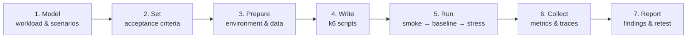
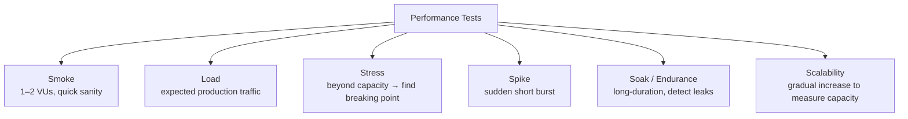
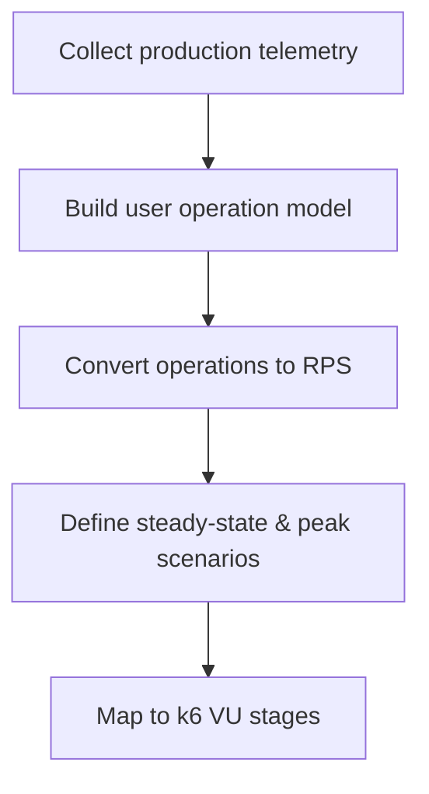
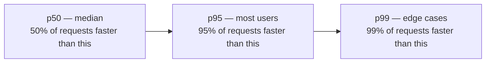
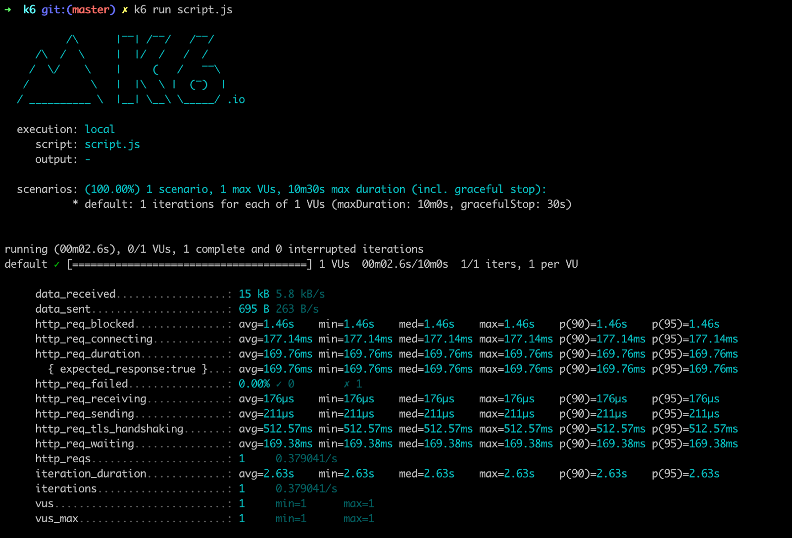
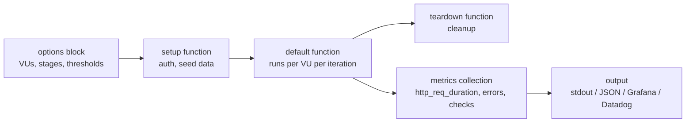
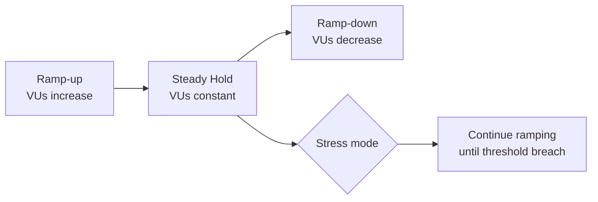
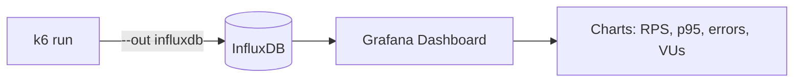
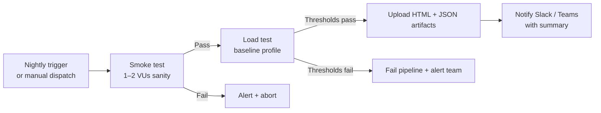
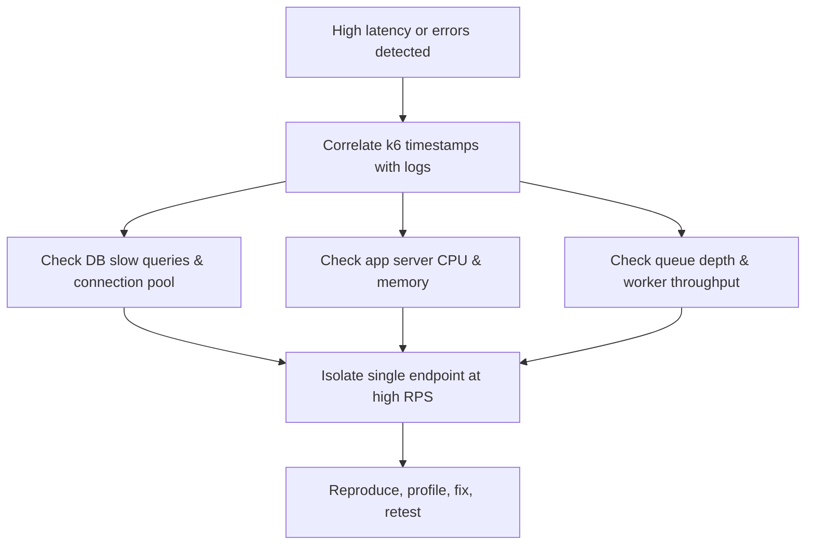

# ⚡ Performance Testing with k6 — A Practical QA Guide

> *"Performance is a feature. If you're not testing it, you're shipping an unknown."*

This guide is a **step-by-step playbook** for designing, writing, and running performance tests using **k6** as the primary tool. It covers the core concepts, test types, workload modelling, k6 script patterns, thresholds, report integration, and CI/CD automation.

Intended audience: Performance QA engineers, SREs, backend engineers, product owners.

---

## 📚 Table of Contents

1. [🎯 Why Performance Testing Matters](#-why-performance-testing-matters)
2. [🗺️ The Performance Testing Workflow](#-the-performance-testing-workflow)
3. [🔬 Types of Performance Tests](#-types-of-performance-tests)
4. [📐 Workload Modelling](#-workload-modelling)
5. [📊 Metrics & Acceptance Criteria](#-metrics--acceptance-criteria)
6. [🛠️ Tooling Overview](#-tooling-overview)
7. [⚙️ k6 — Core Concepts](#-k6--core-concepts)
8. [✍️ k6 — Writing Your First Script](#-k6--writing-your-first-script)
9. [🧪 k6 — Test Profiles & Stages](#-k6--test-profiles--stages)
10. [✅ k6 — Thresholds & Checks](#-k6--thresholds--checks)
11. [🔁 k6 — Parameterization & Test Data](#-k6--parameterization--test-data)
12. [📈 k6 — Report Integration](#-k6--report-integration)
13. [🤖 CI/CD Integration](#-cicd-integration)
14. [🔍 Observability & Instrumentation](#-observability--instrumentation)
15. [🧹 Environment & Test Data](#-environment--test-data)
16. [🚦 Execution Checklist](#-execution-checklist)
17. [⚠️ Common Pitfalls](#-common-pitfalls)
18. [✅ Best Practices](#-best-practices)
19. [📚 References](#-references)

---

## 🎯 Why Performance Testing Matters

Skipping performance testing means shipping a system whose behavior under real load is entirely unknown. A structured performance QA practice gives you:

- 🔎 **Visibility** into how your system behaves under expected and peak conditions.
- 🛡️ **Confidence** that SLAs for latency, throughput, and availability will hold in production.
- 🏗️ **Evidence** to guide infrastructure decisions — scale up, scale out, or optimize code.
- 🔄 **Regression prevention** — catch newly introduced bottlenecks before release.
- 📊 **Data-driven conversations** with developers, SREs, and product owners.

Define measurable acceptance criteria **before** running any test: error rates, latency percentiles (p50 / p95 / p99), throughput, and resource utilization.

---

## 🗺️ The Performance Testing Workflow



> 💡 Always run a **smoke test** (1–2 VUs) first to validate scripts and environment before scaling up load.

---

## 🔬 Types of Performance Tests

### Overview



### Test Type Reference

| Test Type | Goal | Duration | VU Profile | When to Run |
|-----------|------|----------|------------|-------------|
| **Smoke** | Validate script & env sanity | 1–2 min | 1–2 VUs | Before every other test type |
| **Load** | Verify stability at expected traffic | 15–30 min | Ramp to steady target | Every release candidate |
| **Stress** | Find breaking point / max capacity | Until failure | Ramp continuously | Monthly or pre-launch |
| **Spike** | Observe behavior under sudden surge | 2–15 min | Rapid ramp to 3–10× baseline | Campaign launches, flash sales |
| **Soak** | Detect memory leaks and degradation | 4–8 hours | Hold at baseline or slightly above | Before major releases |
| **Scalability** | Measure capacity vs. resources | Iterative steps | Step-ramp with pause between steps | Infrastructure planning |

---

## 📐 Workload Modelling

### Step-by-Step Approach



1. **Collect telemetry** (or create a conservative model if unavailable):
   - Endpoint RPS, user sessions, peak concurrency, operation mix.
2. **Model per-user actions per hour**:
   - Example: 50 active concurrent users from a base of 100.
3. **Convert to RPS**: `active users × actions/hr ÷ 3600`
   - Note: UI interactions generate 3–10× the API calls (auth checks, autosave, validations).
4. **Define scenarios**: steady, peak (3–10× steady), and soak.

### Example Workload Table

| Operation | Per user/hr | Active users | Total/hr | Approx RPS |
|-----------|------------:|-------------:|---------:|-----------:|
| Search / List | 10 | 50 | 500 | 0.14 |
| Save Draft | 5 | 50 | 250 | 0.07 |
| Create | 1 | 50 | 50 | 0.014 |
| Publish | 0.5 | 50 | 25 | 0.007 |
| Upload asset | 0.5 | 50 | 25 | 0.007 |
| **Aggregate estimate** | — | — | — | **1–10 RPS steady / 50–200 RPS peak** |

Adjust numbers to your real telemetry before scripting.

---

## 📊 Metrics & Acceptance Criteria

### Key Performance Indicators

| Metric | Target (tune to your SLA) | k6 metric name |
|--------|--------------------------|----------------|
| Error rate | < 1% (critical endpoints) | `http_req_failed` |
| Read latency p95 | < 500 ms | `http_req_duration{p(95)}` |
| Read latency p99 | < 1 s | `http_req_duration{p(99)}` |
| Write latency p95 | < 1.5 s | `http_req_duration{p(95)}` |
| Write latency p99 | < 3 s | `http_req_duration{p(99)}` |
| Bulk operation p95 | < 10 s | `http_req_duration{p(95)}` |
| Throughput | Match workload model RPS | `http_reqs` (rate) |
| App server CPU | < 70% sustained | Infrastructure monitoring |
| DB connections | < 80% of pool | DB monitoring |

### Latency Percentile Explained



> 💡 Always define SLAs tailored to your business. A payment endpoint has stricter requirements than a reporting endpoint.

---

## 🛠️ Tooling Overview

<br>

<br>

| Category | Tool | Strengths | Best when |
|----------|------|-----------|-----------|
| **API-level load** | **k6** ⭐ | Lightweight, JS scripting, CI-friendly, rich metrics | Preferred for all HTTP API tests |
| API-level | Locust | Python-based, flexible behavior modeling | Complex flows; Python-first teams |
| API-level | Gatling | High throughput, detailed reports | Very high concurrency scenarios |
| Legacy / GUI | JMeter | Mature, wide plugin ecosystem | Teams with existing JMeter investment |
| Browser-level | k6 + xk6-browser | Real browser flows at limited scale | Small number of UX sessions during load |
| Browser-level | Playwright | Real browser, functional + perf | Low-concurrency UX validation |
| Cloud / Distributed | k6 Cloud, BlazeMeter | Managed distributed load, easy scaling | Large-scale tests beyond single machine |
| Monitoring / APM | Prometheus + Grafana, Datadog | Metrics, traces, dashboards | Observability during and after runs |
| Logging | ELK, Splunk | Centralized log analysis | Troubleshoot errors and stack traces |

> ⭐ This guide focuses on **k6** — it is lightweight, scriptable in JavaScript, integrates cleanly with CI pipelines, and outputs to Grafana, Prometheus, Datadog, and more.

---

## ⚙️ k6 — Core Concepts

### Execution Model



### Key Concepts

| Concept | Meaning |
|---------|---------|
| **VU** (Virtual User) | A concurrent simulated user running the default function in a loop |
| **Iteration** | One complete execution of the default function by a single VU |
| **Stage** | A period with a target VU count — used to ramp up, hold, or ramp down |
| **Threshold** | A pass/fail rule on a metric (e.g. p95 latency < 500ms) |
| **Check** | An inline assertion (e.g. `status === 200`) — does not fail the test, contributes to check rate |
| **Scenario** | A named executor configuration for advanced traffic patterns |
| **Metric** | A time-series data point k6 tracks (built-in or custom) |

### Built-in Metrics Reference

| Metric | Type | Description |
|--------|------|-------------|
| `http_req_duration` | Trend | Total time for a request (ms) |
| `http_req_failed` | Rate | Proportion of failed requests |
| `http_reqs` | Counter | Total number of HTTP requests |
| `http_req_waiting` | Trend | Time waiting for first byte (TTFB) |
| `vus` | Gauge | Current number of active VUs |
| `iterations` | Counter | Total completed iterations |
| `iteration_duration` | Trend | Time for one full iteration |
| `checks` | Rate | Proportion of passed checks |

---

## ✍️ k6 — Writing Your First Script

### Minimal Script Structure

```javascript
import http from 'k6/http';
import { check, sleep } from 'k6';

// 1. Options: define VUs, stages, and thresholds
export const options = {
  vus: 10,
  duration: '30s',
  thresholds: {
    http_req_duration: ['p(95)<500'],
    http_req_failed: ['rate<0.01'],
  },
};

// 2. Default function: runs once per VU per iteration
export default function () {
  const res = http.get('https://api.test.example/v1/health');

  check(res, {
    'status is 200': (r) => r.status === 200,
    'response time < 500ms': (r) => r.timings.duration < 500,
  });

  sleep(1); // think time between iterations
}
```

### Full CRUD Flow Example

Adapt endpoints, headers, and payloads to your API.

```javascript
import http from 'k6/http';
import { check, sleep } from 'k6';
import { uuidv4 } from 'https://jslib.k6.io/k6-utils/1.4.0/index.js';

export const options = {
  stages: [
    { duration: '1m', target: 20 }, // ramp up
    { duration: '5m', target: 20 }, // hold steady
    { duration: '1m', target: 0 },  // ramp down
  ],
  thresholds: {
    'http_req_duration': ['p(95)<1500'],
    'http_req_failed': ['rate<0.01'],
    'checks': ['rate>0.99'],
  },
};

const BASE = __ENV.BASE_URL || 'https://api.test.example';
const TOKEN = __ENV.TEST_TOKEN;

const headers = {
  Authorization: `Bearer ${TOKEN}`,
  'Content-Type': 'application/json',
};

export default function () {
  // 1. Search / list (read path)
  const list = http.get(`${BASE}/v1/promotions?limit=20`, { headers, tags: { name: 'ListPromotions' } });
  check(list, { 'list 200': (r) => r.status === 200 });

  // 2. Create (write path)
  const payload = JSON.stringify({
    name: `Load Promo ${uuidv4()}`,
    rewards: [{ type: 'bonus', amount: 10 }],
    schedule: {
      start: new Date().toISOString(),
      end: new Date(Date.now() + 86_400_000).toISOString(),
    },
    conditions: { min_deposit: 10 },
  });
  const create = http.post(`${BASE}/v1/promotions`, payload, { headers, tags: { name: 'CreatePromotion' } });
  check(create, { 'created 201': (r) => r.status === 201 });

  // 3. Publish (background job trigger)
  const id = create.json('id');
  if (id) {
    const publish = http.post(`${BASE}/v1/promotions/${id}/publish`, null, { headers, tags: { name: 'PublishPromotion' } });
    check(publish, { 'published 200': (r) => r.status === 200 });
  }

  sleep(Math.random() * 3 + 1); // randomize think time 1–4 s
}
```

> 💡 Use `tags: { name: 'EndpointLabel' }` to break down metrics per endpoint in your reports.

---

## 🧪 k6 — Test Profiles & Stages

### Profiles at a Glance

| Profile | VU Target | Duration | Purpose |
|---------|-----------|----------|---------|
| **Smoke** | 1–2 | 1–2 min | Validate script & env |
| **Baseline (Load)** | 10–50 | 15–30 min | Steady production traffic |
| **Spike** | 3–10× baseline (ramp fast) | 2–15 min | Surge behavior |
| **Stress** | Ramp until failure | Until errors | Find maximum capacity |
| **Soak** | Baseline or +10% | 4–8 hours | Memory leaks & degradation |

### Stages Configuration Examples

**Smoke**
```javascript
export const options = {
  vus: 2,
  duration: '2m',
};
```

**Baseline Load**
```javascript
export const options = {
  stages: [
    { duration: '2m', target: 20 },  // ramp up
    { duration: '20m', target: 20 }, // hold
    { duration: '2m', target: 0 },   // ramp down
  ],
};
```

**Spike**
```javascript
export const options = {
  stages: [
    { duration: '10s', target: 100 }, // rapid spike
    { duration: '5m', target: 100 },  // hold spike
    { duration: '10s', target: 0 },   // rapid drop
  ],
};
```

**Stress — Ramp to Breaking Point**
```javascript
export const options = {
  stages: [
    { duration: '5m', target: 50 },
    { duration: '5m', target: 100 },
    { duration: '5m', target: 200 },
    { duration: '5m', target: 300 }, // keep going until errors exceed threshold
    { duration: '5m', target: 0 },
  ],
};
```

**Soak**
```javascript
export const options = {
  stages: [
    { duration: '5m', target: 20 },  // ramp up
    { duration: '6h', target: 20 },  // hold for soak
    { duration: '5m', target: 0 },   // ramp down
  ],
};
```

### Stage Flow Visualized



---

## ✅ k6 — Thresholds & Checks

### Thresholds (pass/fail gates)

Thresholds make your test **fail the CI pipeline** when SLAs are violated.

```javascript
export const options = {
  thresholds: {
    // p95 of all requests must be under 500ms
    'http_req_duration': ['p(95)<500'],

    // error rate must stay below 1%
    'http_req_failed': ['rate<0.01'],

    // 99% of checks must pass
    'checks': ['rate>0.99'],

    // per-endpoint thresholds using tags
    'http_req_duration{name:CreatePromotion}': ['p(95)<1500'],
    'http_req_duration{name:ListPromotions}': ['p(95)<300'],
  },
};
```

### Checks (inline assertions)

Checks record pass/fail per request and feed the `checks` metric — they do **not** abort the test.

```javascript
import { check } from 'k6';

const res = http.post('/v1/promotions', payload, { headers });

check(res, {
  'status is 201':            (r) => r.status === 201,
  'has id in body':           (r) => r.json('id') !== undefined,
  'response time under 1.5s': (r) => r.timings.duration < 1500,
  'content-type is JSON':     (r) => r.headers['Content-Type'].includes('application/json'),
});
```

### Threshold vs Check — When to Use Each

| | Threshold | Check |
|--|-----------|-------|
| **Fails the test?** | ✅ Yes — test exits non-zero | ❌ No — recorded only |
| **CI gate?** | ✅ Use for SLA enforcement | ❌ Use for diagnostics |
| **Granularity** | Per metric / per tag | Per request / per assertion |
| **Typical use** | `p(95)<500`, `rate<0.01` | `status===200`, `body has id` |

---

## 🔁 k6 — Parameterization & Test Data

### Environment Variables

Pass config at runtime — never hardcode URLs or tokens in scripts.

```bash
# Run with environment variables
k6 run \
  --env BASE_URL=https://api.staging.example \
  --env TEST_TOKEN=my-secret-token \
  script.js
```

```javascript
// In script
const BASE = __ENV.BASE_URL;
const TOKEN = __ENV.TEST_TOKEN;
```

### Shared Data Arrays (CSV / JSON)

```javascript
import { SharedArray } from 'k6/data';

// Loaded once, shared across all VUs (memory efficient)
const users = new SharedArray('users', function () {
  return JSON.parse(open('./data/users.json'));
});

export default function () {
  const user = users[__VU % users.length]; // distribute users across VUs
  // use user.email, user.password, etc.
}
```

### Unique Payload per Iteration

```javascript
import { uuidv4 } from 'https://jslib.k6.io/k6-utils/1.4.0/index.js';

export default function () {
  const payload = JSON.stringify({
    name: `Promo-${uuidv4()}`,    // unique per iteration, avoids caching
    ref: `VU${__VU}-IT${__ITER}`, // useful for tracing in logs
  });
}
```

---

## 📈 k6 — Report Integration

### Output Options at a Glance

| Output | Command flag | Best for |
|--------|-------------|---------|
| **Console summary** | _(default)_ | Quick local feedback |
| **JSON file** | `--out json=results.json` | Post-processing, custom reports |
| **CSV file** | `--out csv=results.csv` | Spreadsheet analysis |
| **InfluxDB + Grafana** | `--out influxdb=http://localhost:8086/k6` | Real-time dashboards |
| **Prometheus remote write** | `--out experimental-prometheus-rw` | Existing Prometheus stack |
| **Datadog** | `--out datadog` | Teams already using Datadog APM |
| **k6 Cloud** | `k6 cloud script.js` | Managed UI, distributed runs |
| **HTML summary** | `handleSummary` function | CI artifacts, stakeholder reports |

### Custom HTML Summary Report

```javascript
import { htmlReport } from 'https://raw.githubusercontent.com/benc-uk/k6-reporter/main/dist/bundle.js';
import { textSummary } from 'https://jslib.k6.io/k6-summary/0.0.1/index.js';

export function handleSummary(data) {
  return {
    'summary.html': htmlReport(data),        // rich HTML report
    'summary.json': JSON.stringify(data),    // machine-readable
    stdout: textSummary(data, { indent: ' ', enableColors: true }), // console
  };
}
```

Run with:
```bash
k6 run script.js
# outputs: summary.html, summary.json
```

### Grafana + InfluxDB Real-Time Dashboard



```bash
# Start InfluxDB and Grafana with Docker Compose
docker run -d -p 8086:8086 --name influxdb influxdb:1.8
docker run -d -p 3000:3000 --name grafana grafana/grafana

# Run k6 streaming metrics to InfluxDB
k6 run --out influxdb=http://localhost:8086/k6 script.js
```

Import the official **k6 Grafana dashboard** (ID `2587`) from grafana.com for instant visualization.

### JSON Output for Post-Processing

```bash
k6 run --out json=raw-results.json script.js
```

```json
{
  "type": "Point",
  "metric": "http_req_duration",
  "data": {
    "time": "2026-06-05T10:00:00Z",
    "value": 342.5,
    "tags": { "name": "ListPromotions", "status": "200" }
  }
}
```

---

## 🤖 CI/CD Integration

### GitHub Actions Workflow

```yaml
name: Performance Tests

on:
  schedule:
    - cron: '0 2 * * *'   # nightly at 02:00 UTC
  workflow_dispatch:        # manual trigger

jobs:
  k6-load-test:
    runs-on: ubuntu-latest
    steps:
      - uses: actions/checkout@v4

      - name: Run k6 smoke test
        uses: grafana/k6-action@v0.3.1
        with:
          filename: tests/performance/smoke.js
        env:
          BASE_URL: ${{ secrets.STAGING_BASE_URL }}
          TEST_TOKEN: ${{ secrets.TEST_TOKEN }}

      - name: Run k6 load test
        uses: grafana/k6-action@v0.3.1
        with:
          filename: tests/performance/load.js
          flags: --out json=results/load.json
        env:
          BASE_URL: ${{ secrets.STAGING_BASE_URL }}
          TEST_TOKEN: ${{ secrets.TEST_TOKEN }}

      - name: Upload results as artifact
        uses: actions/upload-artifact@v4
        if: always()
        with:
          name: k6-results
          path: results/
```

### CI Flow



### Recommended Pipeline Strategy

| Trigger | Profile | Gate |
|---------|---------|------|
| Every PR (critical paths) | Smoke (1–2 VUs, 2 min) | Block merge if fails |
| Nightly | Load (baseline, 20 min) | Notify on degradation |
| Pre-release | Stress + Spike | Block release if SLAs breach |
| Monthly | Soak (6 hours) | Track trend over time |

---

## 🔍 Observability & Instrumentation

Collect and correlate during every test run:

- **API metrics**: RPS, latency breakdown per endpoint (use k6 tags).
- **Error counts**: 4xx vs 5xx split — different root causes.
- **System metrics**: CPU, memory, disk I/O, network on app servers.
- **DB metrics**: slow query log, lock waits, connection pool usage.
- **Queue metrics**: enqueue/dequeue rate, depth, dead-letter count.
- **Traces**: APM (Jaeger / Datadog APM) with correlation IDs injected in request headers.
- **Logs**: centralized (ELK / Cloud Logging) tagged with `test-run-id`.

### Triage Flow for High Latency or Errors



---

## 🧹 Environment & Test Data

- Mirror production topology: app servers, DB replicas, caches, queue brokers.
- **Stub or sandbox** external services (payments, email, SMS); use mock receivers for webhooks.
- Seed test tenant(s), users, categories, and reference data before each run.
- Use a **snapshot/restore** or containerized DB to reset state between runs — noisy data corrupts results.
- Inject a **correlation ID** (`X-Test-Run-Id`) into every request header for log tracing.
- Tag all test-generated data so cleanup scripts can target it precisely.

---

## 🚦 Execution Checklist

Use this as a literal to-do list before every test run.

**Pre-Run**
- [ ] Environment prepared and mirrors production as closely as possible.
- [ ] Test accounts and tenant seeded; reference data in place.
- [ ] External dependencies stubbed or sandboxed.
- [ ] Monitoring dashboards open with baseline captured.
- [ ] k6 scripts validated with a smoke run (1–2 VUs).
- [ ] Thresholds and acceptance criteria agreed with the team.
- [ ] Rollback plan in place; relevant people notified.
- [ ] Rate limits and throttles noted and accounted for.

**Post-Run**
- [ ] Collect k6 JSON summary and HTML report.
- [ ] Correlate k6 metrics with APM traces and logs.
- [ ] Document throughput, error rate, and latency percentiles (p50/p95/p99).
- [ ] Identify bottlenecks and root causes.
- [ ] Share findings with devs and SREs.
- [ ] Create tickets for issues found.
- [ ] Schedule retest after fixes.

---

## ⚠️ Common Pitfalls

| Pitfall | Better approach |
|---------|----------------|
| Not running a smoke test first | Always validate script and env with 1–2 VUs before scaling |
| Hardcoding URLs and tokens in scripts | Use `__ENV.VARIABLE` and pass via `--env` flag or CI secrets |
| Ignoring think time (`sleep`) | Add randomized sleep to simulate realistic user pacing |
| Not using `tags` on requests | Tag by endpoint name to get per-route metrics in reports |
| Treating checks as test gates | Use **thresholds** for CI gates; checks are diagnostics only |
| Testing in an undersized environment | Undersized env masks production bottlenecks — mirror prod |
| Not resetting state between runs | Dirty data causes noisy, non-reproducible results |
| Not simulating async / queue behavior | Background jobs are often the real bottleneck — include them |
| Ignoring external service latencies | Stub or sandbox third-party calls to isolate your system |
| Forgetting to tag test traffic | You won't be able to filter logs or traces by test run |

---

## ✅ Best Practices

- 🚬 **Smoke first, always** — never skip the 1–2 VU sanity run.
- 🏷️ **Tag every request** with a meaningful name for per-endpoint reporting.
- 📐 **Model from telemetry** — use real production data to set VU counts and RPS targets.
- 🔁 **Parameterize everything** — unique payloads per iteration avoid caching artifacts.
- 🎯 **Use thresholds as SLA gates** — let the pipeline enforce pass/fail, not a human.
- 📊 **Publish results as artifacts** — HTML summary + JSON for every CI run.
- 🤝 **Share findings immediately** — loop in devs and SREs before closing the run.
- 🔄 **Test iteratively** — small runs → baseline → stress → soak, not big-bang.
- 🔗 **Correlate everything** — k6 metrics + APM traces + logs with a shared run ID.
- 📝 **Version scripts with app code** — performance tests belong in the same repo.

---

## 📚 References

- k6 documentation — [k6.io/docs](https://k6.io/docs)
- k6 GitHub repository — [github.com/grafana/k6](https://github.com/grafana/k6)
- k6 jslib (shared utilities) — [jslib.k6.io](https://jslib.k6.io)
- k6 Grafana dashboard (ID 2587) — [grafana.com/grafana/dashboards/2587](https://grafana.com/grafana/dashboards/2587)
- k6 HTML reporter — [github.com/benc-uk/k6-reporter](https://github.com/benc-uk/k6-reporter)
- Grafana k6 GitHub Action — [github.com/grafana/k6-action](https://github.com/grafana/k6-action)
- Related docs: [k6-performance-testing.md](k6-performance-testing.md) · [qaTestingReport.md](qaTestingReport.md) · [prioritization.md](prioritization.md) · [traceability.md](traceability.md)
