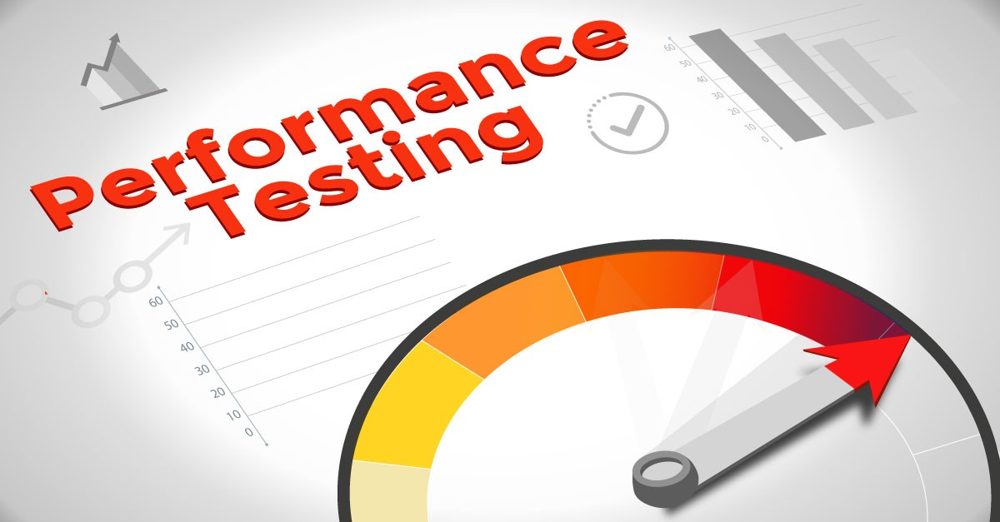

# Performance QA — Practical Guide

<br>

<br>

## Overview

This document explains how to design, implement and run performance (load) tests from a generic perspective. It covers objectives, test types, workload modelling, scenarios, metrics and SLAs, environment and data management, recommended tools, example scripts, execution checklists and reporting. Use this as a template to adapt to your product and infrastructure.

Intended audience: Performance QA engineers, SREs, backend/frontend engineers, product owners.

---

## 1. Goals & Objectives

- Validate system behavior under expected and peak loads.
- Identify bottlenecks (DB, CPU, network, queues, external services).
- Ensure SLAs for latency/availability are met.
- Validate asynchronous flows and background processing.
- Verify scalability and resilience (failover, recovery under load).

Define measurable acceptance criteria up front: error rates, latency percentiles (p50/p95/p99), throughput, resource utilization.

---

## 2. Types of Performance Tests

- Load: simulate expected production traffic and verify stability.
- Stress: push beyond expected capacity to find breaking points.
- Spike: sudden short bursts to observe behavior under surges.
- Soak (Endurance): long-duration test to detect memory leaks, degradation.
- Scalability: gradually increase load to measure capacity and scaling behavior.
- Capacity Planning: identify what hardware or configuration is required to satisfy demand.

---

## 3. Workload Modeling & Traffic Assumptions

1. Collect production telemetry (if available):
   - Endpoint RPS, user sessions, peak/concurrency, operation mix.
2. If not available, create a conservative model:
   - Example: 100 professional users (commercial staff) where:
     - 25–50 active concurrently at any given minute.
     - Actions per active user/hour (example):
       - Create promotion: 1
       - Edit/save draft: 5
       - Publish: 0.5
       - Search/list: 10
       - Upload asset: 0.5
3. Convert to RPS for test:
   - Example: 50 active users * 10 searches/hour ⇒ (500 searches/hr) ≈ 0.138 RPS
   - But UI multiplies API calls (auth checks, autosave, validations) — estimate a 3–10× multiplier for aggregate RPS.
4. Model steady-state and peak scenarios:
   - Steady: expected aggregate RPS.
   - Peak: 3–10× steady for short duration (spike).
   - Soak: steady or slightly higher for 4–8 hours.

Example workload table (simplified):

| Operation        | Per active user/hr | Active users | Total/hr | Approx RPS |
|------------------|--------------------:|-------------:|---------:|----------:|
| Search/List      | 10                  | 50           | 500      | 0.14      |
| Save Draft       | 5                   | 50           | 250      | 0.069     |
| Create           | 1                   | 50           | 50       | 0.014     |
| Publish          | 0.5                 | 50           | 25       | 0.007     |
| Upload (image)   | 0.5                 | 50           | 25       | 0.007     |
| Aggregate (estimate) | -               | -            | -        | 1–10 RPS (steady), spikes to 50–200 RPS |

Adjust numbers to your real telemetry.

---

## 4. Prioritized Test Scenarios

High priority:
- Promotion create (full payload) — DB writes.
- Publish promotion — triggers background jobs for reward allocation.
- Search/list promotions with filters & pagination — read scaling.
- Bulk import/export — heavy writes / CPU.
- Assign rewards/winning calculations — CPU-heavy logic and correctness.
- Concurrent edit conflict handling.

Medium priority:
- Duplicate promotion.
- Scheduling activation/deactivation.
- Reward category CRUD.

Low priority:
- Admin/audit flows, rare maintenance endpoints.

---

## 5. Metrics and Acceptance Criteria

Suggested KPIs (tune to business):

- Error rate: < 1% (critical endpoints) during normal/peak.
- Latency:
  - Read endpoints: p95 < 500 ms, p99 < 1s
  - Write endpoints: p95 < 1.5s, p99 < 3s
  - Bulk operations: p95 < 10s (or business-defined)
- Throughput: match workload model RPS.
- Resource utilization:
  - App server CPU < 70% (sustained)
  - DB connections < 80% of pool
- Queue depth: within acceptable threshold, low retry/dead-letter count.
- No data corruption; background jobs complete within SLA.

Always define SLAs tailored to your system and business needs.

---

## 6. Environment & Test Data

- Use an environment that mirrors production topology (app servers, DB replicas, caches, queue brokers).
- Stub or sandbox external services (payments, email); use mock receivers for webhooks.
- Seed test tenant(s), users, categories, rewards, and assets.
- Use a snapshot/restore or containerized DB to reset state between tests.
- Tag test traffic, correlation IDs & tracing headers for observability.

---

## 7. Observability & Instrumentation

Collect and correlate:
- API metrics (RPS, latency by endpoint).
- Error counts and types (4xx vs 5xx).
- System metrics (CPU, memory, disk IO, network).
- DB metrics (slow queries, locks, connection counts).
- Queue metrics (enqueue/dequeue rates, depth).
- Traces (APM/Jaeger) with correlation IDs.
- Centralized logs (ELK/Cloud logs) with test-run tags.

Create dashboards (Grafana/Datadog) for quick triage.

---

## 8. Tooling — Comparison Table

<br>

<br>

| Category | Recommended Tools | Strengths | When to use |
|---|---|---:|---|
| API-level load | k6 | Lightweight, JS scripting, CI-friendly, good metrics integration | Preferred for HTTP API tests |
| API-level | Locust | Python-based, flexible behavior modeling | Complex user flows; Python shops |
| API-level | Gatling | High performance, detailed reports | High throughput needs |
| Legacy / GUI | JMeter | Mature, lots of plugins (heavier) | Teams with existing JMeter investments |
| Browser-level | Playwright / Puppeteer | Real browser UX, functional checks | Low-concurrency UX validation |
| Browser-level | k6 + xk6-browser | Browser-like flows at limited scale | Small number of real sessions during load |
| Managed/cloud | k6 Cloud, BlazeMeter, Flood | Distributed load, easy scaling | Large-scale distributed tests |
| Monitoring/APM | Prometheus + Grafana, Datadog, NewRelic | Metrics, traces, alerts | Observability during tests |
| Logging | ELK, Splunk | Centralized logs for troubleshooting | Analyze errors & stack traces |

Notes:
- Use API-level tests for large-scale load (cheaper and representative if UI calls map to APIs).
- Run a few real browser sessions to validate UX under load but avoid simulating many real browsers due to resource cost.

---

## 9. Test Script Best Practices

- Use OpenAPI/Swagger to generate stubs/payloads and keep tests in sync.
- Parameterize payloads to avoid caching artifacts and collisions (UUIDs).
- Add realistic think-time and pacing; randomize intervals to avoid synchronized bursts unless testing spike.
- Include assertions:
  - HTTP status codes (200/201/etc.).
  - Business-level validations in responses.
- Add correlation IDs to link traces and logs.
- Implement retries for transient errors in scripts carefully — measure raw error surface first.
- Clean up created test data or use ephemeral test tenants.

---

## 10. Example Test Profiles

- Smoke: 1–2 VUs, basic create & search flows, quick sanity.
- Baseline (steady): ramp to expected load (e.g., 10–50 VUs equivalent) and hold 15–30 minutes.
- Spike: rapid ramp to 3–10× baseline for 2–15 minutes.
- Soak: hold baseline or slightly above for 4–8 hours to detect leaks.
- Stress: ramp until failure to identify max sustainable RPS.

---

## 11. Example Scripts

Note: adapt endpoints, headers and payloads to your API.

k6 (API-level) example:
```javascript
import http from 'k6/http';
import { check, sleep } from 'k6';

export let options = {
  stages: [
    { duration: '1m', target: 20 }, // ramp up to 20 VUs
    { duration: '5m', target: 20 }, // hold
    { duration: '1m', target: 0 },  // ramp down
  ],
  thresholds: {
    'http_req_duration': ['p(95)<1500'],
    'errors': ['rate<0.01'],
  },
};

export default function () {
  const BASE = 'https://api.test.example';
  const headers = { 'Authorization': `Bearer ${__ENV.TEST_TOKEN}`, 'Content-Type': 'application/json' };

  // Create promotion
  const payload = JSON.stringify({
    name: `Load Promo ${__VU}-${__ITER}`,
    rewards: [{ type: 'bonus', amount: 10 }],
    schedule: { start: new Date().toISOString(), end: new Date(Date.now()+86400000).toISOString() },
    conditions: { min_deposit: 10 }
  });
  let res = http.post(`${BASE}/v1/promotions`, payload, { headers });
  check(res, { 'created': r => r.status === 201 });

  // Publish
  let id = res.json('id');
  let pub = http.post(`${BASE}/v1/promotions/${id}/publish`, null, { headers });
  check(pub, { 'published': r => r.status === 200 });

  sleep(Math.random() * 3);
}
```

Locust (Python) example:
```python
from locust import HttpUser, task, between
import uuid, time

class PromotionUser(HttpUser):
    wait_time = between(1, 3)

    @task(3)
    def search_list(self):
        self.client.get("/v1/promotions?limit=20")

    @task(1)
    def create_and_publish(self):
        payload = {
            "name": f"Locust Promo {uuid.uuid4()}",
            "rewards": [{"type": "bonus", "amount": 5}],
            "schedule": {"start": int(time.time()), "end": int(time.time()+86400)}
        }
        r = self.client.post("/v1/promotions", json=payload)
        if r.status_code == 201:
            pid = r.json().get("id")
            self.client.post(f"/v1/promotions/{pid}/publish")
```

---

## 12. Diagnostics & Troubleshooting

When you see failures or high latency:
1. Correlate timestamps with logs and traces.
2. Check DB slow queries, locks, connection exhaustion.
3. Inspect queue depth and worker throughput.
4. Look for hot CPU/memory on app servers.
5. Review external service latencies (stubbed if possible).
6. Reproduce problematic scenario with isolated tests (single endpoint at high RPS).
7. Capture heap/CPU profiles if memory/CPU issues suspected.

---

## 13. Execution Checklist (Pre-Run)

- Environment prepared and mirrors production as close as possible.
- Test accounts and test tenant seeded.
- External dependencies stubbed or sandboxed.
- Monitoring dashboards set up and baseline captured.
- Load test scripts reviewed and validated in small runs.
- Rollback plan in place and responsible people notified.
- Rate limits and throttles considered.

---

## 14. Post-Test Reporting

Minimum contents of a run report:
- Test configuration (profile, duration, VUs/RPS).
- High level results: throughput, error rate, latency percentiles (p50/p95/p99).
- System metrics during the run (CPU, memory, DB metrics).
- Bottlenecks observed and root-cause analysis.
- Recommended mitigations and prioritized fixes.
- Retest plan and acceptance criteria for next verification.

---

## 15. CI/CD Integration & Automation

- Keep test scripts in repo and version with application code.
- Run smoke/perf-check in PR pipelines (lightweight).
- Schedule nightly/weekly performance jobs (soak or peak runs).
- Gate major releases with a performance checklist (or automated run) for critical flows.

---

## 16. Practical Tips & Best Practices

- Test the happy path and business-critical unhappy paths (e.g., partial failure in background job).
- Prefer API-level tests for broad coverage and efficient resource usage; add a small number of real browser sessions for UX validation.
- Use service virtualization to isolate external dependencies.
- Run smaller iterative tests before large distributed runs.
- Use synthetic load and real telemetry together to refine scenarios.
- Share findings with devs and SREs immediately and iterate.

---

## 17. Example Priority Matrix

| Impact on Business | Technical Risk | Test Priority |
|---:|---:|---:|
| Publish & reward allocation (affects payouts) | High | P0 |
| Bulk imports/exports (campaign ops) | High | P1 |
| Search/list (UX for commercial staff) | Medium | P1 |
| Asset uploads (images) | Medium | P2 |
| Admin & audit endpoints | Low | P3 |

---

## 18. Common Pitfalls

- Not simulating asynchronous job behavior (queues).
- Overlooking downstream integrations—external services can cause timeouts.
- Running tests in undersized test environments that mask production bottlenecks.
- Not resetting state between runs causing noisy results.
- Forgetting to tag test data and correlate traces.

---

## 19. Next Steps & Templates

- Use the k6/Locust examples above to build scripts for your top 5 scenarios.
- Create dashboards for each test run.
- Automate nightly runs for regression monitoring.

---

## 20. References & Further Reading

- k6 documentation: https://k6.io/docs
- Locust documentation: https://docs.locust.io
- Gatling documentation: https://gatling.io/docs
- The Art of Capacity Planning, John Allspaw (book)
- Principles of Chaos Engineering (for resilience testing)

---

Appendix: Quick checklist for a single-run
- [ ] Identify the top 3 business-critical flows
- [ ] Model RPS and concurrent users
- [ ] Prepare environment & test data
- [ ] Configure monitoring & tracing
- [ ] Run smoke tests
- [ ] Execute full profile (steady/spike/soak)
- [ ] Collect metrics & logs
- [ ] Produce report & triage issues
- [ ] Retest after fixes
