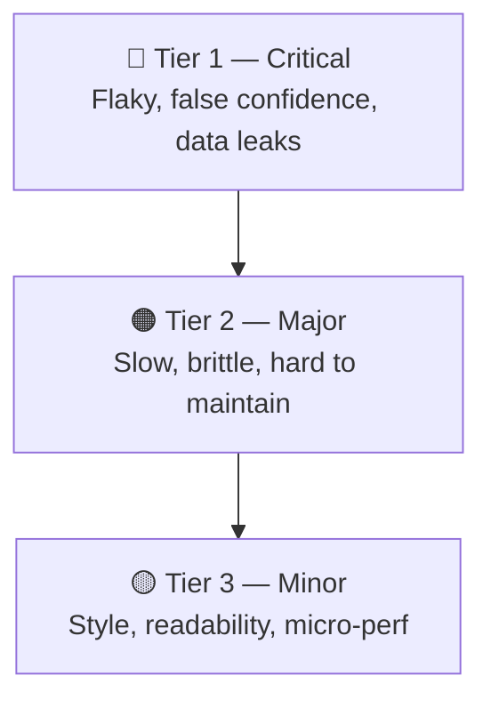
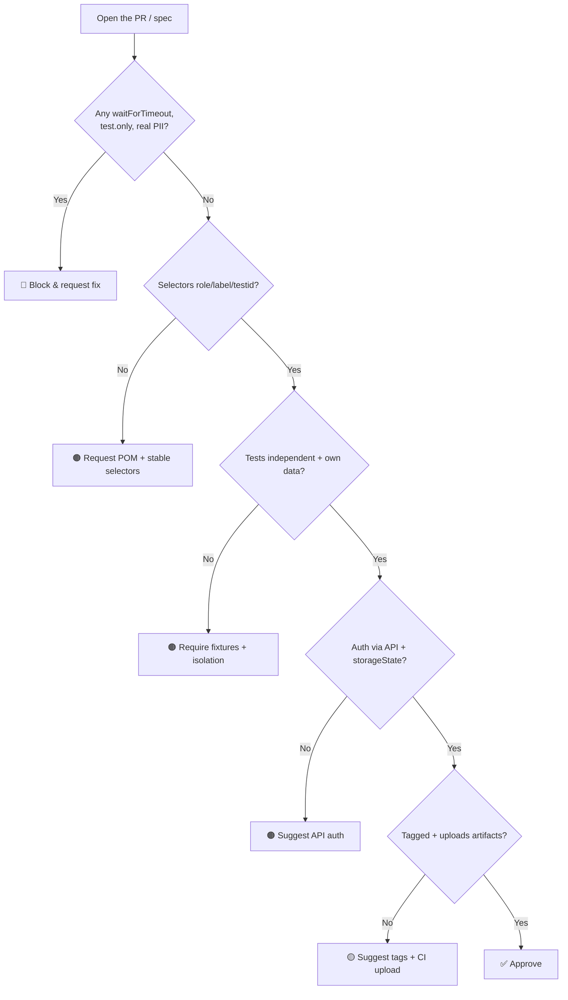

# 🎭 Playwright + TypeScript — Common Automation Mistakes (and How to Fix Them)

> *"Flaky tests don't fall from the sky — they are written, one shortcut at a time."*

A senior-level field guide to the coding mistakes that hurt Playwright + TypeScript automation suites the most. Each mistake is paired with a **❌ Wrong** and **✅ Right** snippet, an explanation, and the *why* behind it. Mistakes are grouped by **severity tier** so you know where to spend your review attention first.

---

## 📚 Table of Contents

1. [🎯 Why This Guide](#-why-this-guide)
2. [🪜 Severity Tiers at a Glance](#-severity-tiers-at-a-glance)
3. [🔴 Tier 1 — Critical Mistakes (kill the suite)](#-tier-1--critical-mistakes-kill-the-suite)
4. [🟠 Tier 2 — Major Mistakes (degrade quality & maintenance)](#-tier-2--major-mistakes-degrade-quality--maintenance)
5. [🟡 Tier 3 — Minor Mistakes (style & polish)](#-tier-3--minor-mistakes-style--polish)
6. [📊 Mistake Impact Matrix](#-mistake-impact-matrix)
7. [🧭 Decision Flow — Is My Test Healthy?](#-decision-flow--is-my-test-healthy)
8. [✅ Senior Reviewer's Checklist](#-senior-reviewers-checklist)
9. [📚 References](#-references)

---

## 🎯 Why This Guide

Playwright is **forgiving** — it auto-waits, retries, and gives you traces. That same forgiveness lets bad patterns survive code review and then **rot the suite over months**: flaky CI, slow runs, brittle selectors, untrustworthy reports.

This guide is the senior QA's mental checklist when reviewing a teammate's PR. Use it as a code review aid, an onboarding doc, or a self-audit before pushing.

📖 See also: [pwRepoIntegration.md](pwRepoIntegration.md) · [onboardingNewRepo.md](onboardingNewRepo.md) · [automationDecision.md](automationDecision.md)

---

## 🪜 Severity Tiers at a Glance



| Tier  | Symptom in CI                                | Cost to fix later | Fix priority         |
| ----- | -------------------------------------------- | ----------------- | -------------------- |
| 🔴 1  | Random failures, false greens, leaked data   | Very high         | **Block the PR**     |
| 🟠 2  | Slow runs, fragile selectors, copy-paste     | Medium            | Request changes      |
| 🟡 3  | Inconsistent style, missing types            | Low               | Suggest & approve    |

---

## 🔴 Tier 1 — Critical Mistakes (kill the suite)

These are the patterns that produce **flaky tests**, **false confidence**, or **shared state across workers**. They are non-negotiable in review.

### 1.1 Using arbitrary `waitForTimeout` instead of web-first assertions

Hard sleeps are the #1 source of flakiness. They are either *too short* (flaky) or *too long* (slow). Playwright's web-first assertions auto-retry until the condition holds.

```ts
// ❌ Wrong — magic sleep
await page.click('#submit');
await page.waitForTimeout(3000);
const text = await page.locator('.toast').textContent();
expect(text).toBe('Saved');
```

```ts
// ✅ Right — auto-retrying assertion
await page.getByRole('button', { name: 'Submit' }).click();
await expect(page.getByRole('status')).toHaveText('Saved');
```

**Why:** `expect(locator).toHaveText` polls until the timeout. No race condition, no wasted seconds.

---

### 1.2 Reading state with `textContent()` and asserting later

`textContent()` returns the value at *one* point in time — before the UI has settled. Always assert with web-first matchers.

```ts
// ❌ Wrong — snapshot of a moving target
const total = await page.locator('[data-test=total]').textContent();
expect(total).toBe('$120.00');
```

```ts
// ✅ Right — waits for the value to appear
await expect(page.getByTestId('total')).toHaveText('$120.00');
```

---

### 1.3 Tests that depend on each other (shared state)

Each `test(...)` must be **independent**. Otherwise, parallelism breaks them, reordering breaks them, and a failure cascades.

```ts
// ❌ Wrong — Test B depends on Test A
let createdUserId: string;

test('A: create user', async ({ request }) => {
  const res = await request.post('/users', { data: { name: 'Ada' } });
  createdUserId = (await res.json()).id;
});

test('B: delete user', async ({ request }) => {
  await request.delete(`/users/${createdUserId}`); // 💥 undefined when run alone
});
```

```ts
// ✅ Right — each test sets up its own data
test('delete user', async ({ request }) => {
  const created = await request.post('/users', { data: { name: 'Ada' } });
  const { id } = await created.json();

  const res = await request.delete(`/users/${id}`);
  expect(res.status()).toBe(204);
});
```

> 💡 If setup is expensive, use a **fixture** scoped to `test` or `worker` — never a module-level variable.

---

### 1.4 Sharing one user account across parallel workers

Two workers logging in as the same user will fight over sessions, carts, balances, etc. Each worker needs its own identity.

```ts
// ❌ Wrong — single user reused everywhere
test.beforeEach(async ({ page }) => {
  await login(page, 'qa@example.com', 'Password1!');
});
```

```ts
// ✅ Right — one user per worker, created via API
export const test = base.extend<{}, { workerUser: User }>({
  workerUser: [async ({}, use, workerInfo) => {
    const user = await api.createUser(`qa+${workerInfo.workerIndex}@example.com`);
    await use(user);
    await api.deleteUser(user.id);
  }, { scope: 'worker' }],
});
```

---

### 1.5 Logging in through the UI on every test

UI login is **slow** and **breaks when login changes**. Authenticate once via API and reuse the storage state.

```ts
// ❌ Wrong — full UI flow before every test
test.beforeEach(async ({ page }) => {
  await page.goto('/login');
  await page.getByLabel('Email').fill(USER);
  await page.getByLabel('Password').fill(PASS);
  await page.getByRole('button', { name: 'Sign in' }).click();
});
```

```ts
// ✅ Right — authenticate once, reuse storageState
// global-setup.ts
const browser = await chromium.launch();
const ctx = await browser.newContext();
await ctx.request.post('/api/login', { data: { email: USER, password: PASS } });
await ctx.storageState({ path: 'storage/admin.json' });

// playwright.config.ts
use: { storageState: 'storage/admin.json' }
```

---

### 1.6 Brittle selectors (CSS chains, nth-child, full XPath)

Selectors should reflect what the **user sees**, not how the DOM is currently structured.

```ts
// ❌ Wrong — breaks on any layout change
await page.locator('div.container > div:nth-child(2) > button.primary').click();
await page.locator('//*[@id="root"]/main/div[3]/form/button[1]').click();
```

```ts
// ✅ Right — user-facing, stable
await page.getByRole('button', { name: 'Save changes' }).click();
await page.getByLabel('Email').fill('a@b.com');
await page.getByTestId('checkout-submit').click();
```

**Locator priority (Playwright recommendation):**
`getByRole` → `getByLabel` → `getByPlaceholder` → `getByText` → `getByTestId` → CSS/XPath.

---

### 1.7 Conditional logic instead of assertions

`if (await locator.isVisible())` silently passes when the element is missing. That's a **false green**.

```ts
// ❌ Wrong — silently skips real bugs
if (await page.locator('.error').isVisible()) {
  expect(await page.locator('.error').textContent()).toContain('Invalid');
}
```

```ts
// ✅ Right — assert the expected outcome
await expect(page.getByRole('alert')).toHaveText(/invalid/i);
```

---

### 1.8 Leaving `test.only` or `.skip` in committed code

A single `test.only` disables every other test in the file — and CI keeps reporting green. Block it with ESLint (`no-focused-tests`) and a pre-commit hook.

```ts
// ❌ Wrong
test.only('renders dashboard', async ({ page }) => { /* ... */ });
test.skip('flaky cart total', async ({ page }) => { /* ... */ });
```

```ts
// ✅ Right
test('renders dashboard', async ({ page }) => { /* ... */ });
test('cart total', async ({ page }) => { /* ... */ }); // fix it or open an issue, don't skip silently
```

---

### 1.9 Real PII or production credentials in the repo

Secrets and PII in fixtures end up on GitHub forever. Use env vars, secret managers, and synthetic data.

```ts
// ❌ Wrong
const ADMIN = { email: 'ceo@realcompany.com', password: 'CorrectHorse42!' };
```

```ts
// ✅ Right
const ADMIN = {
  email: process.env.ADMIN_EMAIL!,        // injected from CI secrets
  password: process.env.ADMIN_PASSWORD!,
};
```

📖 See also: [aiPromptsForQA.md](aiPromptsForQA.md#-privacy-security--compliance)

---

## 🟠 Tier 2 — Major Mistakes (degrade quality & maintenance)

These don't break the suite immediately, but they make it **slow, fragile, or unmaintainable** over time.

### 2.1 No Page Object Model — selectors duplicated across specs

When the same selector is repeated in ten specs, one UI change means ten failing tests.

```ts
// ❌ Wrong — selectors scattered
test('login', async ({ page }) => {
  await page.getByLabel('Email').fill('a@b.com');
  await page.getByLabel('Password').fill('x');
  await page.getByRole('button', { name: 'Sign in' }).click();
});
```

```ts
// ✅ Right — encapsulated in a POM
export class LoginPage {
  constructor(private page: Page) {}
  email = () => this.page.getByLabel('Email');
  password = () => this.page.getByLabel('Password');
  submit = () => this.page.getByRole('button', { name: 'Sign in' });

  async signIn(email: string, password: string) {
    await this.email().fill(email);
    await this.password().fill(password);
    await this.submit().click();
  }
}

test('login', async ({ page }) => {
  await new LoginPage(page).signIn('a@b.com', 'x');
});
```

---

### 2.2 Assertions inside Page Objects

POMs **drive the UI**. Assertions belong in the spec — that's where the *test intent* lives.

```ts
// ❌ Wrong — assertion hidden in POM
class CartPage {
  async assertTotal(amount: string) {
    await expect(this.page.getByTestId('total')).toHaveText(amount);
  }
}
```

```ts
// ✅ Right — POM exposes locators, spec asserts
class CartPage {
  total = () => this.page.getByTestId('total');
}

test('cart total updates', async ({ page }) => {
  const cart = new CartPage(page);
  await expect(cart.total()).toHaveText('$120.00');
});
```

---

### 2.3 Storing locators in the constructor

Locators stored at construction time can become stale after navigation. Build them on demand.

```ts
// ❌ Wrong — captured once, may detach
class HomePage {
  readonly header: Locator;
  constructor(private page: Page) {
    this.header = page.locator('h1');
  }
}
```

```ts
// ✅ Right — fresh locator on every call
class HomePage {
  constructor(private page: Page) {}
  header = () => this.page.locator('h1');
}
```

> 💡 Both styles can work, but the **getter pattern** is safer across SPA re-renders.

---

### 2.4 Mixing `expect` timeouts and global timeouts

Setting `timeout: 60000` on every test to "be safe" hides slow code. Tune at the right layer.

```ts
// ❌ Wrong — blanket 60s per test, hides real perf issues
// playwright.config.ts
timeout: 60_000,
expect: { timeout: 30_000 }
```

```ts
// ✅ Right — defaults stay tight, override per case
// playwright.config.ts
timeout: 30_000,
expect: { timeout: 5_000 }

// inside one slow spec only:
test('large CSV import', async ({ page }) => {
  test.setTimeout(120_000);
  // ...
});
```

---

### 2.5 Not isolating network — letting tests hit real third parties

Real third-party calls make tests slow, flaky, and dependent on someone else's uptime.

```ts
// ❌ Wrong — depends on live Stripe/Google
await page.goto('/checkout'); // calls real payment provider
```

```ts
// ✅ Right — intercept and stub
await page.route('**/api.stripe.com/**', route =>
  route.fulfill({ status: 200, body: JSON.stringify({ id: 'pi_test_123' }) }),
);
await page.goto('/checkout');
```

---

### 2.6 Ignoring `--workers` and project structure

Throwing all browsers + mobile into one project and running serially wastes minutes.

```ts
// ❌ Wrong — one project, sequential
projects: [{ name: 'all', use: { ...devices['Desktop Chrome'] } }]
```

```ts
// ✅ Right — projects + sharded CI
projects: [
  { name: 'chromium', use: { ...devices['Desktop Chrome'] } },
  { name: 'firefox',  use: { ...devices['Desktop Firefox'] } },
  { name: 'mobile',   use: { ...devices['iPhone 13'] } },
],
workers: process.env.CI ? 4 : undefined,
fullyParallel: true,
```

---

### 2.7 Catching errors and swallowing them

`try/catch` around assertions turns failures into silent passes.

```ts
// ❌ Wrong — bug never reported
try {
  await expect(page.getByTestId('total')).toHaveText('$120.00');
} catch {
  console.log('total not visible, skipping');
}
```

```ts
// ✅ Right — let the assertion fail loudly
await expect(page.getByTestId('total')).toHaveText('$120.00');
```

> 💡 Use `try/catch` only for **cleanup**, never around the *thing under test*.

---

### 2.8 Not using fixtures for cross-cutting concerns

Repeating setup blocks in every test invites drift. Fixtures keep behavior consistent.

```ts
// ❌ Wrong — duplicated beforeEach across files
test.beforeEach(async ({ page }) => {
  await page.goto('/');
  await page.evaluate(() => localStorage.setItem('ff_newCart', 'true'));
});
```

```ts
// ✅ Right — single fixture, reused everywhere
export const test = base.extend({
  pageWithNewCart: async ({ page }, use) => {
    await page.addInitScript(() => localStorage.setItem('ff_newCart', 'true'));
    await page.goto('/');
    await use(page);
  },
});
```

---

### 2.9 No tagging strategy

Without tags, you can't run "smoke only" or "skip flaky in PR". Tag every test.

```ts
// ❌ Wrong — flat suite, all-or-nothing
test('user can checkout', async ({ page }) => { /* ... */ });
```

```ts
// ✅ Right — tagged
test('user can checkout @smoke @regression @checkout', async ({ page }) => { /* ... */ });

// run:  npx playwright test --grep @smoke
```

---

### 2.10 Forgetting to upload traces & artifacts in CI

If CI fails and you only see a red ❌, debugging takes hours. Always upload the HTML report and traces on failure.

```yaml
# ❌ Wrong — no artifacts
- run: npx playwright test
```

```yaml
# ✅ Right — actionable failures
- run: npx playwright test
- uses: actions/upload-artifact@v4
  if: always()
  with:
    name: playwright-report
    path: playwright-report/
    retention-days: 14
```

📖 See also: [pwRepoIntegration.md](pwRepoIntegration.md)

---

## 🟡 Tier 3 — Minor Mistakes (style & polish)

These are easy fixes that raise the readability and consistency bar.

### 3.1 Using `any` instead of typed responses

```ts
// ❌ Wrong
const res: any = await request.get('/users/1').then(r => r.json());
```

```ts
// ✅ Right
type User = { id: string; email: string };
const res = await request.get('/users/1');
const user = (await res.json()) as User;
```

---

### 3.2 Inconsistent test titles

Future you and your CI report will thank you for predictable, behavior-focused titles.

```ts
// ❌ Wrong
test('test1', async () => { /* ... */ });
test('checks the thing', async () => { /* ... */ });
```

```ts
// ✅ Right
test('user with valid credentials lands on dashboard', async () => { /* ... */ });
test('invalid password shows inline error', async () => { /* ... */ });
```

---

### 3.3 Magic strings and numbers

```ts
// ❌ Wrong
await page.waitForResponse(r => r.url().includes('/api/v2/x') && r.status() === 201);
```

```ts
// ✅ Right
const ORDERS_ENDPOINT = '/api/v2/orders';
await page.waitForResponse(r => r.url().includes(ORDERS_ENDPOINT) && r.status() === 201);
```

---

### 3.4 Comments that explain *what* instead of *why*

```ts
// ❌ Wrong
// click the submit button
await page.getByRole('button', { name: 'Submit' }).click();
```

```ts
// ✅ Right — comment removed; code is self-explanatory.
await page.getByRole('button', { name: 'Submit' }).click();

// or, when the WHY matters:
// Cart total recalculation is async; wait for the updated event before asserting.
await page.waitForResponse(/\/cart\/recalc/);
```

---

### 3.5 Not formatting with Prettier / ESLint configured for Playwright

```jsonc
// ❌ Wrong — no enforcement, every PR is a style debate
{}
```

```jsonc
// ✅ Right — package.json
{
  "scripts": {
    "lint": "eslint . --ext .ts",
    "format": "prettier --write ."
  },
  "devDependencies": {
    "eslint-plugin-playwright": "^1.6.0",
    "prettier": "^3.3.0"
  }
}
```

> 💡 `eslint-plugin-playwright` flags `test.only`, missing `await`, `waitForTimeout`, and many Tier-1 mistakes automatically.

---

### 3.6 Verbose async chains instead of fixtures

```ts
// ❌ Wrong
test('flow', async ({ page }) => {
  const api = new ApiClient();
  await api.seed();
  const user = await api.createUser();
  await page.goto('/');
  // ...
});
```

```ts
// ✅ Right — fixture handles the plumbing
test('flow', async ({ page, seededUser }) => {
  await page.goto('/');
  // seededUser is ready, cleanup runs automatically
});
```

---

## 📊 Mistake Impact Matrix

| #    | Mistake                                  | Tier | Flakiness | Maintenance | Speed | Coverage |
| ---- | ---------------------------------------- | ---- | --------- | ----------- | ----- | -------- |
| 1.1  | `waitForTimeout`                         | 🔴   | 🔥🔥🔥    | 🟠         | 🔥🔥  | —        |
| 1.2  | Snapshot of `textContent`                | 🔴   | 🔥🔥🔥    | —          | —     | 🟠       |
| 1.3  | Tests depend on each other               | 🔴   | 🔥🔥🔥    | 🔥🔥       | 🟠    | 🟠       |
| 1.4  | Shared user across workers               | 🔴   | 🔥🔥🔥    | 🟠         | 🟠    | —        |
| 1.5  | UI login per test                        | 🔴   | 🟠        | 🟠         | 🔥🔥🔥| —        |
| 1.6  | Brittle selectors                        | 🔴   | 🔥🔥🔥    | 🔥🔥🔥     | —     | —        |
| 1.7  | `if` instead of assertion                | 🔴   | —         | —          | —     | 🔥🔥🔥   |
| 1.8  | `test.only` committed                    | 🔴   | —         | —          | —     | 🔥🔥🔥   |
| 1.9  | PII / secrets in repo                    | 🔴   | —         | 🟠         | —     | —        |
| 2.1  | No POM                                   | 🟠   | 🟠        | 🔥🔥🔥     | —     | —        |
| 2.2  | Assertions inside POM                    | 🟠   | —         | 🔥🔥       | —     | —        |
| 2.3  | Locators stored in constructor           | 🟠   | 🔥🔥      | 🟠         | —     | —        |
| 2.4  | Blanket large timeouts                   | 🟠   | —         | 🟠         | 🔥🔥  | —        |
| 2.5  | Hitting real third parties               | 🟠   | 🔥🔥🔥    | —          | 🔥🔥  | —        |
| 2.6  | No projects / no parallelism             | 🟠   | —         | —          | 🔥🔥🔥| —        |
| 2.7  | Swallowing errors                        | 🟠   | —         | —          | —     | 🔥🔥🔥   |
| 2.8  | No fixtures                              | 🟠   | 🟠        | 🔥🔥       | —     | —        |
| 2.9  | No tags                                  | 🟠   | —         | 🟠         | 🟠    | —        |
| 2.10 | No CI artifacts                          | 🟠   | —         | 🔥🔥       | —     | —        |
| 3.x  | Types, titles, magic strings, formatting | 🟡   | —         | 🟠         | —     | —        |

Legend: 🔥🔥🔥 severe · 🔥🔥 moderate · 🟠 mild · — negligible.

---

## 🧭 Decision Flow — Is My Test Healthy?



---

## ✅ Senior Reviewer's Checklist

Use this as a literal review template.

**🔴 Must-fix (Tier 1)**
- [ ] No `page.waitForTimeout` (use web-first assertions).
- [ ] No raw `textContent()` followed by `expect(...).toBe(...)`.
- [ ] Tests are independent — no shared module-level state.
- [ ] Each worker has its own user / account / data.
- [ ] Authentication uses API + `storageState`, not UI per test.
- [ ] Selectors prefer `getByRole` / `getByLabel` / `getByTestId`.
- [ ] Assertions instead of `if (isVisible)` branching.
- [ ] No `test.only` / `test.skip` without a tracked issue.
- [ ] No real PII or production credentials anywhere.

**🟠 Should-fix (Tier 2)**
- [ ] Selectors live in Page Objects, not inline in specs.
- [ ] POMs expose locators; assertions live in specs.
- [ ] Locators are built on demand (getter pattern).
- [ ] Timeouts tuned per-test, not globally inflated.
- [ ] Third-party calls are intercepted / stubbed.
- [ ] `playwright.config.ts` defines projects + `fullyParallel: true`.
- [ ] No `try/catch` around assertions.
- [ ] Cross-cutting setup lives in fixtures.
- [ ] Tests are tagged (`@smoke`, `@regression`, etc.).
- [ ] CI uploads `playwright-report/` and traces on failure.

**🟡 Nice-to-have (Tier 3)**
- [ ] Typed API responses (no `any`).
- [ ] Behavior-focused test titles.
- [ ] No magic strings — constants for endpoints, statuses, IDs.
- [ ] Comments explain *why*, not *what*.
- [ ] Prettier + `eslint-plugin-playwright` configured and passing.
- [ ] Fixtures used instead of repeated `beforeEach` plumbing.

---

## 📚 References

- Playwright Docs — [playwright.dev](https://playwright.dev/)
- Playwright Best Practices — [playwright.dev/docs/best-practices](https://playwright.dev/docs/best-practices)
- `eslint-plugin-playwright` — [github.com/playwright-community/eslint-plugin-playwright](https://github.com/playwright-community/eslint-plugin-playwright)
- TypeScript Handbook — [typescriptlang.org/docs](https://www.typescriptlang.org/docs/)
- Related docs: [pwRepoIntegration.md](pwRepoIntegration.md) · [onboardingNewRepo.md](onboardingNewRepo.md) · [automationDecision.md](automationDecision.md) · [bugLifeCycle.md](bugLifeCycle.md) · [aiPromptsForQA.md](aiPromptsForQA.md)
