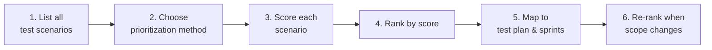
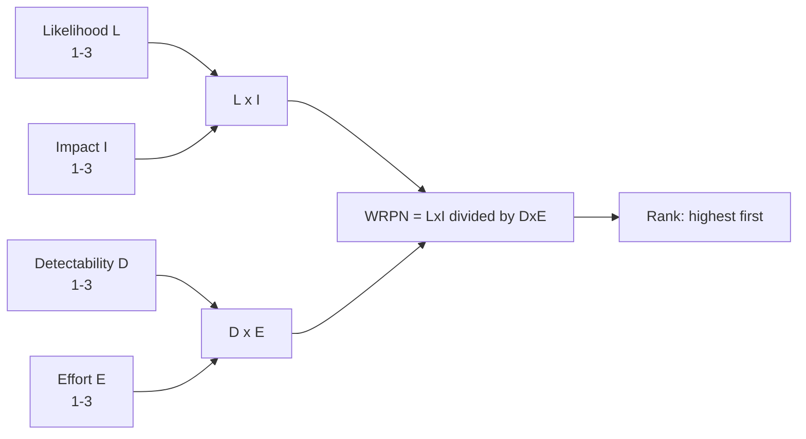
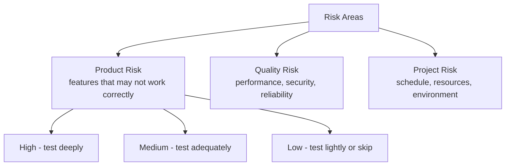
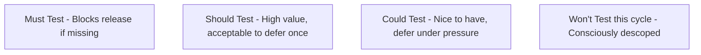
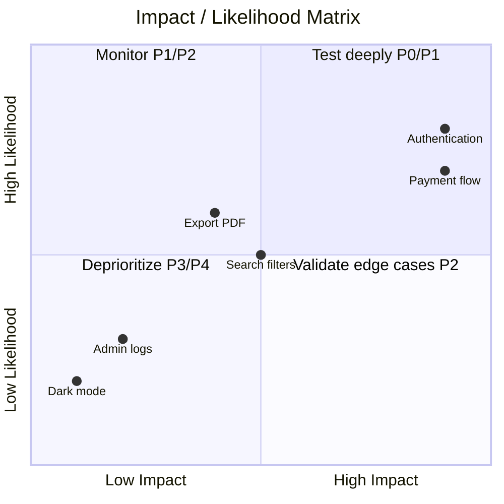
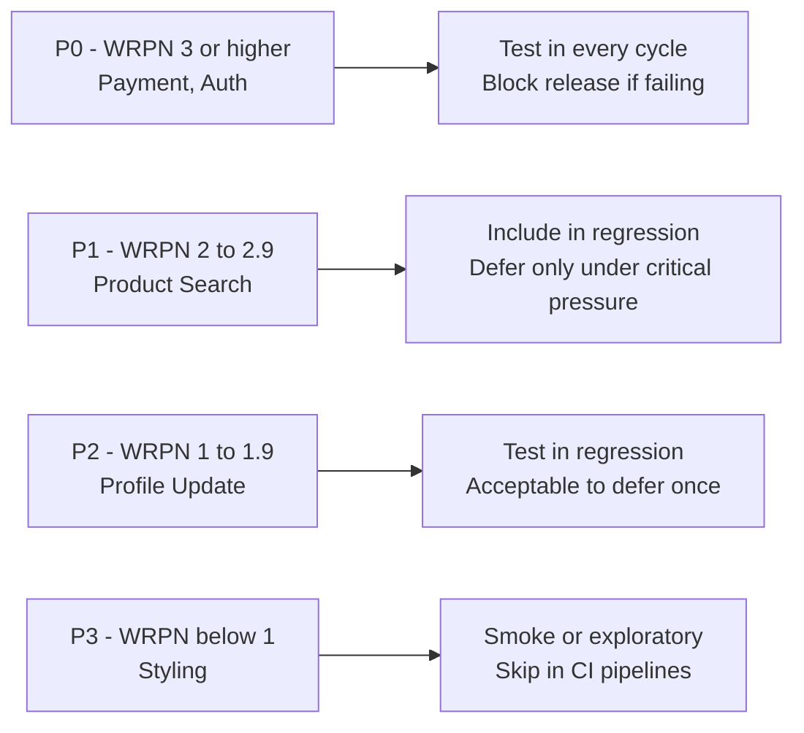
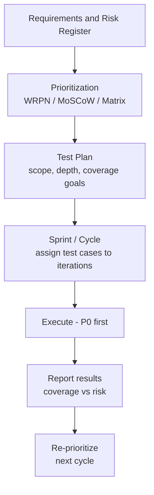

# 🎯 Test Prioritization — A Practical QA Guide

> *"You can't test everything. The skill is knowing what to test first."*

This guide covers the frameworks, formulas, and decision-making models that QA engineers use to prioritize test scenarios under time and resource constraints. It includes WRPN, risk-based testing, the MoSCoW method, the Impact/Likelihood matrix, worked examples, and integration with the test planning process.

Intended audience: QA engineers, test leads, product owners, engineering managers.

---

## 📚 Table of Contents

1. [🎯 Why Prioritization Matters](#-why-prioritization-matters)
2. [🗺️ The Prioritization Workflow](#-the-prioritization-workflow)
3. [🧮 Prioritization Methods Overview](#-prioritization-methods-overview)
4. [💰 WRPN — Weighted Risk Priority Number](#-wrpn--weighted-risk-priority-number)
5. [⚠️ Risk-Based Testing](#-risk-based-testing)
6. [🟩 MoSCoW Method](#-moscow-method)
7. [🔥 Impact / Likelihood Matrix](#-impact--likelihood-matrix)
8. [📊 Worked Example — Applying WRPN](#-worked-example--applying-wrpn)
9. [🔗 Integration with Test Planning](#-integration-with-test-planning)
10. [⚠️ Common Pitfalls](#-common-pitfalls)
11. [✅ Best Practices](#-best-practices)
12. [📚 References](#-references)

---

## 🎯 Why Prioritization Matters

No project has unlimited time or testers. Without a structured approach, teams default to testing what is easiest, most familiar, or most recently changed — leaving high-risk areas uncovered.

A prioritization framework gives you:

- 🛡️ **Risk coverage** — critical paths and high-impact areas tested first.
- ⏱️ **Time efficiency** — effort spent where it matters most.
- 📊 **Objective justification** — data-backed decisions, not gut feeling.
- 🔄 **Adaptability** — re-rank quickly when scope or deadlines change.
- 🤝 **Stakeholder alignment** — shared language for what "most important" means.

---

## 🗺️ The Prioritization Workflow

> 💡 Prioritization is not a one-time activity. Re-evaluate whenever requirements change, new risks emerge, or time pressure increases.

---

## 🧮 Prioritization Methods Overview

| Method | Best for | Inputs required | Output |
|--------|----------|-----------------|--------|
| **WRPN** | Quantitative risk scoring across many scenarios | L, I, D, E ratings | Numeric rank |
| **Risk-Based Testing** | Coverage decisions tied to product risk areas | Risk register, domain knowledge | Risk-tiered test suite |
| **MoSCoW** | Sprint / release scope decisions | Business priorities | Must / Should / Could / Won't buckets |
| **Impact / Likelihood Matrix** | Quick visual triage | Impact and likelihood estimates | 2x2 quadrant placement |
| **Coverage-first** | Regression suites on stable products | Code/feature map | Priority by coverage gap |

Choose the method that fits your team's maturity and the time available. WRPN is the most rigorous; MoSCoW and the matrix are faster for sprint planning.

---

## 💰 WRPN — Weighted Risk Priority Number

### What Is WRPN?

WRPN is a quantitative model that scores each test scenario on four factors and produces a single priority number. It adapts the FMEA (Failure Mode and Effects Analysis) approach for software testing.

### The Formula

$$WRPN = \frac{L \times I}{D \times E}$$

| Factor | Symbol | Question it answers |
|--------|--------|---------------------|
| **Likelihood of Failure** | L | How probable is it that this feature will fail? |
| **Impact of Failure** | I | How severe are the consequences if it does fail? |
| **Detectability** | D | How easily would users or tests catch the failure? |
| **Effort to Test** | E | How much time/resource does testing this scenario cost? |

> A **higher WRPN = higher priority**. High likelihood and impact drive the score up; high detectability and high effort drive it down.

### Scoring Scale

| Score | Likelihood (L) | Impact (I) | Detectability (D) | Effort (E) |
|-------|---------------|------------|-------------------|------------|
| **3** | High — likely to fail | Critical — data loss, security, payments | Hard to detect — silent failure | High — complex multi-step test |
| **2** | Medium — occasionally fails | Moderate — feature broken, UX degraded | Medium — needs manual investigation | Medium — moderate test complexity |
| **1** | Low — rarely fails | Low — cosmetic, minor inconvenience | Easy — immediate visible feedback | Low — simple, fast to test |

### Calculation Flow

---

## ⚠️ Risk-Based Testing

Risk-based testing prioritizes the test suite by identifying **what could go wrong** and **what the consequences would be**, then allocating more testing effort to the highest-risk areas.

### Risk Categories

### Risk Assessment Table

| Risk Area | Likelihood | Impact | Risk Level | Test Depth |
|-----------|-----------|--------|------------|------------|
| Payment processing | High | Critical | P0 | Full regression + exploratory |
| User authentication | High | Critical | P0 | Full regression |
| Core business workflow | Medium | High | P1 | Happy path + key edge cases |
| Search / filtering | Medium | Medium | P2 | Happy path + boundary values |
| Report export | Low | Medium | P2 | Smoke + format validation |
| Admin settings | Low | Low | P3 | Smoke only |
| Tooltip / help text | Low | Low | P4 | Visual check, skip in CI |

---

## 🟩 MoSCoW Method

MoSCoW categorizes test scenarios (or features) into four buckets to support release and sprint scope decisions.

| Bucket | Definition | Examples |
|--------|------------|---------|
| **Must** | Non-negotiable — release is blocked without these passing | Login, checkout, critical data integrity |
| **Should** | Important — should be included unless time is critically short | Profile editing, email notifications |
| **Could** | Low priority — included if time allows | Dark mode, keyboard shortcuts |
| **Won't** | Explicitly out of scope for this cycle — document the decision | Legacy browser compatibility |

> 💡 "Won't" is not "never" — it means "not this sprint/release". Always document why it was deferred.

---

## 🔥 Impact / Likelihood Matrix

The 2x2 matrix is the fastest visual tool for risk-based prioritization in a team session.

| Quadrant | Impact | Likelihood | Action |
|----------|--------|------------|--------|
| High Impact + High Likelihood | High | High | Test first, full coverage |
| High Impact + Low Likelihood | High | Low | Validate key paths, targeted edge cases |
| Low Impact + High Likelihood | Low | High | Monitor, lightweight coverage |
| Low Impact + Low Likelihood | Low | Low | Minimal or deferred testing |

---

## 📊 Worked Example — Applying WRPN

Scenario: an e-commerce checkout flow with five test areas.

 

 

### Scoring Table

| Test Scenario | L | I | D | E | WRPN = (LxI)/(DxE) | Priority |
|---------------|---|---|---|---|---------------------|---------|
| Payment processing | 3 | 3 | 3 | 1 | (3x3)/(3x1) = **3.00** | P0 |
| User authentication | 2 | 3 | 2 | 1 | (2x3)/(2x1) = **3.00** | P0 |
| Product search | 2 | 2 | 2 | 2 | (2x2)/(2x2) = **1.00** | P1 |
| Profile update | 1 | 2 | 1 | 2 | (1x2)/(1x2) = **1.00** | P2 |
| Button styling | 1 | 1 | 1 | 1 | (1x1)/(1x1) = **1.00** | P3 |

### Reading the Results

> 💡 When two scenarios share the same WRPN, break the tie by **Impact** — higher impact wins.

---

## 🔗 Integration with Test Planning

Prioritization outputs feed directly into your test plan and sprint work.

### Mapping Priorities to Test Types

| Priority | Test types to apply | Automation target |
|----------|--------------------|--------------------|
| **P0** | Functional, regression, boundary, security | Automate — run every PR |
| **P1** | Functional, regression, exploratory | Automate — run nightly |
| **P2** | Happy path, boundary | Automate in next sprint |
| **P3** | Smoke, exploratory | Manual or skip |
| **P4** | Visual / exploratory only | Manual when capacity allows |

### Re-prioritization Triggers

Re-run your prioritization process when:
- A new feature or requirement is added.
- A high-severity bug is found in production.
- The release date moves up (scope cut needed).
- A third-party dependency changes behavior.
- Post-release telemetry reveals unexpected usage patterns.

---

## ⚠️ Common Pitfalls

| Pitfall | Better approach |
|---------|----------------|
| Testing what is easy, not what is risky | Use WRPN or the risk matrix to challenge assumptions |
| Treating all tests as equal priority | Explicit P0-P4 labels force honest trade-offs |
| Never revisiting priorities once set | Re-prioritize at the start of each sprint/cycle |
| Skipping Won't Test documentation | Always record what was descoped and why |
| Automating P3/P4 before P0/P1 | Automate highest-risk scenarios first |
| Using only one method for all contexts | Use WRPN for detailed scoring; MoSCoW for sprint scoping |
| Ignoring detectability in WRPN | Silent failures (low D) are more dangerous than visible ones |

---

## ✅ Best Practices

- 🧮 **Use WRPN for quantitative decisions** — it removes subjectivity from prioritization conversations.
- 🗺️ **Map risk areas to business impact** — tie test priorities to what matters most to users and the business.
- 🏷️ **Label every test case** with its priority (P0–P4) so CI and reporting can filter by it.
- 🔄 **Re-prioritize every sprint** — priorities rot as requirements change.
- 📝 **Document Won't Test decisions** — makes trade-offs visible and reversible.
- 🤝 **Involve stakeholders** — product owners and devs have context QA may lack.
- 🔗 **Link to traceability** — each priority maps back to a requirement or risk.
- 🚀 **Automate P0 first** — if you can only automate one thing, it should be the highest-risk scenario.
- 📊 **Report coverage by priority** — "100% P0 tests passing" is more meaningful than "85% overall".

---

## 📚 References

- ISTQB Glossary — [glossary.istqb.org](https://glossary.istqb.org)
- FMEA (Failure Mode and Effects Analysis) — basis for the WRPN formula
- Related docs: [testPlan.md](testPlan.md) · [traceability.md](traceability.md) · [bugLifeCycle.md](bugLifeCycle.md) · [qaTestingReport.md](qaTestingReport.md) · [testingPrinciples.md](testingPrinciples.md)
