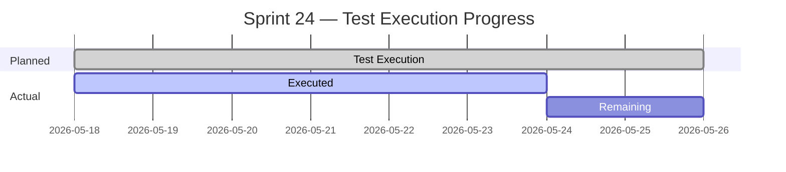
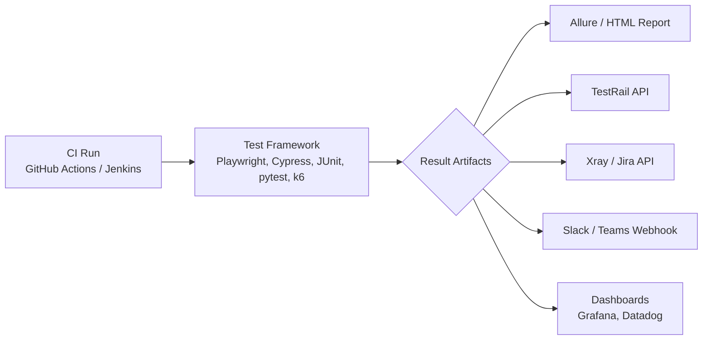

# 📄 QA Testing Reports — A Complete Guide

> *"You can't improve what you don't measure, and you can't measure what you don't report."*

This guide covers **QA reporting from end to end**: ISTQB terminology, report types (defects, test summaries, performance, security, exploratory, release readiness), templates, examples, and **automation/integration** with tools like **TestRail, Xray, Jira, Slack, Microsoft Teams, Allure, and GitHub Actions**.

---

## 📚 Table of Contents

1. [ISTQB Terminology You Must Know](#-istqb-terminology-you-must-know)
2. [Types of QA Reports](#-types-of-qa-reports)
3. [🐞 Defect / Bug Report](#-defect--bug-report)
4. [📊 Test Summary Report (TSR)](#-test-summary-report-tsr)
5. [📈 Test Progress Report](#-test-progress-report)
6. [⚡ Performance Test Report](#-performance-test-report)
7. [🛡️ Security Test Report](#-security-test-report)
8. [🧭 Exploratory Testing Report (Session-Based)](#-exploratory-testing-report-session-based)
9. [🚦 Release Readiness Report](#-release-readiness-report)
10. [🤖 Reporting Automation & Integrations](#-reporting-automation--integrations)
11. [📐 Useful QA Metrics & KPIs](#-useful-qa-metrics--kpis)
12. [✅ Best Practices](#-best-practices)
13. [📚 References](#-references)

---

## 📖 ISTQB Terminology You Must Know

Using the correct vocabulary makes reports unambiguous and professional.

| Term            | ISTQB Definition (paraphrased)                                                                                       |
| --------------- | -------------------------------------------------------------------------------------------------------------------- |
| **Error**       | A human action that produces an incorrect result (e.g., a developer's mistake).                                       |
| **Defect / Bug**| A flaw in a component or system that can cause it to fail to perform its required function. Synonymous with *bug*.    |
| **Failure**     | An event in which a component or system does not perform a required function within specified limits.                |
| **Root Cause**  | A source of a defect such that if it is removed, the defect is decreased or removed.                                  |
| **Severity**    | The degree of impact of a defect on the system or stakeholders.                                                      |
| **Priority**    | The level of business importance assigned to fixing the defect.                                                      |
| **Incident**    | Any event occurring during testing that requires investigation.                                                      |
| **Test Item**   | The work product to be tested.                                                                                       |
| **Coverage**    | The degree to which specified coverage items have been exercised by a test suite.                                    |
| **Exit Criteria**| The set of conditions agreed upon to officially complete a process/phase.                                            |

> 💡 **Error → Defect → Failure**: a human *error* introduces a *defect* in the code; when executed, the defect causes a *failure*.

---

## 🗂️ Types of QA Reports

| Report                       | Audience                | Frequency           | Purpose                                            |
| ---------------------------- | ----------------------- | ------------------- | -------------------------------------------------- |
| **Defect / Bug Report**      | Devs, QA, PM            | On-demand           | Track and resolve individual defects               |
| **Test Progress Report**     | QA Lead, PM             | Daily / weekly      | Show progress vs plan                              |
| **Test Summary Report (TSR)**| Stakeholders            | End of test cycle   | Summarize results & quality status (IEEE 829)      |
| **Performance Test Report**  | Devs, SRE, Architects   | Per perf cycle      | Communicate load/stress results                    |
| **Security Test Report**     | Security, Devs, Compliance | Per assessment   | Document vulnerabilities                           |
| **Exploratory Session Sheet**| QA team                 | Per session         | Capture findings of session-based testing          |
| **Release Readiness Report** | Stakeholders, Mgmt      | Per release         | Go / No-Go decision                                |
| **Daily Status / Standup**   | Team                    | Daily               | Quick visibility                                   |

---

## 🐞 Defect / Bug Report

A good defect report is **clear, reproducible, and actionable**.

### 🧩 Required Fields

| Field             | Description                                                                 |
| ----------------- | --------------------------------------------------------------------------- |
| **ID**            | Unique identifier (auto-generated in Jira/Xray/TestRail).                    |
| **Title**         | One-line summary (`[Module] Short symptom`).                                 |
| **Type**          | Bug / Defect / Improvement / Task.                                           |
| **Environment**   | OS, browser, device, build version, environment (dev/stage/prod).            |
| **Preconditions** | What must be true before reproducing.                                       |
| **Steps to Reproduce** | Numbered, deterministic.                                               |
| **Expected Result** | What the system *should* do (per spec).                                    |
| **Actual Result** | What actually happened.                                                     |
| **Severity**      | Critical / High / Medium / Low (technical impact).                           |
| **Priority**      | P1 / P2 / P3 / P4 (business impact).                                         |
| **Attachments**   | Screenshots, videos, logs, HAR files, network traces.                        |
| **Reporter / Assignee** | People accountable.                                                    |
| **Linked items**  | User story, requirement, test case.                                          |
| **Root cause**    | Filled after analysis (Code / Config / Data / Requirement / Environment).    |

### ⚖️ Severity vs Priority

| Severity ↓ / Priority → | **P1 (Now)**          | **P2 (Next sprint)**     | **P3 / P4 (Backlog)**     |
| ----------------------- | --------------------- | ------------------------ | ------------------------- |
| **Critical**            | Production outage      | Rare combo               | Almost never              |
| **High**                | Major feature broken   | Important workaround     | Edge case                 |
| **Medium**              | Annoying but workable  | Common                   | Cosmetic w/ frequency     |
| **Low**                 | Rare                   | Sometimes                | Typo, minor UI            |

### 📝 Example Bug Report

> **ID:** WEB-1284
> **Title:** `[Signup] Submit fails when phone field is left empty although marked optional`
> **Type:** Bug · **Severity:** High · **Priority:** P2
> **Environment:** Chrome 124, Windows 11, build `web@2.18.0`, env `staging`
>
> **Preconditions:** User is on `/signup`, not logged in.
>
> **Steps to Reproduce:**
> 1. Open `https://stg.example.com/signup`.
> 2. Fill Name, Email, Password.
> 3. Leave **Phone Number** empty (field labeled *optional*).
> 4. Click **Submit**.
>
> **Expected:** Form submits, user redirected to `/welcome`.
> **Actual:** Form does not submit, error: *"Please fill out all required fields."*
>
> **Attachments:** [screenshot.png], [network.har], [console.log]
> **Linked Story:** STORY-901 · **Test case:** TC-5527

---

## 📊 Test Summary Report (TSR)

A **Test Summary Report** (IEEE 829 / ISTQB) is produced at the **end of a test level or cycle** to summarize testing activities and results.

### 🧱 Standard Sections

1. **Test Summary Identifier** – ID & version.
2. **Summary** – What was tested, scope, and high-level outcome.
3. **Variances** – Deviations from the test plan.
4. **Comprehensiveness Assessment** – Coverage achieved vs planned.
5. **Summary of Results** – # tests passed/failed/blocked/skipped; defects opened/closed.
6. **Evaluation** – Overall quality verdict against exit criteria.
7. **Summary of Activities** – Effort, resources, schedule.
8. **Approvals** – Sign-off section.

### 📋 Example Snapshot

| Metric                  | Planned | Actual | Status |
| ----------------------- | ------- | ------ | ------ |
| Test cases executed     | 320     | 318    | 🟢     |
| Pass rate               | ≥ 95%   | 96.8%  | 🟢     |
| Critical defects open   | 0       | 0      | 🟢     |
| High defects open       | ≤ 2     | 1      | 🟢     |
| Requirements coverage   | 100%    | 100%   | 🟢     |
| Automation coverage     | ≥ 70%   | 74%    | 🟢     |

> ✅ **Exit criteria met — recommend release.**

---

## 📈 Test Progress Report

Short, recurring report (often **daily** or **weekly**) used during execution.

### Key Content

- ✅ Tests executed today / this week
- 🐞 New defects vs closed defects
- 🛑 Blockers / risks
- 📊 Burn-down of remaining test cases
- 📅 Forecast for completion



---

## ⚡ Performance Test Report

Generated after **load, stress, spike, soak, or endurance** tests (typically with **k6, JMeter, Gatling, Locust**).

### 📦 Required Sections

| Section                | Content                                                              |
| ---------------------- | -------------------------------------------------------------------- |
| **Objective**          | E.g., "Validate API can handle 1k RPS with p95 < 500ms".              |
| **Test type**          | Load / Stress / Spike / Soak / Endurance / Scalability.               |
| **Workload model**     | Virtual users, ramp-up, scenarios, think time.                        |
| **Environment**        | Hardware, network, DB size, mocks, dataset version.                   |
| **Tools used**         | k6, JMeter, Grafana, Prometheus, New Relic, Datadog.                  |
| **Key metrics**        | RPS, throughput, latency (p50/p90/p95/p99), error rate, CPU, memory.   |
| **Observations**       | Bottlenecks, saturation points, anomalies.                            |
| **Recommendations**    | Caching, indexing, autoscaling, code optimizations.                   |
| **Verdict**            | Pass / Fail vs SLAs/SLOs.                                             |

### 📊 Example Result Table

| Scenario           | VUs   | Duration | RPS  | p95 (ms) | Error % | Verdict |
| ------------------ | ----- | -------- | ---- | -------- | ------- | ------- |
| Login              | 500   | 10 min   | 480  | 320      | 0.02%   | 🟢 Pass |
| Search             | 1000  | 15 min   | 940  | 610      | 0.18%   | 🟡 Warn |
| Checkout           | 250   | 10 min   | 230  | 980      | 1.4%    | 🔴 Fail |

> 🔍 **Bottleneck:** Checkout service DB connection pool saturates at ~200 RPS.

📖 See also: [k6-performance-testing.md](k6-performance-testing.md) · [performanceTests.md](performanceTests.md)

---

## 🛡️ Security Test Report

Documents findings from **SAST, DAST, dependency scans, or pentests** (OWASP ZAP, Burp Suite, SonarQube, Snyk, Trivy).

### 🔑 Sections

1. Scope and methodology (e.g., OWASP Top 10, ASVS level).
2. Tools used.
3. Findings by severity (CVSS score).
4. Reproduction steps & evidence.
5. Remediation recommendations.
6. Re-test results.

| CVE / Finding           | CVSS | Severity  | Status     |
| ----------------------- | ---- | --------- | ---------- |
| SQL Injection in `/api/search` | 9.1  | Critical  | 🟢 Fixed  |
| Missing HSTS header      | 5.3  | Medium    | 🟡 Open   |
| Outdated `lodash@4.17.15`| 7.5  | High      | 🟢 Fixed  |

---

## 🧭 Exploratory Testing Report (Session-Based)

Captured per **time-boxed session** (typically 60–90 min) using the **Session-Based Test Management (SBTM)** model.

```text
CHARTER:    Explore checkout flow with international payment methods
            using emulated low-bandwidth, to discover usability and
            currency-conversion issues.
TESTER:     Bruno
DURATION:   75 min
COVERAGE:   Checkout · Payment · Currency
SETUP:      Stage build 2.18.0, Chrome 124, throttled 3G

NOTES:
- Currency selector defaults to USD even for EUR locale.
- Saved card flow fails silently when CVV omitted (no inline error).
- Page becomes unresponsive while Stripe iframe loads.

BUGS:       3 (logged as WEB-1290, WEB-1291, WEB-1292)
ISSUES:     1 (test data for IN locale missing)
%SESSION:   60% test design, 30% bug investigation, 10% setup
```

---

## 🚦 Release Readiness Report

Used by stakeholders to make a **Go / No-Go decision**.

| Quality Gate                | Target            | Actual          | Status |
| --------------------------- | ----------------- | --------------- | ------ |
| Critical defects open       | 0                 | 0               | 🟢     |
| Regression pass rate        | ≥ 98%             | 99.1%           | 🟢     |
| Performance SLOs            | p95 < 500ms       | 410ms           | 🟢     |
| Security scan               | No critical/high  | 1 high open     | 🟡     |
| Documentation updated       | Yes               | Yes             | 🟢     |
| Rollback plan tested        | Yes               | Pending         | 🔴     |

> **Recommendation:** ⏸️ *Hold release until rollback test is signed off.*

---

## 🤖 Reporting Automation & Integrations

Manual reports don't scale. Modern QA integrates reporting **directly into the pipeline**.



### 🧪 TestRail Integration

- **API key + project ID** stored as CI secret.
- Each automated test maps to a TestRail **Case ID** (e.g., via `@C1234` tag).
- After the run, push results to a **Test Run** with status (Passed / Failed / Blocked / Retest).
- Tools: [`trcli`](https://github.com/gurock/trcli), `testrail-api` npm package, `pytest-testrail`.

```yaml
# .github/workflows/e2e.yml (snippet)
- name: Push results to TestRail
  run: |
    trcli -y \
      -h "$TR_URL" -u "$TR_USER" -k "$TR_KEY" \
      --project "Web" \
      parse_junit -f "results/junit.xml" \
      --title "CI Run #${{ github.run_number }}"
```

### 🐞 Xray (Jira) Integration

- Xray lives **inside Jira** and supports importing results from JUnit, TestNG, Cucumber, Robot, NUnit, etc.
- Use the **Xray REST API** or the official **GitHub Action `mikepenz/xray-action`**.
- Auto-create defects from failing tests via Jira **automation rules**.

```bash
curl -H "Content-Type: application/xml" -X POST \
  -H "Authorization: Bearer $XRAY_TOKEN" \
  --data @results/junit.xml \
  "https://xray.cloud.getxray.app/api/v2/import/execution/junit?projectKey=WEB"
```

### 💬 Slack Webhook Notifications

Send a summary message at the end of every CI run.

```bash
curl -X POST -H 'Content-type: application/json' \
  --data "{
    \"text\": \":white_check_mark: *E2E run #${BUILD_ID}* — 312 passed, 6 failed, 2 skipped\nReport: ${REPORT_URL}\"
  }" \
  "$SLACK_WEBHOOK_URL"
```

Tips:
- Use **Slack Block Kit** for rich messages (buttons, fields).
- Mention `@qa-team` only on failures to avoid noise.
- Post to a dedicated `#qa-ci` channel; keep alerts actionable.

### 🟣 Microsoft Teams Webhook

```bash
curl -H "Content-Type: application/json" \
  -d '{"text":"❌ Build #482 failed: 4 regressions in Checkout"}' \
  "$TEAMS_WEBHOOK_URL"
```

### 📧 Email Reports

- Use SendGrid / SES / SMTP from CI.
- Useful for **executive weekly summaries**, not for noisy per-run alerts.

### 📊 Allure & Custom HTML Reports

- **Allure** aggregates results across runs with history, trends, flaky tests, and steps.
- Publish to **GitHub Pages**, **S3**, or **Netlify** for easy sharing.
- Playwright, Cypress, JUnit, pytest, and k6 all have Allure adapters.

### 📈 Dashboards

| Tool         | Use                                                       |
| ------------ | --------------------------------------------------------- |
| **Grafana**  | Live dashboards for k6, Prometheus, test pass-rate trends. |
| **Datadog**  | APM + synthetic + test results in one place.               |
| **Kibana**   | Search and visualize test logs.                            |
| **ReportPortal** | Real-time AI-assisted test analytics.                  |

📖 See also: [pwRepoIntegration.md](pwRepoIntegration.md)

---

## 📐 Useful QA Metrics & KPIs

| Metric                          | Formula / Definition                                                |
| ------------------------------- | ------------------------------------------------------------------- |
| **Defect Density**              | Defects / KLOC or per module                                         |
| **Defect Detection Percentage (DDP)** | Defects found in testing / (testing + production) × 100        |
| **Defect Removal Efficiency (DRE)** | Pre-release defects / total defects × 100                        |
| **Test Case Effectiveness**     | Defects detected by tests / total defects × 100                      |
| **Pass Rate**                   | Passed / executed × 100                                              |
| **Automation Coverage**         | Automated tests / total tests × 100                                  |
| **MTTD / MTTR**                 | Mean time to detect / recover                                        |
| **Flaky Test Rate**             | Flaky tests / total automated × 100                                  |
| **Escaped Defects**             | Defects found in production after release                            |

---

## ✅ Best Practices

- 📌 **One report, one purpose** — don't mix bugs, status, and metrics.
- 🔁 **Automate everything repetitive** — humans only summarize and decide.
- 🎯 **Use objective exit criteria** — avoid subjective "feels stable".
- 🧠 **Distinguish severity from priority** — they are independent dimensions.
- 📷 **Attach evidence** — screenshots, videos, HARs, logs, traces.
- 🔗 **Link traceability** — requirement ↔ test case ↔ defect ↔ build.
- 🗣️ **Tailor the audience** — execs want trends; devs want stack traces.
- 🧪 **Track flaky tests** — quarantine, don't ignore.
- 🕒 **Be timely** — a late report is a useless report.
- 🏷️ **Standardize templates** — consistency across teams improves readability.

---

## 📚 References

- ISTQB® **Foundation Level Syllabus** — Test management, incident reporting, exit criteria
- ISTQB® **Glossary** — [glossary.istqb.org](https://glossary.istqb.org/)
- IEEE **829-2008** — Standard for Software Test Documentation
- OWASP **Testing Guide** — [owasp.org/www-project-web-security-testing-guide](https://owasp.org/www-project-web-security-testing-guide/)
- TestRail Docs — [support.gurock.com](https://support.gurock.com/)
- Xray Documentation — [docs.getxray.app](https://docs.getxray.app/)
- Slack API – Incoming Webhooks — [api.slack.com/messaging/webhooks](https://api.slack.com/messaging/webhooks)
- Allure Framework — [allurereport.org](https://allurereport.org/)
- Grafana k6 — [grafana.com/docs/k6](https://grafana.com/docs/k6/)

### 🔗 Related in this Repo

- [bugLifeCycle.md](bugLifeCycle.md)
- [prioritization.md](prioritization.md)
- [testPlan.md](testPlan.md)
- [testProcessISTQB.md](testProcessISTQB.md)
- [k6-performance-testing.md](k6-performance-testing.md)
- [pwRepoIntegration.md](pwRepoIntegration.md)
- [automationDecision.md](automationDecision.md)

---

<p align="center"><i>📘 Report clearly. Decide confidently. Ship safely.</i></p>
