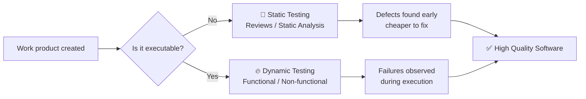

# 🧪 Static Testing vs Dynamic Testing — The ISTQB Way

> *"Testing is not only about executing tests. It starts much earlier."*
> — ISTQB Foundation Level Syllabus

This guide explains the **difference between Static Testing and Dynamic Testing** using the **official ISTQB definitions**, with tables, examples, and interactive sections.

---

## 📚 Table of Contents

1. [What ISTQB Says](#-what-istqb-says)
2. [Static Testing in Depth](#-static-testing-in-depth)
3. [Dynamic Testing in Depth](#-dynamic-testing-in-depth)
4. [Side-by-Side Comparison](#-side-by-side-comparison)
5. [Examples You Can Try](#-examples-you-can-try)
6. [When to Use Which?](#-when-to-use-which)
7. [Quick Quiz](#-quick-quiz-test-yourself)
8. [Key Takeaways](#-key-takeaways)
9. [References](#-references)

---

## 📖 What ISTQB Says

<table>
<tr>
<th>Term</th>
<th>ISTQB Definition</th>
</tr>
<tr>
<td><b>Static Testing</b></td>
<td><i>"Testing of a work product without code execution."</i> It includes <b>reviews</b> and <b>static analysis</b> performed on work products such as requirements, design specifications, source code, test cases, or user stories.</td>
</tr>
<tr>
<td><b>Dynamic Testing</b></td>
<td><i>"Testing that involves the execution of the software of a test object."</i> The test object is run with specific inputs and its actual behavior is compared to expected behavior.</td>
</tr>
</table>

> 💡 **The fundamental difference:**
> **Static = no execution.** **Dynamic = execution required.**

---

## 🔍 Static Testing in Depth

<details>
<summary><b>👉 Click to expand: What is Static Testing?</b></summary>

Static Testing examines work products **without running the code**. It is typically performed **early** in the SDLC, making it one of the cheapest ways to detect defects.

### 🛠️ Two Main Techniques (per ISTQB)

| Technique           | Description                                                                       | Tools / Examples                            |
| ------------------- | --------------------------------------------------------------------------------- | ------------------------------------------- |
| **Reviews**         | Manual examination of work products by people (peers, authors, moderators).        | Informal review, walkthrough, technical review, inspection |
| **Static Analysis** | Automated examination of code or models, without executing them.                   | SonarQube, ESLint, Checkstyle, PMD, Coverity |

### 📝 Work Products That Can Be Statically Tested

- ✅ Requirements (user stories, specifications)
- ✅ Design documents and architecture diagrams
- ✅ Source code
- ✅ Test plans and test cases
- ✅ User documentation
- ✅ Contracts, models, configuration files

### 🐞 Typical Defects Found

- Deviations from coding standards
- Security vulnerabilities (e.g., SQL injection patterns)
- Undefined variables / unreachable (dead) code
- Inconsistencies / contradictions in requirements
- Non-compliance with design rules
- Ambiguous or missing acceptance criteria

</details>

---

## ⚙️ Dynamic Testing in Depth

<details>
<summary><b>👉 Click to expand: What is Dynamic Testing?</b></summary>

Dynamic Testing **executes the software** with defined inputs and verifies that the **actual behavior** matches the **expected behavior**.

### 🛠️ Main Categories

| Category               | Purpose                                              | Example                                   |
| ---------------------- | ---------------------------------------------------- | ----------------------------------------- |
| **Functional Testing** | Does the system do what it should?                   | Login returns correct response             |
| **Non-Functional**     | How well does it perform?                            | Load testing, security testing, usability  |
| **White-box**          | Based on internal structure (code, paths).            | Branch coverage, statement coverage        |
| **Black-box**          | Based on specifications (no internal knowledge).      | Equivalence partitioning, boundary values  |
| **Experience-based**   | Leverages tester intuition and experience.            | Exploratory testing, error guessing        |

### 🐞 Typical Defects Found

- Functional bugs (wrong output)
- Performance bottlenecks (slow response, memory leaks)
- Crashes / unhandled exceptions
- Integration failures between components
- Usability problems
- Security flaws triggered at runtime

</details>

---

## ⚖️ Side-by-Side Comparison

| 🔎 Aspect                  | 🧊 Static Testing                                    | 🔥 Dynamic Testing                                  |
| -------------------------- | --------------------------------------------------- | -------------------------------------------------- |
| **Code execution?**        | ❌ No                                                | ✅ Yes                                              |
| **When in SDLC**           | Early (requirements, design, code)                  | After build is available                           |
| **Cost of fixing defects** | 💲 Low — caught early                                | 💲💲💲 Higher — found later                          |
| **Main techniques**        | Reviews, static analysis                            | Functional, non-functional, structural testing     |
| **Verifies**               | *Are we building it right?* (verification)          | *Are we building the right thing?* (validation)    |
| **Performed by**           | Authors, peers, architects, automated tools         | Testers, developers, QA automation                 |
| **Typical artifacts**      | Requirements, designs, code, test cases             | Executable application, APIs, services             |
| **Detects**                | Defects in **work products**                        | Failures in **runtime behavior**                   |
| **Examples of tools**      | SonarQube, ESLint, Checkstyle                       | Playwright, JUnit, k6, Selenium, Postman           |

---

## 💡 Examples You Can Try

### 🧊 Example 1 — Static Testing finds dead code

```python
def process_payment(amount):
    if amount > 0:
        print("Payment processed.")
    return
    print("This line will never run!")  # ⚠️ Dead code
```

A **static analyzer** flags the unreachable `print` — **no execution needed**.

---

### 🔥 Example 2 — Dynamic Testing finds a runtime bug

```python
def divide(a, b):
    return a / b
```

Static analysis says: *looks fine*. ✅
But **dynamic testing** with `divide(10, 0)` reveals a `ZeroDivisionError`. ❌

---

### 🧊 + 🔥 Example 3 — Both work together

| Stage     | Activity                                  | Finds                              |
| --------- | ----------------------------------------- | ---------------------------------- |
| Static    | Review of login user story                | Missing requirement for lockout    |
| Static    | Lint scan on `login.py`                   | Hardcoded credentials              |
| Dynamic   | Functional test of login API              | Wrong error code on invalid input  |
| Dynamic   | Load test with 1000 concurrent users      | Response time degrades to 8s       |

> 🎯 **Best practice:** combine both throughout the lifecycle.

---

## 🧭 When to Use Which?



---

## 🎯 Quick Quiz — Test Yourself!

<details>
<summary><b>Q1.</b> A team performs a walkthrough of the requirements document. Static or Dynamic?</summary>

✅ **Static Testing** — no code is being executed; a work product is being reviewed.
</details>

<details>
<summary><b>Q2.</b> Running 500 virtual users against an API to measure response time. Static or Dynamic?</summary>

✅ **Dynamic Testing** — the software is executed under load (a non-functional test).
</details>

<details>
<summary><b>Q3.</b> SonarQube flags a possible null pointer dereference without running the app. Static or Dynamic?</summary>

✅ **Static Testing** — it is **static analysis**, an automated form of static testing.
</details>

<details>
<summary><b>Q4.</b> A tester runs exploratory testing in the staging environment. Static or Dynamic?</summary>

✅ **Dynamic Testing** — experience-based dynamic test technique.
</details>

<details>
<summary><b>Q5.</b> Which type typically finds defects <i>earlier</i> and <i>cheaper</i>?</summary>

✅ **Static Testing** — defects are found before execution, often before code is written.
</details>

---

## 🏁 Key Takeaways

> 🧊 **Static Testing** = examine work products **without** executing code
> → Reviews + Static Analysis
> → Finds defects in **requirements, design, code, tests**
> → Cheap, early, prevents defects

> 🔥 **Dynamic Testing** = examine behavior **by** executing the software
> → Functional, non-functional, structural, experience-based
> → Finds **failures** during execution
> → Validates that the system actually works

> 🤝 **They are complementary — not alternatives.** A mature QA strategy uses **both**.

---

## 📚 References

- ISTQB® **Certified Tester Foundation Level Syllabus** (CTFL) — Chapter 3 *Static Testing*, Chapter 4 *Test Techniques*
- ISTQB® **Glossary of Testing Terms** — [glossary.istqb.org](https://glossary.istqb.org/)
- See also in this repo:
  - [softwareTesting.md](softwareTesting.md)
  - [testingPrinciples.md](testingPrinciples.md)
  - [reviewActivities.md](reviewActivities.md)
  - [testProcessISTQB.md](testProcessISTQB.md)

---

<p align="center"><i>📘 Made for QA learners following the ISTQB Foundation Level path.</i></p>
