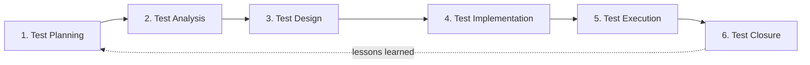
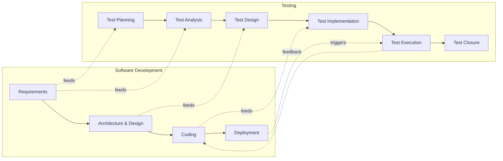

# 🧪 The Software Testing Lifecycle (STLC) — Phases, Activities & Examples

> *"Skip a phase, ship a surprise."*

This guide walks through the **Software Testing Life Cycle (STLC)** — the six practical phases a QA team moves through on every project, every release, and every sprint. For each phase you get the **purpose**, **key activities**, **inputs**, **outputs**, **entry/exit criteria**, a **worked example** (the Login feature), and **common pitfalls** to avoid.

> 💡 The STLC is the **hands-on, lifecycle view** of testing. For the ISTQB-aligned, formal model with seven activities and Test Monitoring & Control as a continuous activity, see [testProcessISTQB.md](testProcessISTQB.md).

---

## 📚 Table of Contents

1. [🎯 What the STLC Is (and Isn't)](#-what-the-stlc-is-and-isnt)
2. [🗺️ The STLC at a Glance](#-the-stlc-at-a-glance)
3. [1️⃣ Test Planning](#1-test-planning)
4. [2️⃣ Test Analysis](#2-test-analysis)
5. [3️⃣ Test Design](#3-test-design)
6. [4️⃣ Test Implementation](#4-test-implementation)
7. [5️⃣ Test Execution](#5-test-execution)
8. [6️⃣ Test Closure](#6-test-closure)
9. [🔁 STLC vs SDLC — How They Align](#-stlc-vs-sdlc--how-they-align)
10. [📊 Summary Table](#-summary-table)
11. [⚠️ Common Pitfalls Across Phases](#-common-pitfalls-across-phases)
12. [✅ Best Practices](#-best-practices)
13. [📚 References](#-references)

---

## 🎯 What the STLC Is (and Isn't)

The **Software Testing Life Cycle** is a structured sequence of QA activities that runs **alongside** development. It ensures that nothing is tested by accident — every test traces back to a requirement, every result back to a build, every defect back to a test.

| The STLC IS…                                  | The STLC IS NOT…                                       |
| --------------------------------------------- | ------------------------------------------------------ |
| A repeatable QA workflow                      | A one-off ceremony before release                       |
| Iterative — repeats per sprint / release      | A waterfall hand-off from dev                          |
| Traceable — every artifact links back         | Free-form "test whatever you remember"                 |
| Risk-driven — depth matches risk              | Equal effort on every feature                          |
| Owned by the **whole team** in Agile          | Owned only by QA                                       |

### Benefits

- 🧭 **Predictability** — every release looks the same on the QA side.
- 🔗 **Traceability** — requirement ↔ test case ↔ result ↔ defect.
- 📊 **Reportable progress** — metrics live at every phase boundary.
- 🛡️ **Reduced escape rate** — defects are caught at the cheapest stage.
- 🤝 **Shared language** — devs, PMs, and QA agree on what "done" means.

---

## 🗺️ The STLC at a Glance

> 💡 The dotted arrow back to Planning is **not optional** — closure feeds the next cycle. That's how the team gets better release after release.

---

## 1️⃣ Test Planning

### Purpose
Decide **what** will be tested, **how**, **by whom**, **when**, and **on what** — and define what "done" looks like.

### Inputs
- Project brief, roadmap, or release scope.
- Requirements / user stories (even if still being written).
- Known risks, regulatory or contractual constraints.
- Team availability and budget.

### Key activities
- Define **scope, objectives, and out-of-scope** items.
- Identify **test levels and types** (unit, integration, system, acceptance; functional, performance, security, accessibility…).
- Choose **tools** (test management, automation, CI integration).
- Estimate **effort, schedule, and milestones**.
- Identify **risks and mitigations**.
- Define **entry and exit criteria** for the cycle.

### Entry criteria
- A release/sprint scope exists.
- Key stakeholders (PM, Tech Lead, QA Lead) are available to align.

### Exit criteria
- **Test Plan** approved and shared.
- Tools, environments, and people booked.

### Outputs (work products)
- **Test Plan** document.
- **Test strategy** / approach.
- **Risk register**.

### 🎯 Example — Login feature
For a new web app, the QA team agrees the scope is "Login via email/password + social providers". They pick **Playwright** for E2E automation, **k6** for load tests on the auth endpoint, plan two sprints of work, and define the exit criterion: *"100% of acceptance criteria covered; no open Critical/High defects."*

### ⚠️ Pitfalls
- Planning in isolation — without the PM and Tech Lead, the plan misses constraints.
- Skipping entry/exit criteria — you'll never know when to stop.
- Treating the plan as a write-once document — it should be revised when scope changes.

📖 See also: [testPlan.md](testPlan.md) · [prioritization.md](prioritization.md) · [automationDecision.md](automationDecision.md)

---

## 2️⃣ Test Analysis

### Purpose
Turn the **what to build** into the **what to test** — identify testable conditions from the test basis.

### Inputs
- Approved Test Plan.
- Requirements, user stories, acceptance criteria, UX flows, API contracts, architecture diagrams.

### Key activities
- Read and **review the test basis** (this is also static testing — defects found here are the cheapest to fix).
- Identify **features and sub-features** to be tested.
- Derive **test conditions** (positive, negative, boundary, non-functional).
- Clarify ambiguities with the PO / Tech Lead.
- **Prioritize** test conditions by risk and business value.
- Capture **traceability** from requirement → test condition.

### Entry criteria
- Test basis available and reasonably stable.

### Exit criteria
- Prioritized list of **test conditions** linked back to the requirements.
- Open questions logged or resolved.

### Outputs (work products)
- **Test conditions** list.
- **Clarification log** / decisions.
- Static-testing defects raised against the test basis.

### 🎯 Example — Login feature
Reading the user story *"As a registered user, I can log in with email and password"*, QA derives test conditions:
- ✅ Valid credentials → dashboard.
- ❌ Invalid password → inline error.
- 🔒 5 failed attempts → account lockout (15 min).
- 📭 Empty fields → field-level validation.
- 🔁 "Forgot password" → magic link flow.
- ♿ Full keyboard navigation + screen-reader labels.

### ⚠️ Pitfalls
- Treating a user story as a test case — it's the **starting point**, not the deliverable.
- Skipping non-functional conditions (a11y, perf, security).
- Not raising static-testing defects when the requirement is ambiguous.

📖 See also: [traceability.md](traceability.md) · [staticVsDynamicTesting_ISTQB.md](staticVsDynamicTesting_ISTQB.md)

---

## 3️⃣ Test Design

### Purpose
Convert **test conditions** into **executable test cases** — with steps, data, and expected results.

### Inputs
- Prioritized test conditions.
- Test design techniques (EP, BVA, decision tables, state transitions, etc.).

### Key activities
- Apply **test design techniques** to derive cases that maximize coverage.
- Specify **steps, test data, and expected results**.
- Define **test environment requirements** (browsers, devices, services, mocks).
- Decide which cases will be **manual vs automated**.
- **Peer-review** the test cases.
- Update **traceability**: requirement → condition → case.

### Entry criteria
- Test conditions defined and prioritized.

### Exit criteria
- Test cases written, reviewed, and ready to implement.
- Test data requirements documented.

### Outputs (work products)
- **Test cases** (manual + automated).
- **Test data specifications**.
- **Environment requirements**.

### 🎯 Example — Login feature
From the test conditions, QA designs cases like:

| ID            | Title                                 | Technique          | Type     |
| ------------- | ------------------------------------- | ------------------ | -------- |
| TC_LOGIN_001  | Valid email + password → dashboard    | Equivalence Partitioning | Manual + auto |
| TC_LOGIN_002  | Invalid password → inline error       | Negative case      | Auto     |
| TC_LOGIN_003  | 5th failed attempt triggers lockout   | Boundary Value Analysis | Auto |
| TC_LOGIN_004  | Empty email → "Email required"        | Field validation   | Auto     |
| TC_LOGIN_005  | Keyboard-only navigation              | Accessibility      | Manual   |

### ⚠️ Pitfalls
- Writing test cases that mirror the implementation instead of the behavior.
- Hard-coding environment-specific data (URLs, IDs) into the cases.
- Skipping peer review — test cases are code; they need review too.

📖 See also: [blackBoxTesting.md](blackBoxTesting.md) · [whiteBoxTesting.md](whiteBoxTesting.md) · [xRayTestCase.md](xRayTestCase.md)

---

## 4️⃣ Test Implementation

### Purpose
Get everything **ready to run** — testware, environment, data, and schedule.

### Inputs
- Designed test cases.
- Environment and data requirements.

### Key activities
- **Develop automation scripts** (Playwright, k6, etc.) and check them into the repo.
- Organize cases into **suites** (smoke, regression, critical-path).
- **Build / verify the test environment** (servers, browsers, mocks, service virtualization).
- **Prepare test data** (factories, seeds, fixtures).
- Integrate suites with **CI** (triggers, sharding, reporting).
- Build a **test execution schedule** (what runs when, on which trigger).

### Entry criteria
- Test cases designed.
- Environment requirements known.

### Exit criteria
- Suites, environment, data, and CI hooks are all ready.
- A dry run passes.

### Outputs (work products)
- **Automated test scripts** in the repo.
- **Test suites** and tags (`@smoke`, `@regression`).
- **Configured test environment**.
- **CI pipeline** running the suites.

### 🎯 Example — Login feature
The team automates `TC_LOGIN_001` to `TC_LOGIN_004` in Playwright, tags them `@smoke`, seeds two users (active + locked) via the API in a `beforeAll`, mocks the email provider for the magic-link flow, and wires the suite into the PR workflow with the report uploaded as an artifact.

### ⚠️ Pitfalls
- Automating before the design is reviewed → throw-away work.
- Hand-built environments that no one else can recreate.
- Slow, serial CI jobs that nobody waits for.

📖 See also: [pwRepoIntegration.md](pwRepoIntegration.md) · [playwrightTSMistakes.md](playwrightTSMistakes.md) · [k6-performance-testing.md](k6-performance-testing.md)

---

## 5️⃣ Test Execution

### Purpose
**Run the tests**, compare actual vs expected, and report failures as defects.

### Inputs
- Ready suites + environment.
- A build under test.

### Key activities
- Execute **manual and automated** suites per the schedule.
- **Log results** (pass / fail / blocked / skipped).
- **Triage failures** — defect in the product? in the test? in the data? in the environment?
- **Raise defects** with reproducible steps + evidence (logs, screenshots, traces).
- **Confirmation testing** — re-run a failed test after a fix.
- **Regression testing** — re-run impacted suites to ensure no new defects.
- Keep **traceability** alive: result → case → requirement → defect.

### Entry criteria
- Build deployed to the test environment.
- Smoke / sanity suite passes (the "build is testable" gate).

### Exit criteria
- All planned tests executed (or explicitly skipped with justification).
- Results logged; defects raised; exit criteria evaluated.

### Outputs (work products)
- **Test execution logs / reports**.
- **Defect reports** linked to failing tests.
- Updated **status of each test case**.

### 🎯 Example — Login feature
The Playwright suite runs on every PR. Build `1.4.0` fails `TC_LOGIN_003`: the 5th attempt is **not** locking the account. QA opens **BUG-512** linked to the failing test and the original story, attaches the trace, and tags it Severity *High* / Priority *P1*. Dev fixes it, QA confirms with the same test, then re-runs the smoke suite for regression.

### ⚠️ Pitfalls
- Marking tests as "pass" because *probably* a glitch — re-run, investigate, never ignore.
- Logging defects without evidence — reviewers will reject them.
- Skipping regression after a fix.

📖 See also: [bugLifeCycle.md](bugLifeCycle.md) · [qaTestingReport.md](qaTestingReport.md)

---

## 6️⃣ Test Closure

### Purpose
**Wrap up** the cycle: confirm exit criteria are met, archive everything, learn the lessons, communicate the outcome.

### Inputs
- All execution results, defect status, coverage data.

### Key activities
- Confirm **exit criteria** are met (or formally accept exceptions).
- Verify all defects are **closed, deferred, or accepted** with sign-off.
- Produce the **Test Summary Report** for stakeholders.
- **Archive testware** — suites, data, environments, scripts — for the next cycle and for audits.
- Run a **retrospective**: what worked, what hurt, what to change.
- Capture **lessons learned** and **process improvements** as actions in the next plan.

### Entry criteria
- Test Execution complete (or milestone reached).

### Exit criteria
- Test Summary Report delivered.
- Testware archived.
- Lessons learned actionable for the next cycle.

### Outputs (work products)
- **Test Summary Report** (coverage, pass rate, defects, risks).
- **Archived testware**.
- **Retrospective notes** + improvement backlog items.

### 🎯 Example — Login feature
QA publishes the summary: *"42 test cases executed, 100% AC coverage, 3 defects fixed (BUG-512, 513, 514), 1 deferred (BUG-520 — IE11 compatibility, agreed out of scope). Average defect MTTR: 18h."* In the retro, the team agrees to **add an auth-lockout test to the smoke suite** so a regression of `TC_LOGIN_003` would have been caught earlier in CI.

### ⚠️ Pitfalls
- Skipping closure because "we're already on the next release".
- Reports that show numbers but no insights or actions.
- Lessons learned that nobody owns — they vanish.

📖 See also: [qaTestingReport.md](qaTestingReport.md)

---

## 🔁 STLC vs SDLC — How They Align

The STLC mirrors the SDLC: every dev phase has a corresponding QA activity. This is the foundation of the **V-Model** and the reason "shift-left" works.

> 💡 In Agile/DevOps, all six phases compress into each sprint and many of them run **in parallel**. The activities don't disappear — they shrink and repeat.

---

## 📊 Summary Table

| Phase                  | Key Activities                                          | Main Output                          | Example (Login)                                |
| ---------------------- | ------------------------------------------------------- | ------------------------------------ | ---------------------------------------------- |
| 1. Test Planning       | Scope, approach, tools, risks, criteria                 | Test Plan                            | Pick Playwright + k6; define exit criteria     |
| 2. Test Analysis       | Identify & prioritize test conditions                   | Test conditions + traceability       | Derive login scenarios (positive/negative/a11y)|
| 3. Test Design         | Write test cases; apply techniques; specify data        | Test cases + data specs              | `TC_LOGIN_001..005` written and reviewed       |
| 4. Test Implementation | Automate, build env, prep data, wire CI                 | Automated suites + ready environment | Playwright `@smoke` suite running in PR CI     |
| 5. Test Execution      | Run, triage, log defects, confirm fixes, regress        | Test logs + defect reports           | Found `BUG-512`, fixed, confirmed, regressed   |
| 6. Test Closure        | Verify exit criteria, summarize, archive, retro         | Test Summary Report + lessons        | Add lockout to smoke suite next cycle          |

---

## ⚠️ Common Pitfalls Across Phases

| Pitfall                                                        | Better approach                                                            |
| -------------------------------------------------------------- | -------------------------------------------------------------------------- |
| Treating STLC as sequential in an Agile team                   | Run phases in parallel inside the sprint; shrink each one.                 |
| Starting Test Design before requirements stabilize             | Use a lightweight analysis pass first; flag ambiguities as static defects. |
| Automating before designing                                    | Design and peer-review first; then automate the right tests.               |
| One person owns all phases                                     | Whole-team approach — devs help analysis, design, automation.              |
| No exit criteria                                               | Define measurable criteria up front; you can't "finish" without them.      |
| Skipping closure to start the next cycle                       | Always run closure — lessons learned compound across releases.             |
| Reports that count tests but ignore risk                       | Lead with risk and quality signals, not raw pass-rate.                     |

---

## ✅ Best Practices

- 🧭 **Apply all six phases every cycle** — adjust *depth*, not *whether* they happen.
- 🛡️ **Plan around risk** — let risk drive prioritization in Analysis and Design.
- 🔁 **Shift left** — start Analysis and Design as soon as user stories appear.
- 🔗 **Maintain bi-directional traceability** at every phase boundary.
- 🤝 **Whole-team approach** — testing is a shared responsibility in Agile.
- 📐 **Make exit criteria explicit and measurable** for every phase.
- 🧪 **Use early static testing** in Analysis — finding defects in requirements is the cheapest of all.
- 🤖 **Automate to sustain coverage**, especially regression — never as a goal in itself.
- 🪞 **Always run Closure** — lessons learned are how the process improves.
- 📊 **Report quality signals**, not just numbers — coverage, escaped defects, MTTR.

---

## 📚 References

- ISTQB® **Certified Tester Foundation Level (CTFL) Syllabus** — Chapter 1 *Fundamentals of Testing*
- ISTQB® **Glossary of Testing Terms** — [glossary.istqb.org](https://glossary.istqb.org/)
- ISO/IEC/IEEE **29119** — Software Testing standards
- Related docs: [testProcessISTQB.md](testProcessISTQB.md) · [testPlan.md](testPlan.md) · [staticVsDynamicTesting_ISTQB.md](staticVsDynamicTesting_ISTQB.md) · [blackBoxTesting.md](blackBoxTesting.md) · [whiteBoxTesting.md](whiteBoxTesting.md) · [xRayTestCase.md](xRayTestCase.md) · [pwRepoIntegration.md](pwRepoIntegration.md) · [playwrightTSMistakes.md](playwrightTSMistakes.md) · [bugLifeCycle.md](bugLifeCycle.md) · [qaTestingReport.md](qaTestingReport.md) · [traceability.md](traceability.md)
