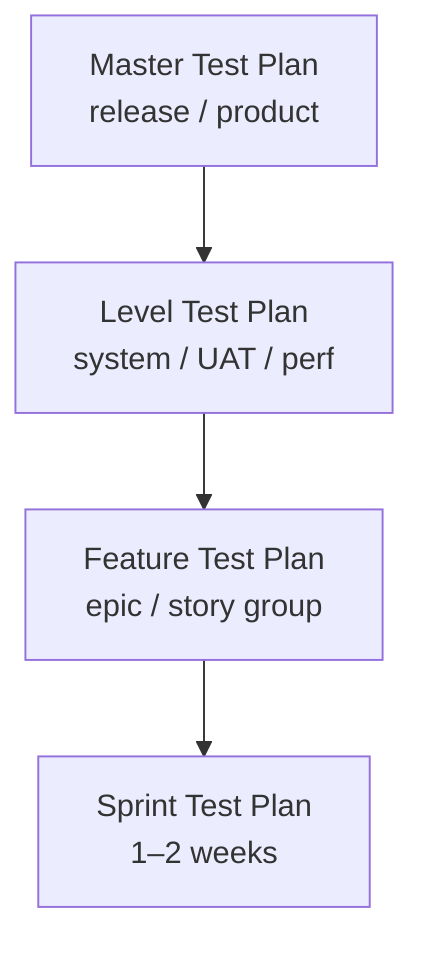
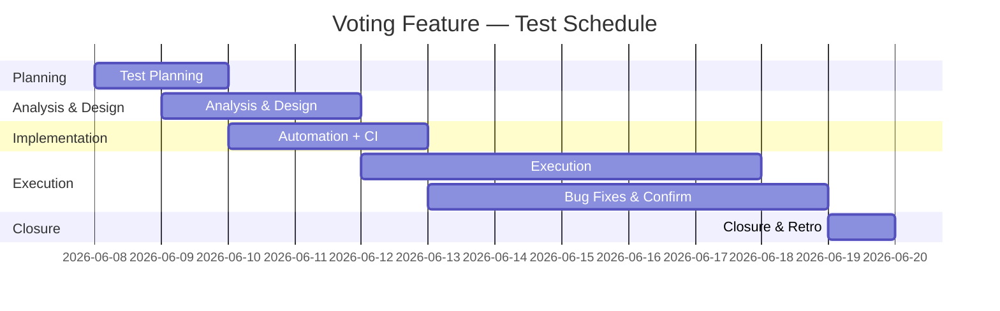
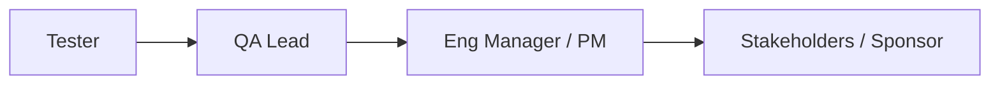

# 📋 The QA Test Plan — A Complete Guide

> *"A test plan is not a document — it's an agreement."*

This guide explains **what a QA Test Plan is, why it matters, and how to build one** that the whole team will actually use. It walks through every section of a modern test plan, with a **running example** (the *Voting Feature* of the Buggy Cars Rating site), templates you can copy, prioritization formulas, risk scoring, and a reviewer's checklist.

> 💡 The Test Plan is the **work product of Test Planning**, the first activity of both the [STLC](testPhases.md) and the [ISTQB Test Process](testProcessISTQB.md). This guide focuses on **the document itself**: structure, content, and quality.

---

## 📚 Table of Contents

1. [🎯 What a Test Plan Is (and Isn't)](#-what-a-test-plan-is-and-isnt)
2. [📖 Key Terminology](#-key-terminology)
3. [🧭 When to Write (and Update) a Test Plan](#-when-to-write-and-update-a-test-plan)
4. [🧱 The 12 Sections of a Test Plan](#-the-12-sections-of-a-test-plan)
5. [1️⃣ Objective](#1-objective)
6. [2️⃣ Scope](#2-scope)
7. [3️⃣ Test Approach](#3-test-approach)
8. [4️⃣ Test Cases & Prioritization (WRPN)](#4-test-cases--prioritization-wrpn)
9. [5️⃣ Test Environment](#5-test-environment)
10. [6️⃣ Test Case Design](#6-test-case-design)
11. [7️⃣ Bug Management](#7-bug-management)
12. [8️⃣ Entry & Exit Criteria](#8-entry--exit-criteria)
13. [9️⃣ Test Schedule](#9-test-schedule)
14. [🔟 Risks & Mitigation (RPN)](#-risks--mitigation-rpn)
15. [1️⃣1️⃣ Deliverables](#1-1-deliverables)
16. [1️⃣2️⃣ Communication Plan](#1-2-communication-plan)
17. [📐 Test Plan Templates (Waterfall vs Agile)](#-test-plan-templates-waterfall-vs-agile)
18. [⚠️ Common Pitfalls](#-common-pitfalls)
19. [✅ Reviewer's Checklist](#-reviewers-checklist)
20. [📚 References](#-references)

---

## 🎯 What a Test Plan Is (and Isn't)

A **QA Test Plan** is a formal, living document that captures **what will be tested, how, by whom, when, and on what** — and how the team will know they're done. It's the contract between QA, Dev, Product, and stakeholders for a release, project, or feature.

| The Test Plan IS…                                            | The Test Plan IS NOT…                                       |
| ------------------------------------------------------------ | ----------------------------------------------------------- |
| The blueprint for the testing effort                         | A list of test cases                                        |
| A negotiated agreement with stakeholders                     | A QA-only artifact written in isolation                     |
| A **living document** updated as scope/risk changes          | Written once and archived                                   |
| Scoped to a release, feature, or test level                  | One mega-plan covering the entire product forever            |
| The basis for measuring "done" via exit criteria             | A vague "we'll test everything" statement                   |

### Why it matters

- 🧭 **Alignment** — everyone agrees on scope, depth, and "done".
- 🛡️ **Risk reduction** — risks are surfaced and mitigated up front.
- 📊 **Measurable progress** — exit criteria give an objective end state.
- 🔗 **Traceability** — every test ties back to a requirement, every defect to a test.
- 🤝 **Coordination** — schedule, ownership, and communication are explicit.
- 🧾 **Audit & compliance** — required in regulated industries (ISO 9001, IEEE 29119, medical/financial).

📖 See also: [testProcessISTQB.md](testProcessISTQB.md) · [testPhases.md](testPhases.md)

---

## 📖 Key Terminology

| Term                  | Meaning                                                                                              |
| --------------------- | ---------------------------------------------------------------------------------------------------- |
| **Test Plan**         | Document describing the scope, approach, resources, schedule, and exit criteria for testing.         |
| **Test Strategy**     | High-level, **organization-wide** approach to testing (often referenced *by* the Test Plan).         |
| **Test Basis**        | The body of knowledge used to derive tests (requirements, stories, design, code).                    |
| **Test Item**         | The component or feature to be tested.                                                               |
| **Entry Criteria**    | Conditions that must be true to start a test activity.                                                |
| **Exit Criteria**     | Conditions that must be true to consider a test activity complete.                                    |
| **WRPN**              | *Weighted Risk Priority Number* — used to prioritize test cases.                                      |
| **RPN**               | *Risk Priority Number* — used to prioritize project/product risks.                                    |
| **Traceability Matrix** | Mapping of requirements ↔ test cases ↔ defects.                                                   |

---

## 🧭 When to Write (and Update) a Test Plan

A test plan exists at different **levels of granularity**. Pick the one(s) that fit your project.

| Level                  | Scope                                  | Typical owner   | Updated when…                          |
| ---------------------- | -------------------------------------- | --------------- | -------------------------------------- |
| **Master Test Plan**   | Whole project / product line           | QA Manager      | Major release or contract changes      |
| **Level Test Plan**    | One test level (system, UAT, perf…)    | Test Lead       | Test level scope or environment shifts |
| **Feature Test Plan**  | A single feature / epic                | QA Lead / SDET  | Feature scope or risk changes          |
| **Sprint Test Plan**   | One sprint (lightweight, often inline) | Whole team      | Every sprint planning                  |



> 💡 The **same 12 sections** apply at every level — what changes is the **depth and formality**.

---

## 🧱 The 12 Sections of a Test Plan

| # | Section                  | Answers the question…                                  |
| - | ------------------------ | ------------------------------------------------------ |
| 1 | Objective                | *Why* are we testing this?                              |
| 2 | Scope                    | *What* is in / out of scope?                            |
| 3 | Test Approach            | *How* will we test it?                                  |
| 4 | Test Cases & Priority    | *Which* tests, in what order?                           |
| 5 | Test Environment         | *On what* are we testing?                               |
| 6 | Test Case Design         | *How* will tests be written?                            |
| 7 | Bug Management           | *How* do we find, log, fix, verify bugs?                |
| 8 | Entry & Exit Criteria    | When do we *start* and *finish*?                        |
| 9 | Test Schedule            | *When* does each activity happen?                       |
|10 | Risks & Mitigation       | What could *go wrong*, and what will we do?             |
|11 | Deliverables             | *What artifacts* do we produce?                         |
|12 | Communication Plan       | *Who talks to whom*, how often, and through what tool?  |

---

## 1️⃣ Objective

### Purpose
State, in one or two sentences, **why this test plan exists** and what success means for the release/feature.

### Good objectives are…
- 🎯 **Specific** — tied to the feature or release.
- 📐 **Measurable** — link to exit criteria.
- 🤝 **Stakeholder-aligned** — written in business language.

### 🎯 Example — Voting Feature
> Verify the **functionality, usability, performance, and security** of the Voting Feature on the Buggy Cars Rating site, ensuring users can cast votes, see updated counts, and submit messages reliably across supported devices and browsers.

---

## 2️⃣ Scope

### Purpose
Explicitly state **what is in scope and what is out of scope** to prevent scope creep and resource waste.

### What to capture
- Features and sub-features included.
- Test levels (unit, integration, system, UAT) and types (functional, perf, security, a11y, i18n).
- Browsers, devices, operating systems, locales.
- Integrations / dependencies covered.
- **Out-of-scope items** with reasoning.

### 🎯 Example — Voting Feature

| In scope                                | Out of scope                          |
| --------------------------------------- | ------------------------------------- |
| Core voting flow & vote count updates   | Backend database internals            |
| UI/UX on Chrome, Firefox, Safari, Edge  | Language localization (English only)  |
| Functional + integration + smoke perf   | Extreme load / chaos testing          |
| Security: prevent multiple votes        | Penetration testing (separate plan)   |
| Cross-device: desktop, tablet, mobile   | Native mobile apps                    |

> 💡 An honest **"out of scope"** section is the single biggest defense against scope creep.

---

## 3️⃣ Test Approach

### Purpose
Describe the **overall strategy** — types of testing, manual vs automated, and how testing fits into the development lifecycle.

### What to capture
- **Test types** and what each verifies.
- **Manual vs automated** split and rationale.
- **Lifecycle integration** (Agile sprint cadence, CI gates, release gates).
- **Tools** (Playwright, Jira+Xray, k6, etc.).
- **Coverage goals** (e.g., 100% of acceptance criteria; ≥80% line coverage on critical modules).

### 🎯 Example — Voting Feature

| Test type           | What it verifies                                          | Manual / Auto    | Tool          |
| ------------------- | --------------------------------------------------------- | ---------------- | ------------- |
| Functional          | Voting registration, count updates, message submission    | Auto             | Playwright    |
| Usability           | UI intuitive and accessible across devices                | Manual           | —             |
| Integration         | Vote persisted, count reflects in real-time, API contract | Auto             | Playwright + API |
| Performance (smoke) | Normal load (100 concurrent votes) responds < 500ms       | Auto             | k6            |
| Security            | Cannot vote twice; message field sanitized                | Auto + Manual    | Playwright + manual |

> 💡 **Agile alignment**: tests are written alongside stories, run continuously in CI, and reviewed at each sprint review.

📖 See also: [automationDecision.md](automationDecision.md) · [k6-performance-testing.md](k6-performance-testing.md) · [pwRepoIntegration.md](pwRepoIntegration.md)

---

## 4️⃣ Test Cases & Prioritization (WRPN)

### Purpose
Identify the **key test cases** and prioritize them so the team always works on the highest-value tests first.

### The Weighted Risk Priority Number (WRPN)

A simple scoring formula to rank test cases:

$$\text{WRPN} = \frac{(L \times w_L) + (I \times w_I) + (D \times w_D) + (E \times w_E)}{w_L + w_I + w_D + w_E}$$

| Factor | Meaning                              | Scale  |
| ------ | ------------------------------------ | ------ |
| **L**  | Likelihood of failure                | 1 (low) – 4 (high) |
| **I**  | Impact of failure (severity to user) | 1 – 4  |
| **D**  | Detectability *if missed*            | 1 (easy to detect) – 4 (hard) |
| **E**  | Effort to test                       | 1 (low) – 4 (high), often *inverted* in priority |

> 💡 Many teams use **equal weights** (`(L + I + D - E) / 3`) or even just `L × I`. Pick a formula, document it, and stick to it.

### 🎯 Example — Voting Feature test cases

| ID    | Test Case               | L | I | D | E | WRPN | Priority |
| ----- | ----------------------- | - | - | - | - | ---- | -------- |
| TC001 | Voting Registration     | 3 | 4 | 2 | 2 | 3.75 | High     |
| TC002 | Vote Count Updates      | 4 | 4 | 2 | 3 | 4.00 | Critical |
| TC003 | Message Submission      | 2 | 3 | 2 | 2 | 2.75 | Medium   |
| TC004 | Voting Restrictions     | 3 | 4 | 3 | 2 | 4.00 | Critical |
| TC005 | UX Elements             | 2 | 2 | 1 | 1 | 1.75 | Low      |
| TC006 | Error Handling          | 3 | 3 | 2 | 2 | 3.00 | High     |

📖 See also: [prioritization.md](prioritization.md) · [xRayTestCase.md](xRayTestCase.md)

---

## 5️⃣ Test Environment

### Purpose
Define **what infrastructure** the tests run on, so results are repeatable and representative of production.

### What to capture
- **Devices / OSes / browsers** matrix.
- **Network conditions** to simulate.
- **Test data** sources (factories, seeds, anonymized prod copies).
- **Environment URLs** (dev / staging / preview) and access.
- **Tools and integrations** (mocks, service virtualization, observability).

### 🎯 Example — Voting Feature

| Dimension          | Configuration                                                       |
| ------------------ | ------------------------------------------------------------------- |
| Platforms          | Desktop, tablet, mobile                                             |
| Browsers           | Chrome (latest), Firefox (latest), Safari 17+, Edge (latest)         |
| Network            | Stable broadband + simulated 3G                                     |
| Test data          | Seeded users (active / locked), 20 sample car models                |
| Environment        | Production-like staging: `https://stg.buggycars.example.com`        |
| Mocked services    | Email provider (for confirmation messages)                          |

> 💡 If staging diverges from production, document the gaps and the risks they introduce.

---

## 6️⃣ Test Case Design

### Purpose
Describe **how test cases are structured** — the techniques used, the data, and the traceability rules.

### What to capture
- Coverage of **positive, negative, boundary, and non-functional** scenarios.
- **Design techniques** in use (equivalence partitioning, BVA, decision tables, state transitions, exploratory charters).
- Standard **test case template** (steps, data, expected results, traceability).
- **Naming conventions** (e.g., `TC_<Feature>_<Scenario>`).

### 🎯 Example — Voting Feature test case

```markdown
**Test Case ID**: TC_Voting_ValidVote
**Title**: Verify a logged-in user can cast a vote for a car model
**Preconditions**:
  - User is logged in with valid credentials
  - At least one car model is available for voting
**Test Steps**:
  1. Navigate to /cars/{carId}
  2. Click "Vote"
  3. Confirm submission in the dialog
**Test Data**: { user: validUser, carId: MODEL_S }
**Expected Results**:
  - Toast "Vote submitted successfully"
  - Vote count increases by 1
  - "Vote" button becomes disabled for the same user/car
**Traceability**: Requirement R1.2 — "Users can vote for car models"
**Priority**: High (WRPN 3.75)
```

📖 See also: [blackBoxTesting.md](blackBoxTesting.md) · [whiteBoxTesting.md](whiteBoxTesting.md) · [xRayTestCase.md](xRayTestCase.md)

---

## 7️⃣ Bug Management

### Purpose
Describe **how defects are identified, logged, prioritized, fixed, verified, and reported**.

### What to capture
- **Tool** (Jira, Xray, GitHub Issues, Azure DevOps).
- **Required fields** when logging (severity, priority, repro steps, evidence).
- **Severity vs Priority** definitions.
- **Workflow** (Triage → Open → Fixed → Verified → Closed).
- **Regression strategy** after a fix.
- **Reporting cadence** (stand-up, sprint review).

### 🎯 Example — Voting Feature

> Bugs are logged in **Jira (Kanban board: VOT)** using the standard Bug issue type with severity, priority, environment, build version, and screenshots/HAR attached. Triage runs **daily at 10:00**. Critical/High bugs block the release. Each fix is **confirmation-tested** + a **regression suite** is re-run before closure.

📖 See also: [bugLifeCycle.md](bugLifeCycle.md)

---

## 8️⃣ Entry & Exit Criteria

### Purpose
Define the **objective conditions** that signal it's OK to start and OK to stop testing.

### What to capture

| Entry criteria (must be true to start)              | Exit criteria (must be true to stop)                    |
| --------------------------------------------------- | ------------------------------------------------------- |
| Test environment is set up and stable               | All planned test cases executed                         |
| Requirements approved by stakeholders               | All Critical/High defects resolved or formally deferred |
| Test cases prepared, reviewed, and approved         | Test Summary Report completed and shared                |
| Test data and accounts available                    | Non-critical defects have an agreed resolution plan      |
| Build under test deployed and smoke test green      | Coverage and quality metrics meet agreed targets         |

### 🎯 Example — Voting Feature

| Type  | Criterion                                                            | Owner       |
| ----- | -------------------------------------------------------------------- | ----------- |
| Entry | Staging env up; build `1.4.0` deployed; smoke green                  | DevOps + QA |
| Entry | All AC for Voting epic signed off by PO                              | PO          |
| Entry | Playwright suite + dataset in repo, dry run passing                  | QA          |
| Exit  | 100% of priority-1/2 test cases executed                             | QA Lead     |
| Exit  | 0 open Critical/High defects                                         | QA Lead     |
| Exit  | ≥95% pass rate; Test Summary Report distributed                      | QA Lead     |

---

## 9️⃣ Test Schedule

### Purpose
Set the **timeline** for each test activity, with owners and dependencies.

### What to capture
- Phases (Planning, Analysis, Design, Implementation, Execution, Closure).
- Owner per task.
- Start/end dates and dependencies.
- Milestones aligned to release dates.

### 🎯 Example — Voting Feature (one sprint)

| Phase                | Tasks                                              | Owner          | Start      | End        |
| -------------------- | -------------------------------------------------- | -------------- | ---------- | ---------- |
| Test Planning        | Draft plan, agree on scope & exit criteria         | QA Lead        | 2026-06-08 | 2026-06-09 |
| Test Analysis/Design | Derive test conditions, write/peer-review cases    | QA Engineers   | 2026-06-09 | 2026-06-11 |
| Implementation       | Automate, seed data, wire CI                       | SDET           | 2026-06-10 | 2026-06-12 |
| Execution            | Run suites per build; manual a11y pass             | QA Engineers   | 2026-06-12 | 2026-06-17 |
| Bug Fixes & Confirm. | Fix, re-test, regression                           | Dev + QA       | 2026-06-13 | 2026-06-18 |
| Closure              | Summary report, retro, archive                     | QA Lead        | 2026-06-19 | 2026-06-19 |



---

## 🔟 Risks & Mitigation (RPN)

### Purpose
Identify **what could go wrong** during the test effort, score it, and decide how to respond.

### Risk Priority Number (RPN)

$$\text{RPN} = \text{Severity} \times \text{Likelihood} \times \text{Detectability}$$

| Factor          | Scale (1–4)                                              |
| --------------- | -------------------------------------------------------- |
| Severity        | 1 = negligible … 4 = catastrophic                        |
| Likelihood      | 1 = rare … 4 = almost certain                            |
| Detectability   | 1 = easy to detect early … 4 = hard to detect            |

### 🎯 Example — Voting Feature

| ID     | Risk                                  | S | L | D | RPN | Mitigation                                                            |
| ------ | ------------------------------------- | - | - | - | --- | --------------------------------------------------------------------- |
| RSK001 | Requirements still evolving           | 4 | 3 | 3 | 36  | Daily PO sync; lock AC before sprint mid-point                        |
| RSK002 | Staging environment unstable          | 4 | 2 | 4 | 32  | Pre-test smoke gate; rollback plan; standby env                       |
| RSK003 | Limited a11y expertise on team        | 3 | 3 | 3 | 27  | Pair with a11y specialist; use axe-core in CI                          |
| RSK004 | Race condition on simultaneous votes  | 4 | 2 | 3 | 24  | Add concurrent test in k6; review API locking strategy with dev       |
| RSK005 | Insufficient test data variety        | 3 | 3 | 2 | 18  | Build data factory; seed 20+ car models with varied attributes        |

> 💡 Track the **top 5 risks** in the plan and re-score them at each sprint review.

---

## 1️⃣1️⃣ Deliverables

### Purpose
List the **artifacts** the test effort will produce. These are the *evidence* of testing.

| Deliverable             | Description                                                                  | Owner          |
| ----------------------- | ---------------------------------------------------------------------------- | -------------- |
| **Test Plan**           | This document.                                                               | QA Lead        |
| **Test Cases**          | Written cases in Xray with steps, data, expected results, traceability.       | QA Engineers   |
| **Automation Suite**    | Code in the repo (Playwright/k6) with CI integration.                         | SDET           |
| **Test Data**           | Factories, seeds, fixtures.                                                  | SDET           |
| **Execution Report**    | Pass/fail per build, coverage, defects.                                       | QA Lead        |
| **Bug Reports**         | Jira issues linked to failing tests and requirements.                         | QA Engineers   |
| **Test Summary Report** | Final summary: results, defects, risks, recommendations.                      | QA Lead        |
| **Lessons Learned**     | Retro notes + improvement actions for the next cycle.                         | QA Lead + team |

📖 See also: [qaTestingReport.md](qaTestingReport.md)

---

## 1️⃣2️⃣ Communication Plan

### Purpose
Define **who communicates what, to whom, how, and how often**.

### 🎯 Example — Voting Feature

| Meeting / Channel        | Purpose                                       | Participants               | Frequency       |
| ------------------------ | --------------------------------------------- | -------------------------- | --------------- |
| **Daily stand-up**       | Progress, blockers, next steps                | Whole team                 | Daily, 15 min   |
| **Bug triage**           | Review and prioritize new defects             | QA, Dev Lead, PO           | Daily, 30 min   |
| **Sprint review**        | Demo + test results                           | Whole team + stakeholders  | Per sprint      |
| **Sprint retro**         | What worked, what hurt, actions               | Whole team                 | Per sprint      |
| **Weekly test report**   | Coverage, pass rate, top defects, risks       | Team + management          | Weekly          |
| **Slack `#qa-voting`**   | Real-time questions / async updates           | Whole team                 | Always-on       |
| **Email (release sign-off)** | Formal go/no-go communication             | PM, QA Lead, Eng Lead, PO  | Per release     |

### Escalation path



> 💡 Escalate **early** when a Critical defect or a blocked entry/exit criterion threatens the release date.

---

## 📐 Test Plan Templates (Waterfall vs Agile)

| Section                  | Waterfall / Regulated                              | Agile / Lightweight                                   |
| ------------------------ | -------------------------------------------------- | ----------------------------------------------------- |
| Objective                | Formal, signed off by stakeholders                 | One-paragraph in the epic / Confluence page           |
| Scope                    | Detailed in/out lists, traceability matrix         | Bulleted list under the epic                          |
| Test Approach            | Test strategy referenced + detailed                | Inline; usually a few bullets                         |
| Test Cases & Priority    | Full case suite with WRPN                          | Cases in Xray/Jira, tagged `@smoke`/`@regression`     |
| Test Environment         | Full matrix + sign-off                             | URL list + browsers covered                           |
| Test Case Design         | IEEE 829 / 29119 test case spec                    | Markdown template + repo conventions                  |
| Bug Management           | Formal CCB, RCA mandatory                          | Jira workflow; severity/priority in sprint            |
| Entry & Exit Criteria    | Formal sign-offs                                   | Definition of Ready + Definition of Done              |
| Test Schedule            | Gantt chart with milestones                        | Sprint board + sprint goal                            |
| Risks & Mitigation       | Full RPN matrix, periodic review                   | Top-5 risks in the plan, re-scored at retro           |
| Deliverables             | Formal artifact list, version-controlled          | Linked from the epic; lives in the repo              |
| Communication Plan       | Formal RACI                                        | Slack channel + ceremonies                            |

> 💡 The **content** is the same. The **formality** scales with risk and regulation.

---

## ⚠️ Common Pitfalls

| Pitfall                                                       | Better approach                                                            |
| ------------------------------------------------------------- | -------------------------------------------------------------------------- |
| "We'll test everything" scope                                 | Be explicit — in and out — and update as scope changes.                    |
| No exit criteria                                              | You can't finish what you haven't defined as done.                         |
| Writing the plan in isolation                                 | Co-author with Dev Lead and PM; review with stakeholders.                  |
| Treating it as a one-time deliverable                         | It's a **living document**; update at every sprint review.                 |
| Listing test cases inside the plan                            | Reference them from Xray/Jira; don't duplicate.                            |
| Skipping risks because "Agile doesn't need them"              | Keep at least the **top-5 risks** list; revisit at every retro.            |
| Schedule without owners                                       | Every task in the schedule has **one** named owner.                        |
| Bug management section that just says "use Jira"              | Include workflow, severity definitions, and triage cadence.                |
| No communication plan                                         | Misalignment is the #1 cause of missed release dates.                      |

---

## ✅ Reviewer's Checklist

Use this when reviewing a new or updated test plan.

- [ ] Objective is specific and tied to the release/feature.
- [ ] Scope lists both **in** and **out** items explicitly.
- [ ] Test approach covers all relevant types (func, perf, security, a11y, i18n).
- [ ] Test cases reference Xray/Jira IDs; priorities use a defined formula (WRPN).
- [ ] Test environment is fully specified, including data and mocks.
- [ ] Test case design section includes template + naming conventions + techniques.
- [ ] Bug management section defines tool, workflow, severity/priority, triage cadence.
- [ ] Entry and exit criteria are **objective and measurable**.
- [ ] Schedule has phases, owners, dates, and dependencies.
- [ ] Risks are scored (RPN) with mitigations and owners.
- [ ] Deliverables list every artifact with an owner.
- [ ] Communication plan includes meetings, reports, channels, and escalation.
- [ ] Cross-links to related docs (test strategy, requirements, epics).
- [ ] Document version, author, last updated, and approval log present.

---

## 📚 References

- ISTQB® **Certified Tester Foundation Level (CTFL) Syllabus** — Chapter 5 *Test Management*
- ISO/IEC/IEEE **29119-3** — Test documentation
- IEEE **829** — Standard for Software and System Test Documentation (legacy reference)
- ISTQB® **Glossary of Testing Terms** — [glossary.istqb.org](https://glossary.istqb.org/)
- Related docs: [testProcessISTQB.md](testProcessISTQB.md) · [testPhases.md](testPhases.md) · [prioritization.md](prioritization.md) · [bugLifeCycle.md](bugLifeCycle.md) · [traceability.md](traceability.md) · [xRayTestCase.md](xRayTestCase.md) · [qaTestingReport.md](qaTestingReport.md) · [blackBoxTesting.md](blackBoxTesting.md) · [whiteBoxTesting.md](whiteBoxTesting.md) · [automationDecision.md](automationDecision.md)
