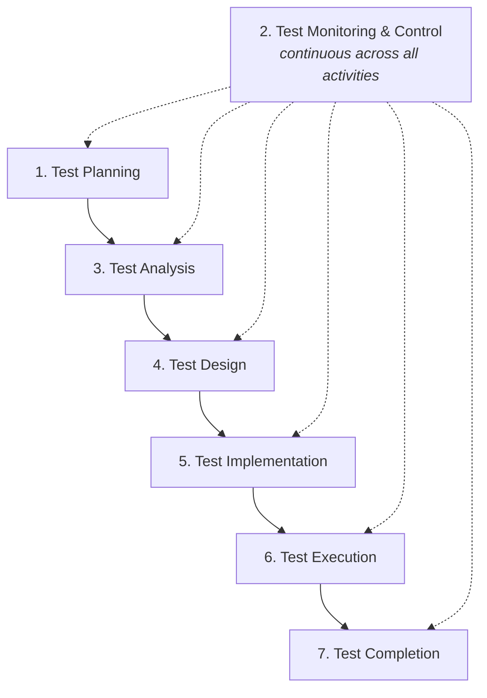
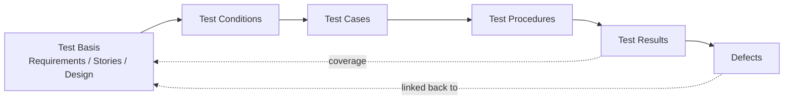
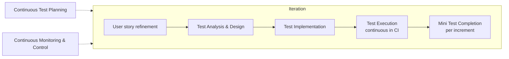

# 🧭 The ISTQB Test Process — A Complete Guide

> *"Testing is a process, not a phase."* — ISTQB Foundation Level Syllabus

This guide presents the **ISTQB Test Process** as defined in the *Certified Tester Foundation Level (CTFL)* syllabus. It covers the **seven activities**, the **work products** produced by each, the **roles** involved, **entry/exit criteria**, **traceability**, the **contextual factors** that shape every test process, and how the process is tailored in **sequential vs Agile** lifecycles — strictly within the ISTQB body of knowledge.

---

## 📚 Table of Contents

1. [📖 ISTQB Terminology You Must Know](#-istqb-terminology-you-must-know)
2. [🎯 Why a Defined Test Process Matters](#-why-a-defined-test-process-matters)
3. [🧩 The Seven Test Activities (Overview)](#-the-seven-test-activities-overview)
4. [🗺️ Process Flow Diagram](#-process-flow-diagram)
5. [1️⃣ Test Planning](#1-test-planning)
6. [2️⃣ Test Monitoring & Test Control](#2-test-monitoring--test-control)
7. [3️⃣ Test Analysis](#3-test-analysis)
8. [4️⃣ Test Design](#4-test-design)
9. [5️⃣ Test Implementation](#5-test-implementation)
10. [6️⃣ Test Execution](#6-test-execution)
11. [7️⃣ Test Completion](#7-test-completion)
12. [🧾 Test Work Products (by activity)](#-test-work-products-by-activity)
13. [🔗 Traceability Throughout the Process](#-traceability-throughout-the-process)
14. [🧠 Contextual Factors that Tailor the Process](#-contextual-factors-that-tailor-the-process)
15. [🔁 The Process in Sequential vs Agile Lifecycles](#-the-process-in-sequential-vs-agile-lifecycles)
16. [👥 Roles & Responsibilities](#-roles--responsibilities)
17. [📊 Summary Table](#-summary-table)
18. [✅ Best Practices](#-best-practices)
19. [📚 References](#-references)

---

## 📖 ISTQB Terminology You Must Know

Aligning on ISTQB vocabulary keeps the process unambiguous across the team.

| Term                            | ISTQB Definition (paraphrased)                                                                                          |
| ------------------------------- | ----------------------------------------------------------------------------------------------------------------------- |
| **Test Process**                | A set of interrelated activities that compose the production of testing, comprising planning, monitoring & control, analysis, design, implementation, execution, and completion. |
| **Test Basis**                  | The body of knowledge used as the basis for test analysis and design (requirements, user stories, design docs, code).   |
| **Test Object**                 | The component or system to be tested.                                                                                    |
| **Test Condition**              | A testable aspect of a component or system identified as a basis for testing.                                            |
| **Test Case**                   | A set of preconditions, inputs, actions, expected results, and postconditions developed to verify a test condition.     |
| **Test Procedure / Script**     | A sequence of test cases in execution order, with any associated actions required to set up and conclude the run.       |
| **Test Suite**                  | A set of test scripts or test procedures to be executed in a specific test run.                                          |
| **Test Data**                   | Data used to verify a test condition.                                                                                    |
| **Test Environment**            | An environment containing hardware, instrumentation, simulators, software tools, and other support elements needed to execute a test. |
| **Entry Criteria**              | The set of conditions for officially starting a defined task.                                                            |
| **Exit Criteria**               | The set of conditions for officially completing a defined task.                                                          |
| **Coverage**                    | The degree, expressed as a percentage, to which a specified coverage item has been exercised by a test suite.            |
| **Traceability**                | The ability to identify related items in documentation and software, such as requirements with associated tests.         |
| **Test Work Product**           | An artifact produced as part of the test process (e.g., test plan, test cases, test logs, test summary report).          |
| **Defect (Bug)**                | A flaw in a component or system that can cause it to fail to perform its required function.                              |

> 💡 The ISTQB syllabus distinguishes **error → defect → failure**: a human *error* introduces a *defect* in a work product; when executed, the defect may cause a *failure*.

📖 See also: [bugLifeCycle.md](bugLifeCycle.md) · [traceability.md](traceability.md)

---

## 🎯 Why a Defined Test Process Matters

According to ISTQB, a defined test process:

- 🧭 **Provides a common framework** so testers, developers, and stakeholders share the same view of testing.
- 📊 **Enables measurement and improvement** — consistent activities yield consistent metrics.
- 🔗 **Supports traceability** — from test basis to test conditions, cases, results, and defects.
- 🛡️ **Reduces risk** — risk-based testing depends on a repeatable analysis activity.
- 🤝 **Clarifies responsibilities** — every activity has owners and work products.
- 🔁 **Adapts to context** — the same process can be tailored to sequential or Agile lifecycles.

---

## 🧩 The Seven Test Activities (Overview)

The ISTQB test process is composed of **seven activities**. They are *logical* — they may overlap in time, occur in parallel, or iterate, especially in Agile.

| # | Activity                       | Purpose (one line)                                                            |
| - | ------------------------------ | ----------------------------------------------------------------------------- |
| 1 | **Test Planning**              | Define objectives, scope, approach, resources, schedule, and exit criteria.    |
| 2 | **Test Monitoring & Control**  | Compare actual progress against the plan and take corrective action.          |
| 3 | **Test Analysis**              | Identify *what* to test — derive test conditions from the test basis.         |
| 4 | **Test Design**                | Specify *how* to test — derive test cases from test conditions.               |
| 5 | **Test Implementation**        | Prepare the testware and environment required for execution.                  |
| 6 | **Test Execution**             | Run tests, compare actual vs expected results, report defects.                |
| 7 | **Test Completion**            | Archive testware, evaluate the process, communicate results.                  |

---

## 🗺️ Process Flow Diagram

> 💡 **Test Monitoring & Control** is a *continuous* activity that runs **alongside** all other activities, not after them.

---

## 1️⃣ Test Planning

### Purpose
Define **what testing will be done**, **why**, **how**, **by whom**, **when**, and **on what** — and what success looks like.

### Key tasks (per ISTQB)
- Determine the **scope, objectives, and risks** of testing.
- Define the overall **test approach**, including test levels and types.
- Identify **resources** (people, tools, environments) and **schedule** activities.
- Define **entry and exit criteria** (a.k.a. *Definition of Ready* / *Definition of Done* in Agile).
- Determine the **test work products** to be produced.

### Entry criteria
- Test basis available (requirements, user stories, design, risks).
- Stakeholders identified and available.

### Exit criteria
- Approved **Test Plan** that defines scope, approach, schedule, criteria, resources, and risks.

### Work products
- **Test Plan** (master and/or level/type-specific).

📖 See also: [testPlan.md](testPlan.md)

---

## 2️⃣ Test Monitoring & Test Control

### Purpose
Continuously **compare actual progress against the plan** (*monitoring*) and **take action when needed** (*control*).

### Key tasks (per ISTQB)
- Check the **status** of activities and work products against the plan.
- Gather and report **test progress metrics** (e.g., test cases executed, passed, failed; defects found by severity; test environment availability).
- Evaluate **exit criteria** continuously.
- Initiate **control actions** (re-prioritize, re-plan, request more resources, change scope).

### Entry criteria
- A Test Plan exists with measurable criteria.

### Exit criteria
- Test progress reports communicated regularly; control actions documented.

### Work products
- **Test Progress Reports** (interim).
- **Test Summary Report** (final, prepared during Test Completion).

> 💡 Monitoring **without** control is just reporting. ISTQB stresses *both* — observe **and** act.

---

## 3️⃣ Test Analysis

### Purpose
Analyze the **test basis** to identify **what should be tested** — i.e., the **test conditions**.

### Key tasks (per ISTQB)
- Analyze the **test basis** for testability and identify defects (ambiguities, gaps, inconsistencies).
- Identify **features and sets of features** to be tested.
- Define and prioritize **test conditions** for each feature, based on **risk, requirements, and other factors**.
- Capture **bi-directional traceability** between test basis and test conditions.

### Entry criteria
- Test basis available, sufficiently complete, and under change control.

### Exit criteria
- Defined and prioritized **test conditions** linked back to the test basis.

### Work products
- **Test Conditions** (and associated coverage items).
- Defect reports on the test basis (when defects are detected during analysis — *static testing* outcome).

📖 See also: [staticVsDynamicTesting_ISTQB.md](staticVsDynamicTesting_ISTQB.md)

---

## 4️⃣ Test Design

### Purpose
Transform **test conditions** into **high-level and low-level test cases**, and design the **test data** and **test environment** they need.

### Key tasks (per ISTQB)
- Design and prioritize **test cases** and **sets of test cases**.
- Identify required **test data** to support test conditions and test cases.
- Design the **test environment** and identify required infrastructure and tools.
- Capture **bi-directional traceability** between test basis, test conditions, test cases, and test procedures.

### Entry criteria
- Test conditions defined and prioritized.

### Exit criteria
- Test cases designed, reviewed, and ready to be implemented.

### Work products
- **Test cases** (and **test design specifications**).
- Test data requirements and **test environment requirements**.

📖 See also: [blackBoxTesting.md](blackBoxTesting.md) · [whiteBoxTesting.md](whiteBoxTesting.md)

---

## 5️⃣ Test Implementation

### Purpose
Prepare everything needed to **actually run** the tests.

### Key tasks (per ISTQB)
- Develop and prioritize **test procedures**; create **automated test scripts** where appropriate.
- Create **test suites** from test procedures.
- Arrange test suites within a **test execution schedule**.
- Build the **test environment** (hardware, tools, simulators, service virtualization, test data) and verify everything is correctly set up.
- Prepare **test data** and load it into the environment.
- Verify and update **bi-directional traceability**.

### Entry criteria
- Test cases designed; test environment requirements defined.

### Exit criteria
- Test procedures, test suites, environment, and data ready for execution.

### Work products
- **Test procedures / test scripts**.
- **Test suites**, **test execution schedule**, **test data**, **test environment**.

---

## 6️⃣ Test Execution

### Purpose
**Run the tests**, observe results, compare to expected outcomes, and report.

### Key tasks (per ISTQB)
- Execute tests **manually or with automation**, in line with the test execution schedule.
- Compare **actual results** with **expected results**.
- Analyze anomalies to determine likely cause (e.g., failures due to defects in the test object, test data, test environment, test procedure, or tester action).
- Report **defects** based on the failures observed.
- Log **test execution status** (Pass, Fail, Blocked, etc.).
- Repeat test activities as a result of action taken for each anomaly:
  - **Confirmation testing** — re-execute a previously failed test after a fix.
  - **Regression testing** — execute additional tests to ensure changes did not introduce new defects.
- Verify and update **bi-directional traceability**.

### Entry criteria
- Test environment ready; test suites prepared; test data loaded; build under test available.

### Exit criteria
- All planned tests executed (or explicitly skipped/blocked with justification); results logged; exit criteria evaluated.

### Work products
- **Test logs / test execution logs**.
- **Defect reports**.
- Updated **status of test cases and test procedures**.

📖 See also: [bugLifeCycle.md](bugLifeCycle.md)

---

## 7️⃣ Test Completion

### Purpose
**Close out** the test effort: preserve useful artifacts, learn lessons, and communicate results.

### Key tasks (per ISTQB)
- Check whether all **defect reports are closed** (deferred ones handled with appropriate change requests).
- Create a **Test Summary Report** for stakeholders.
- **Finalize and archive** the test environment, test data, test infrastructure, and other testware for later reuse.
- **Hand over testware** to maintenance teams, other project teams, or stakeholders who can benefit.
- **Analyze lessons learned** from the completed test activities and determine improvements for future projects.
- Use the information gathered to improve **test process maturity**.

### Entry criteria
- A test milestone has been reached (e.g., release, project end, iteration end), or a test level has been completed.

### Exit criteria
- Test Summary Report distributed; testware archived; lessons learned captured.

### Work products
- **Test Summary Report**.
- Archived **testware** (test cases, test data, test environments, scripts).
- **Lessons learned** / improvement actions.

📖 See also: [qaTestingReport.md](qaTestingReport.md)

---

## 🧾 Test Work Products (by activity)

ISTQB groups test work products by the activity that produces them. Many work products evolve continuously.

| Activity                  | Main Work Products                                                                                   |
| ------------------------- | ---------------------------------------------------------------------------------------------------- |
| Test Planning             | Test plan(s) — master, level, type.                                                                  |
| Test Monitoring & Control | Test progress reports; control directives; updated test plan.                                        |
| Test Analysis             | Defined and prioritized test conditions; defects in the test basis.                                  |
| Test Design               | Test cases; test design specifications; test data requirements; test environment requirements.       |
| Test Implementation       | Test procedures; test scripts; test suites; test data; verified test environment; execution schedule.|
| Test Execution            | Test logs; documented status of test cases/procedures; defect reports.                               |
| Test Completion           | Test summary report; archived testware; lessons learned; change requests for process improvement.    |

---

## 🔗 Traceability Throughout the Process

ISTQB requires **bi-directional traceability** across the test process. It enables:

- 📐 **Determining coverage** of the test basis by the tests.
- 🔍 **Impact analysis** when requirements change.
- 📊 **Reporting** in business terms (e.g., "Requirement X is 80% tested, 2 defects open").
- ✅ **Verifying that exit criteria** have been met.
- 🧠 **Improving understandability** of test progress and product quality for stakeholders.

📖 See also: [traceability.md](traceability.md)

---

## 🧠 Contextual Factors that Tailor the Process

The ISTQB syllabus is explicit: **there is no single "correct" test process**. The process is shaped by the project's context. Key contextual factors include:

| Factor                              | Examples that change the process                                                              |
| ----------------------------------- | --------------------------------------------------------------------------------------------- |
| **Software development lifecycle**  | Sequential (V-model, waterfall) vs Iterative/Incremental (Agile, DevOps).                     |
| **Test levels and types**           | Component, integration, system, acceptance; functional, non-functional, structural, change-related. |
| **Product and project risks**       | Higher risk → more rigorous analysis, design, and execution.                                  |
| **Business domain**                 | Safety-critical, regulated, consumer web — each demands different rigor.                      |
| **Operational constraints**         | Budgets, schedules, complexity, contractual and regulatory requirements.                      |
| **Organizational policies & practices** | Standards in use, required documentation, governance.                                     |
| **Required internal & external standards** | ISO/IEC, IEEE, regulatory (e.g., medical, finance).                                    |

> 💡 The seven activities **always apply**; what changes is the **depth, formality, and ordering** of each.

---

## 🔁 The Process in Sequential vs Agile Lifecycles

### Sequential lifecycles (e.g., V-model)

- Each activity is **largely sequential** and **formally documented**.
- Test levels (component → integration → system → acceptance) align with development phases.
- Test plan, test design, and test execution typically produce **explicit, separate work products**.

### Iterative & Agile lifecycles

- The seven activities still occur, but they are **compressed into iterations** and run **continuously**.
- Test analysis and design happen as user stories are refined; tests are often written **before or alongside** code (e.g., ATDD/BDD/TDD).
- **Test automation** is essential to sustain regression testing across short iterations.
- Test work products are often **lighter** and **embedded** in user stories, the backlog, and the CI pipeline.
- **Whole-team approach**: testing is a shared responsibility; testers contribute throughout the iteration.

> 💡 ISTQB notes that **the activities do not change**; their **timing, frequency, and formality** do.

---

## 👥 Roles & Responsibilities

ISTQB describes two generic test roles. In Agile, these responsibilities are often **shared by the whole team**.

### Test Management

Overall responsibility for the test process and successful leadership of the test activities. Typical tasks:

- Develop the **test policy** and **test strategy**.
- Plan testing by considering the context and understanding the test objectives and risks.
- Write and update the **test plan(s)**.
- Coordinate the test plan with project managers, product owners, and others.
- Share the testing perspective with other project activities.
- Initiate test analysis, design, implementation, and execution.
- **Monitor test progress and results**, and check exit criteria.
- Prepare **test progress reports** and the **test summary report**.
- Adapt planning based on test results and progress.
- Take actions necessary for **test control**.
- Introduce suitable **metrics** for measuring test progress and evaluating product/test quality.
- Support the **selection and implementation** of tools to support the test process.
- Decide about the implementation of **test environment(s)**.
- Promote and advocate testers and testing within the organization.
- **Develop the skills and careers** of testers (training plans, performance reviews, coaching).

### Testing

Engineering tasks performed by testers (or by any team member taking on the testing role):

- Review and contribute to **test plans**.
- Analyze, review, and assess **requirements, user stories, acceptance criteria, specifications, and models** for testability (i.e., the test basis).
- Identify and document **test conditions** and capture **traceability** between test cases, test conditions, and the test basis.
- Design, set up, and verify **test environments**, often coordinating with system administration and network management.
- Design and implement **test cases** and **test procedures**.
- **Prepare and acquire test data**.
- Create the detailed **test execution schedule**.
- **Execute tests**, evaluate results, and document deviations from expected results.
- Use appropriate **tools** to facilitate the test process.
- **Automate tests** as needed (may be supported by a developer or a test automation engineer).
- Evaluate **non-functional characteristics** such as performance efficiency, reliability, usability, security, compatibility, and portability.
- **Review tests** developed by others.

> 💡 The same person can take on multiple roles. The ISTQB roles describe **responsibilities**, not job titles.

---

## 📊 Summary Table

| Activity                       | Main Inputs                          | Main Outputs                                  | Continuous? |
| ------------------------------ | ------------------------------------ | --------------------------------------------- | ----------- |
| 1. Test Planning               | Project context, test basis, risks   | Test plan                                     | Iterative   |
| 2. Test Monitoring & Control   | Plan + actuals                       | Progress reports, control actions             | ✅ Always    |
| 3. Test Analysis               | Test basis                           | Test conditions, coverage items               | Iterative   |
| 4. Test Design                 | Test conditions                      | Test cases, data requirements, env reqs       | Iterative   |
| 5. Test Implementation         | Test cases, env reqs                 | Test procedures, suites, scripts, env, data   | Iterative   |
| 6. Test Execution              | Suites, environment, build           | Test logs, defect reports, updated statuses   | Iterative   |
| 7. Test Completion             | All test results & artifacts         | Test summary report, archived testware, lessons learned | At milestones |

---

## ✅ Best Practices

- 🧭 **Apply all seven activities** — adjust depth and formality, not whether they happen.
- 🛡️ **Plan around risk** — let product and project risks drive prioritization in analysis, design, and execution.
- 🔁 **Treat monitoring & control as continuous** — not as a post-execution status report.
- 🔗 **Maintain bi-directional traceability** — test basis ↔ conditions ↔ cases ↔ results ↔ defects.
- 📐 **Make entry and exit criteria explicit and measurable** for every activity.
- 🤝 **Use the whole-team approach in Agile** — testing is a shared responsibility.
- 📚 **Tailor work products to context** — formality should match risk and standards, not habit.
- 🧪 **Use early static testing** (reviews) — finding defects in the test basis is cheaper than finding them in execution.
- 🔧 **Automate to sustain coverage**, especially regression, but never as a goal in itself.
- 🪞 **Always run Test Completion** — lessons learned are how the process improves.

---

## 📚 References

- ISTQB® **Certified Tester Foundation Level (CTFL) Syllabus** — Chapter 1 *Fundamentals of Testing* (Test Process; Test Activities and Tasks; Test Work Products; Traceability; Roles in Testing)
- ISTQB® **Glossary of Testing Terms** — [glossary.istqb.org](https://glossary.istqb.org/)
- ISO/IEC/IEEE **29119** — Software Testing standards
- Related docs: [softwareTesting.md](softwareTesting.md) · [testingPrinciples.md](testingPrinciples.md) · [staticVsDynamicTesting_ISTQB.md](staticVsDynamicTesting_ISTQB.md) · [blackBoxTesting.md](blackBoxTesting.md) · [whiteBoxTesting.md](whiteBoxTesting.md) · [traceability.md](traceability.md) · [testPlan.md](testPlan.md) · [bugLifeCycle.md](bugLifeCycle.md) · [qaTestingReport.md](qaTestingReport.md)
