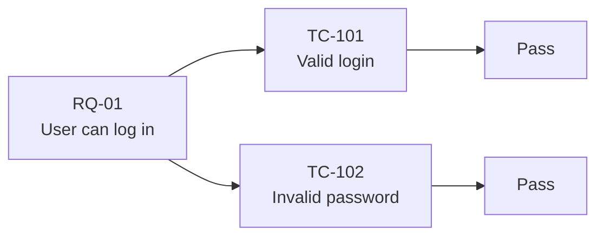
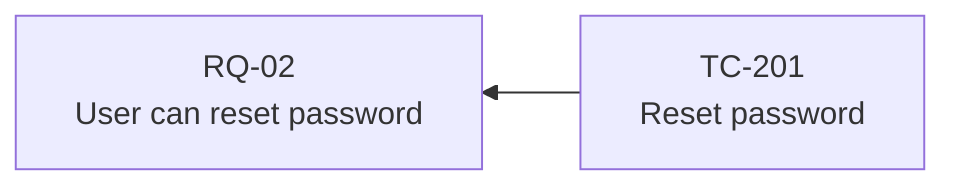
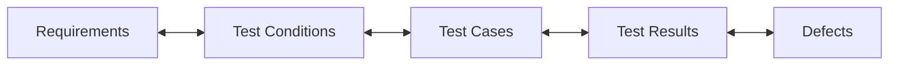
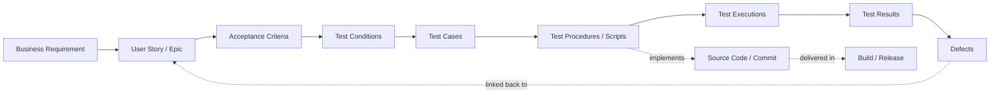
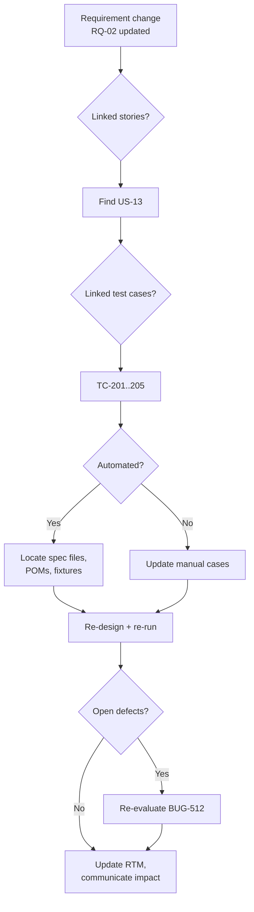

# 🔗 Traceability in QA — A Complete Guide

> *"If you can't trace it, you can't trust it."*

This guide covers **traceability** in software quality assurance: ISTQB definitions, the three directions (forward, backward, bidirectional), how to build and maintain a **Requirements Traceability Matrix (RTM)**, practical tool support (Jira, Xray, Azure DevOps, GitHub), **coverage metrics**, **impact analysis** workflows, common anti-patterns, and a reviewer's checklist.

---

## 📚 Table of Contents

1. [📖 ISTQB Terminology You Must Know](#-istqb-terminology-you-must-know)
2. [🎯 Why Traceability Matters](#-why-traceability-matters)
3. [🧭 The Three Directions of Traceability](#-the-three-directions-of-traceability)
4. [🗺️ The Traceability Chain](#-the-traceability-chain)
5. [📊 The Requirements Traceability Matrix (RTM)](#-the-requirements-traceability-matrix-rtm)
6. [🛠️ Tool Support by Platform](#-tool-support-by-platform)
7. [📐 Coverage Metrics](#-coverage-metrics)
8. [🔄 Impact Analysis Workflow](#-impact-analysis-workflow)
9. [🧪 Worked Example — Login & Password Reset](#-worked-example--login--password-reset)
10. [🤖 Keeping Traceability Alive in CI/CD](#-keeping-traceability-alive-in-cicd)
11. [⚠️ Common Anti-Patterns](#-common-anti-patterns)
12. [✅ Best Practices](#-best-practices)
13. [📋 Reviewer's Checklist](#-reviewers-checklist)
14. [📚 References](#-references)

---

## 📖 ISTQB Terminology You Must Know

Aligning on ISTQB vocabulary keeps traceability conversations unambiguous.

| Term                            | ISTQB Definition (paraphrased)                                                                                          |
| ------------------------------- | ----------------------------------------------------------------------------------------------------------------------- |
| **Traceability**                | The ability to identify related items in documentation and software, such as requirements with associated tests.        |
| **Bi-directional Traceability** | Traceability in both directions — from test basis to tests, and from tests back to the test basis.                     |
| **Test Basis**                  | The body of knowledge used as the basis for test analysis and design (requirements, user stories, design, code).        |
| **Test Condition**              | A testable aspect of a component or system identified as a basis for testing.                                            |
| **Test Case**                   | A set of preconditions, inputs, actions, expected results, and postconditions developed to verify a test condition.     |
| **Coverage**                    | The degree, expressed as a percentage, to which a specified coverage item has been exercised by a test suite.            |
| **Coverage Item**               | An attribute or combination of attributes derived from the test items to enable measurement of test coverage.            |
| **Requirements Traceability Matrix (RTM)** | A document showing the relationship between requirements and test cases (and often defects and deliverables). |
| **Impact Analysis**             | The identification of all work products affected by a change.                                                            |

> 💡 ISTQB explicitly requires **bi-directional traceability** across the entire test process — it is the backbone of coverage, impact analysis, and exit-criteria evaluation.

📖 See also: [testProcessISTQB.md](testProcessISTQB.md)

---

## 🎯 Why Traceability Matters

A defined traceability practice gives the team:

- 🧭 **Complete coverage** — every requirement has at least one test; every test has a reason to exist.
- 🔍 **Impact analysis** — when a requirement changes, you know exactly which tests, automation, and defects are affected.
- 📊 **Objective progress reporting** — *"Requirement RQ-02 is 80% tested, 1 defect open"* instead of *"things are going well"*.
- ✅ **Exit-criteria evaluation** — release decisions become data-driven.
- 🛡️ **Risk control** — gaps in the matrix are gaps in your safety net.
- 🧾 **Audit & compliance** — required in regulated industries (medical, finance, aviation, automotive).
- 🤝 **Accountability** — devs, QA, PMs all speak the same language about what "done" means.

---

## 🧭 The Three Directions of Traceability

### 1. Forward Traceability (Requirements → Tests → Results)

Traces a **requirement** through to the tests that verify it and the results of those tests.

**Answers:** *Are all my requirements covered by tests? Did those tests pass?*

### 2. Backward Traceability (Tests → Requirements)

Traces a **test case** back to the requirement it was written to verify.

**Answers:** *Why does this test exist? Is it still relevant?*

> 💡 If a test cannot be traced back to a requirement, it may be **dead weight** — orphaned by a scope change, or testing something that no longer matters.

### 3. Bi-directional Traceability

The combination of both — every requirement points to its tests, and every test points to its requirement(s).

**Answers:** *Is my coverage complete AND is every test justified?*

> 💡 ISTQB requires **bi-directional** traceability. Forward-only or backward-only is incomplete.

---

## 🗺️ The Traceability Chain

In a mature setup, traceability extends across the entire delivery chain — not just requirements and tests.

| Link                              | What it enables                                                            |
| --------------------------------- | -------------------------------------------------------------------------- |
| Requirement → Story → AC          | Decomposition is traceable; nothing is "forgotten in translation".         |
| AC → Test Condition → Test Case   | Coverage of acceptance criteria is verifiable.                             |
| Test Case → Test Procedure → Code | Automation references can be tracked back to the requirement they cover.   |
| Test Result → Defect → Requirement| When a test fails, the impacted business need is immediately visible.      |
| Defect → Build → Release          | Hotfix and rollback decisions become traceable.                            |

📖 See also: [testProcessISTQB.md](testProcessISTQB.md) · [bugLifeCycle.md](bugLifeCycle.md) · [xRayTestCase.md](xRayTestCase.md)

---

## 📊 The Requirements Traceability Matrix (RTM)

The RTM is the **operational artifact** of traceability — usually a table or a generated report from your test management tool.

### Minimal RTM

| Req ID | Requirement                  | Test Case ID(s)   | Last Result | Open Defects |
| ------ | ---------------------------- | ----------------- | ----------- | ------------ |
| RQ-01  | User can log in              | TC-101, TC-102    | ✅ Pass     | —            |
| RQ-02  | User can reset password      | TC-201            | ❌ Fail     | BUG-512      |
| RQ-03  | User can update profile info | TC-301, TC-302    | ✅ Pass     | —            |

### Extended RTM (audit / regulated)

| Req ID | Requirement              | Story  | Priority | AC IDs       | Test Case IDs   | Automated? | Last Build | Last Result | Coverage | Defects   | Notes |
| ------ | ------------------------ | ------ | -------- | ------------ | ---------------- | ---------- | ---------- | ----------- | -------- | --------- | ----- |
| RQ-01  | User can log in          | US-12  | High     | AC-12.1..3   | TC-101, TC-102   | Yes        | 1.4.0      | ✅ Pass     | 100%     | —         | —     |
| RQ-02  | Reset password           | US-13  | High     | AC-13.1..2   | TC-201           | Partial    | 1.4.0      | ❌ Fail     | 50%      | BUG-512   | a11y missing |
| RQ-03  | Update profile info      | US-14  | Medium   | AC-14.1..4   | TC-301..304      | Yes        | 1.4.0      | ✅ Pass     | 100%     | —         | —     |

### Anatomy

| Column         | Why it matters                                                            |
| -------------- | ------------------------------------------------------------------------- |
| Requirement    | The unit of business value being verified.                                |
| Story / AC     | Decomposition layer — finer granularity, easier coverage measurement.     |
| Test Case IDs  | Forward link to the verifying tests.                                      |
| Automated?     | Tells you what your CI safety net actually covers.                        |
| Last Result    | Current health of the requirement.                                        |
| Coverage       | % of related test conditions executed.                                    |
| Defects        | Open issues tied to this requirement.                                     |

> 💡 In modern tools, the RTM is **generated automatically** from your links — don't maintain it by hand.

---

## 🛠️ Tool Support by Platform

Most modern test-management stacks build the RTM for you, as long as you link the right issue types.

| Tool                  | Link types                                                              | Where to find the matrix                                          |
| --------------------- | ----------------------------------------------------------------------- | ----------------------------------------------------------------- |
| **Jira + Xray**       | *tests* (Test → Story), *is detected by* (Bug → Test)                   | Xray Reports → **Traceability Matrix**, **Requirements Coverage** |
| **Jira + Zephyr**     | Test ↔ Story; Defect ↔ Test                                             | Zephyr → **Traceability Report**                                  |
| **Azure DevOps**      | *Tested By* (Story → Test Case), *Tests* (Test Case → Story)             | Boards → **Requirements quality** widget                          |
| **TestRail**          | References field linking test cases to requirement IDs (Jira/ADO/etc.)  | Reports → **Coverage for References**                             |
| **GitHub Issues + PRs** | `Closes #N`, `Tests #N`, labels, milestones                           | Custom — typically built via GitHub Projects or third-party tools |
| **Polarion / DOORS**  | Native bi-directional links                                             | Built-in **Traceability View**                                    |

📖 See also: [xRayTestCase.md](xRayTestCase.md) · [pwRepoIntegration.md](pwRepoIntegration.md)

---

## 📐 Coverage Metrics

Traceability turns "are we testing enough?" into a measurable question.

| Metric                          | Formula                                                                 | Target |
| ------------------------------- | ----------------------------------------------------------------------- | ------ |
| **Requirements Coverage**       | (Requirements with ≥1 test) / Total requirements × 100                  | 100%   |
| **Acceptance Criteria Coverage**| (AC items with ≥1 passing test) / Total AC items × 100                  | 100%   |
| **Test Execution Coverage**     | Tests executed / Tests planned × 100                                    | ≥95%   |
| **Pass Rate**                   | Tests passed / Tests executed × 100                                     | ≥95%   |
| **Automation Coverage**         | Automated tests / Total tests × 100                                     | ≥70%   |
| **Defect-to-Requirement Ratio** | Open defects / Requirements in scope                                    | Low    |

$$\text{Requirements Coverage} = \frac{\text{Requirements with at least one test}}{\text{Total requirements in scope}} \times 100$$

> 💡 Coverage % is **necessary but not sufficient** — 100% requirements coverage with poorly designed tests still misses defects. Pair coverage metrics with **defect detection** and **escaped defect** metrics.

📖 See also: [qaTestingReport.md](qaTestingReport.md) · [testPlan.md](testPlan.md)

---

## 🔄 Impact Analysis Workflow

When a requirement changes, traceability tells you **exactly what's affected** — in minutes, not days.

### Impact Analysis Checklist

- [ ] All linked stories / epics identified.
- [ ] All linked acceptance criteria reviewed.
- [ ] All test cases re-assessed (still valid? need updates? new ones needed?).
- [ ] Automated tests located in the repo.
- [ ] Open defects re-evaluated against the new requirement.
- [ ] Schedule, exit criteria, and risks revisited.
- [ ] Stakeholders notified.

📖 See also: [bugLifeCycle.md](bugLifeCycle.md)

---

## 🧪 Worked Example — Login & Password Reset

### Scenario

The product team adds three requirements:

1. **RQ-01** — User can log in with email and password.
2. **RQ-02** — User can reset a forgotten password.
3. **RQ-03** — User can update profile information.

### Step 1 — Build the RTM

| Req ID | Requirement                  | Test Case IDs              | Automated? |
| ------ | ---------------------------- | -------------------------- | ---------- |
| RQ-01  | User can log in              | TC-101, TC-102             | Yes        |
| RQ-02  | User can reset password      | TC-201                     | Yes        |
| RQ-03  | User can update profile info | TC-301, TC-302             | Yes        |

### Step 2 — Run the suite

| Test Case | Behavior verified                       | Result   |
| --------- | --------------------------------------- | -------- |
| TC-101    | Login with valid credentials            | ✅ Pass  |
| TC-102    | Login with invalid password             | ✅ Pass  |
| TC-201    | Reset password with valid email          | ❌ Fail  |
| TC-301    | Update name in profile                  | ✅ Pass  |
| TC-302    | Update email in profile                 | ✅ Pass  |

### Step 3 — Update the RTM

| Req ID | Coverage | Last Result | Defects   | Status        |
| ------ | -------- | ----------- | --------- | ------------- |
| RQ-01  | 100%     | ✅ Pass     | —         | ✅ Ready      |
| RQ-02  | 100%     | ❌ Fail     | BUG-512   | ❌ Blocked    |
| RQ-03  | 100%     | ✅ Pass     | —         | ✅ Ready      |

### Step 4 — Report to stakeholders

> *"2 of 3 requirements are fully passing. RQ-02 (password reset) is blocked by BUG-512 (link expires in 5 s instead of 15 min). Release recommendation: **No-Go** until BUG-512 is resolved and TC-201 is re-run."*

### What traceability gave us

- **Coverage proof** — every requirement has tests.
- **Targeted reporting** — the blocker is named, scoped, and linked.
- **Impact clarity** — when BUG-512 is fixed, we know exactly which test to re-run.
- **Audit trail** — the chain RQ-02 → TC-201 → BUG-512 is permanent.

---

## 🤖 Keeping Traceability Alive in CI/CD

Traceability that lives only in a wiki rots. Wire it into the pipeline.

| Practice                                        | How                                                                                              |
| ----------------------------------------------- | ------------------------------------------------------------------------------------------------ |
| **Reference the requirement in the spec**       | Add the Jira/ADO ID in the test title or as a tag: `test('RQ-02: reset password @reset', ...)`. |
| **Reference the requirement in the commit/PR**  | `feat(auth): RQ-01 add magic link login` / `Closes JIRA-142`.                                    |
| **Import results into the test management tool**| Upload JUnit/Allure/Xray-JSON results from CI to update the RTM automatically.                   |
| **Fail the build on coverage drop**             | CI step that fails if requirements coverage drops below threshold.                               |
| **Generate the RTM as a build artifact**        | Produce an HTML/CSV RTM per release; attach it to the release notes.                             |
| **Tag tests by requirement / risk area**        | `@RQ-01`, `@auth`, `@smoke` — enables targeted runs and reports.                                  |
| **Link defects to failing tests automatically** | Use Xray, Allure TestOps, or custom hooks to auto-link bugs to the failing test case.            |

📖 See also: [pwRepoIntegration.md](pwRepoIntegration.md) · [playwrightTSMistakes.md](playwrightTSMistakes.md)

---

## ⚠️ Common Anti-Patterns

| Anti-pattern                                                | Better approach                                                       |
| ----------------------------------------------------------- | --------------------------------------------------------------------- |
| Maintaining the RTM in a separate Excel file                | Generate it from your test management tool — single source of truth.  |
| Test cases without any link to a requirement                | Refuse to merge orphan tests; require a `tests` link or a tag.        |
| Requirements with zero tests                                | Block the release on requirements-coverage drop in CI.                |
| One mega test case covering five requirements                | Split — one test per behavior, each traceable to its own requirement. |
| Updating the RTM only at release time                       | Update on **every** test execution (automatically).                   |
| Tracing only requirements ↔ tests, ignoring defects         | Bi-directional traceability includes defects too.                     |
| "We use Jira so we have traceability" without links         | Tools are containers; traceability requires the **links** to exist.   |
| Stale defect-to-requirement links after a refactor          | Run a periodic audit; broken links are silent risk.                   |
| Treating traceability as audit overhead                     | Use it daily — for impact analysis, planning, and reports.            |

---

## ✅ Best Practices

- 🔗 **Maintain bi-directional traceability** — requirements ↔ tests ↔ results ↔ defects.
- 🛠️ **Use the tooling** — Xray, Zephyr, Azure Test Plans build the RTM for you when links exist.
- 🏷️ **Tag tests with requirement IDs** in the code itself (`@RQ-01`) — it survives refactors.
- 🤖 **Automate result imports** so the RTM is always current.
- 📊 **Report coverage at every layer** — requirements, AC, automated, manual.
- 🔍 **Run impact analysis** on every requirement change, before sprint planning.
- 🧪 **One behavior per test** — keeps backward traceability clean.
- 🧾 **Generate the RTM as a release artifact** — it's your audit trail.
- 🚦 **Block on coverage drops** — fail the build if a requirement loses test coverage.
- 🪞 **Audit the matrix periodically** — orphan tests and uncovered requirements are silent risk.

---

## 📋 Reviewer's Checklist

Use this when reviewing a PR or a release for traceability hygiene.

- [ ] Every new test case is linked to a requirement / story / AC.
- [ ] Every requirement in scope has at least one test.
- [ ] Test titles or tags reference the requirement ID (`@RQ-XX`, Jira key).
- [ ] Automated tests appear in the RTM as **Automated**.
- [ ] Defects raised from failing tests are linked back to the test and the requirement.
- [ ] The RTM is **generated**, not hand-edited.
- [ ] Coverage metrics are reported in the release summary.
- [ ] Impact analysis was performed for every changed requirement.
- [ ] No orphan tests (no requirement link) merged into `main`.
- [ ] No orphan requirements (no test link) in the release scope.
- [ ] RTM artifact attached to the release notes (for regulated contexts).

---

## 📚 References

- ISTQB® **Certified Tester Foundation Level (CTFL) Syllabus** — Traceability across the test process
- ISTQB® **Glossary of Testing Terms** — [glossary.istqb.org](https://glossary.istqb.org/)
- ISO/IEC/IEEE **29119** — Software Testing standards (test documentation & traceability)
- Atlassian — [Requirements traceability in Jira](https://www.atlassian.com/agile/project-management/requirements)
- Xray Docs — [docs.getxray.app](https://docs.getxray.app/) (Traceability Matrix, Requirements Coverage)
- Related docs: [testProcessISTQB.md](testProcessISTQB.md) · [testPhases.md](testPhases.md) · [testPlan.md](testPlan.md) · [xRayTestCase.md](xRayTestCase.md) · [bugLifeCycle.md](bugLifeCycle.md) · [qaTestingReport.md](qaTestingReport.md) · [pwRepoIntegration.md](pwRepoIntegration.md) · [playwrightTSMistakes.md](playwrightTSMistakes.md)
