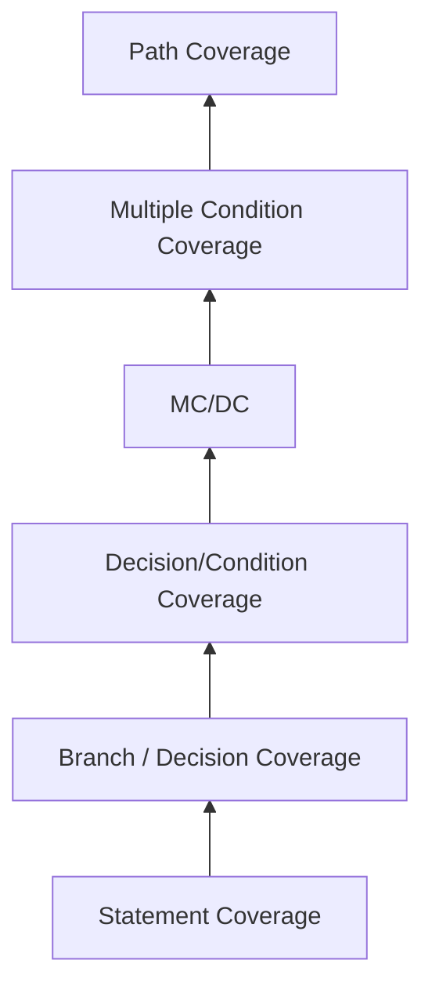
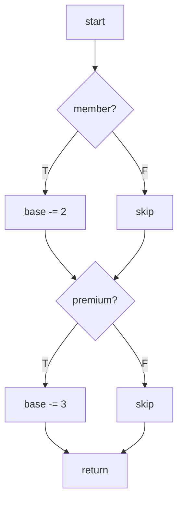
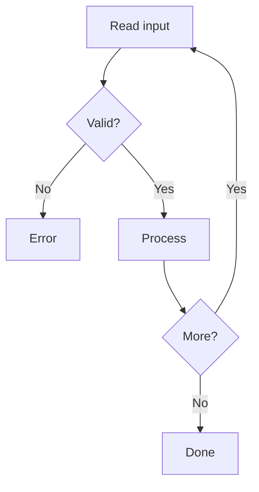
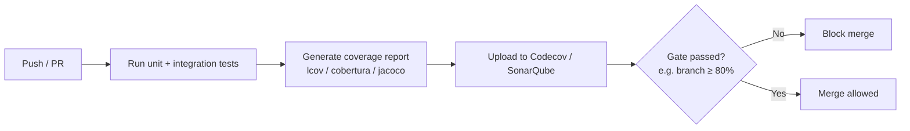

# 🔍 White-Box Testing — A Complete Guide

> *"If black-box testing asks 'does it work?', white-box testing asks 'why does it work — and where will it break?'"*

This guide covers **white-box (structural) testing from end to end**: ISTQB terminology, every coverage technique with worked examples, **coverage hierarchy and what each level actually proves**, tooling for **Java, JavaScript/TypeScript, Python, C#, Go**, **CI integration with coverage gates**, mutation testing, metrics, and best practices.

---

## 📚 Table of Contents

1. [ISTQB Terminology You Must Know](#-istqb-terminology-you-must-know)
2. [Why White-Box Testing Matters](#-why-white-box-testing-matters)
3. [⚖️ White-Box vs Black-Box vs Gray-Box](#-white-box-vs-black-box-vs-gray-box)
4. [📏 Coverage Hierarchy](#-coverage-hierarchy)
5. [🧪 Coverage Techniques](#-coverage-techniques)
    1. [Statement Coverage](#1-statement-coverage)
    2. [Branch / Decision Coverage](#2-branch--decision-coverage)
    3. [Condition Coverage](#3-condition-coverage)
    4. [Decision/Condition Coverage](#4-decisioncondition-coverage)
    5. [Modified Condition/Decision Coverage (MC/DC)](#5-modified-conditiondecision-coverage-mcdc)
    6. [Multiple Condition Coverage](#6-multiple-condition-coverage)
    7. [Path Coverage](#7-path-coverage)
    8. [Loop Testing](#8-loop-testing)
    9. [Data Flow Testing](#9-data-flow-testing)
    10. [Control Flow Testing](#10-control-flow-testing)
6. [🧬 Mutation Testing](#-mutation-testing)
7. [🛠️ Tools by Language](#-tools-by-language)
8. [🤖 CI Integration & Coverage Gates](#-ci-integration--coverage-gates)
9. [📐 Useful Metrics & KPIs](#-useful-metrics--kpis)
10. [✅ Best Practices](#-best-practices)
11. [📚 References](#-references)

---

## 📖 ISTQB Terminology You Must Know

| Term                       | ISTQB Definition (paraphrased)                                                                                |
| -------------------------- | -------------------------------------------------------------------------------------------------------------- |
| **White-Box Testing**      | Testing based on an analysis of the internal structure of the component or system. Also: *structural testing*. |
| **Coverage Item**          | An attribute or combination of attributes derived from the test basis that is used to measure coverage.        |
| **Coverage**               | The degree to which specified coverage items have been exercised by a test suite, expressed as a percentage.   |
| **Statement Coverage**     | Percentage of executable statements exercised by a test suite.                                                 |
| **Decision (Branch) Coverage** | Percentage of decision outcomes exercised by a test suite.                                                 |
| **Condition Coverage**     | Percentage of single condition outcomes that have been exercised.                                              |
| **MC/DC**                  | Modified Condition/Decision Coverage — each condition independently shown to affect the decision outcome.      |
| **Multiple Condition Coverage** | Percentage of combinations of all condition outcomes exercised.                                           |
| **Path Coverage**          | Percentage of paths through a component exercised by a test suite.                                             |
| **Control Flow Graph (CFG)** | Abstract representation of all paths that might be traversed during execution.                               |
| **Cyclomatic Complexity**  | The number of linearly independent paths through a program's source code (McCabe metric).                      |
| **Mutation Testing**       | Testing in which mutants are seeded into the code to evaluate the effectiveness of the test suite.             |

> 💡 **White-box ≠ unit testing.** White-box is a *perspective* (you know the code); unit, integration, and even some E2E tests can be designed with a white-box perspective.

---

## 🎯 Why White-Box Testing Matters

- 🧠 **Finds defects black-box cannot** — dead code, unreachable branches, unused variables, missed error paths.
- 🛡️ **Required by safety standards** — DO-178C (avionics), ISO 26262 (automotive), IEC 62304 (medical) mandate MC/DC or branch coverage at specific levels.
- 🎯 **Drives test design** — the CFG tells you exactly which inputs are needed to cover each branch.
- 📉 **Reduces escaped defects** — high branch + mutation coverage strongly correlates with lower production defect density.
- 🔄 **Powers refactoring confidence** — high coverage = safety net when changing internals.

---

## ⚖️ White-Box vs Black-Box vs Gray-Box

| Aspect             | **Black-Box**                       | **Gray-Box**                            | **White-Box**                            |
| ------------------ | ----------------------------------- | --------------------------------------- | ---------------------------------------- |
| Visibility         | No knowledge of internals           | Partial knowledge (APIs, DB schema)     | Full knowledge of source code            |
| Basis              | Requirements, specs                 | Specs + architecture / interfaces       | Source code, CFG, data flow              |
| Typical level      | System, acceptance                  | Integration, API                        | Unit, component, integration             |
| Designed by        | QA, BA                              | QA with dev input                       | Developer or test engineer with code     |
| Finds              | Functional gaps, UX                 | Integration / contract issues           | Logic errors, dead code, missed paths    |
| Example techniques | EP, BVA, decision tables            | API contract tests, DB-aware E2E        | Statement, branch, MC/DC, mutation       |

📖 See also: [blackBoxTesting.md](blackBoxTesting.md) · [staticVsDynamicTesting.md](staticVsDynamicTesting.md)

---

## 📏 Coverage Hierarchy

Each level **subsumes** the weaker ones: achieving the stronger level guarantees the weaker is also met.



| Level                      | Test cases needed for `if (A && B)` | Typical use                                |
| -------------------------- | ----------------------------------- | ------------------------------------------ |
| Statement                  | 1                                   | Minimum acceptable bar                     |
| Branch / Decision          | 2                                   | Industry default for most projects         |
| Decision/Condition         | 2 (carefully chosen)                | Stronger than branch                       |
| **MC/DC**                  | **n + 1** (3 for 2 conditions)      | **Safety-critical software**               |
| Multiple Condition         | 2ⁿ (4 for 2 conditions)             | Small, critical decisions                  |
| Path                       | All independent paths               | Rarely 100% achievable in real code        |

> ⚠️ **100% statement coverage ≠ tested code.** A test that runs every line but asserts nothing proves only that the code doesn't crash. Coverage is a *necessary but not sufficient* condition.

---

## 🧪 Coverage Techniques

### 1. Statement Coverage

Every executable statement is exercised at least once.

```python
def classify(age):
    if age > 18:
        print("Adult")        # statement 1
    print("Done")             # statement 2
```

✅ **One test** with `age=20` covers 100% statements — but **misses** the `age <= 18` branch entirely.

---

### 2. Branch / Decision Coverage

Every decision outcome (true *and* false) is exercised.

```python
def classify(age):
    if age > 18:
        return "Adult"
    else:
        return "Minor"
```

✅ **Two tests:** `age=20` (true branch) and `age=10` (false branch).

> 📌 In most CI systems "coverage %" defaults to **line** or **branch** coverage. Prefer **branch** as the gate.

---

### 3. Condition Coverage

Each Boolean **sub-expression** evaluates to both `true` and `false` at least once.

```python
def allow(age, member):
    if age > 18 and member:
        return True
    return False
```

| Test | `age > 18` | `member` | Decision |
| ---- | ---------- | -------- | -------- |
| 1    | T          | F        | F        |
| 2    | F          | T        | F        |

✅ Both sub-conditions take T/F values — **but the decision was never true**. Condition coverage alone is *weaker* than branch coverage.

---

### 4. Decision/Condition Coverage

Combines branch + condition: every sub-condition takes T/F **and** every decision takes T/F.

| Test | `age > 18` | `member` | Decision |
| ---- | ---------- | -------- | -------- |
| 1    | T          | T        | **T**    |
| 2    | F          | F        | **F**    |

✅ Two tests cover both — but we still haven't shown that *each condition independently* affects the result.

---

### 5. Modified Condition/Decision Coverage (MC/DC)

Required by **DO-178C Level A** (avionics) and **ISO 26262 ASIL D** (automotive).

> Each condition must be shown to **independently** affect the decision outcome, holding the others fixed.

```python
def allow(age, member, blocked):
    return (age > 18 and member) and not blocked
```

| Test | `age>18` | `member` | `not blocked` | Decision |
| ---- | -------- | -------- | ------------- | -------- |
| 1    | T        | T        | T             | **T**    |
| 2    | F        | T        | T             | F  *(flips with `age`)*   |
| 3    | T        | F        | T             | F  *(flips with `member`)* |
| 4    | T        | T        | F             | F  *(flips with `blocked`)* |

✅ **n+1 = 4 tests** for 3 conditions — proves every condition independently affects the outcome.

---

### 6. Multiple Condition Coverage

All `2ⁿ` combinations of conditions in a decision.

For `(A and B)` — 4 tests: TT, TF, FT, FF. Grows exponentially → only practical for small, critical decisions.

---

### 7. Path Coverage

Every linearly independent path through the CFG is exercised.

```python
def fee(member, premium):
    base = 10
    if member:
        base -= 2
    if premium:
        base -= 3
    return base
```



✅ **4 independent paths** — cyclomatic complexity = 4.

> 💡 **Cyclomatic complexity** = number of binary decisions + 1 = minimum number of tests for full path coverage.

---

### 8. Loop Testing

Loops are defect-rich; test the boundary iteration counts.

| Loop type    | Tests to design                                                            |
| ------------ | -------------------------------------------------------------------------- |
| **Simple**   | 0 iterations, 1, 2, *typical n*, *max n*, *max n + 1*                      |
| **Nested**   | Start at innermost; min outer, then vary inner; then move outward          |
| **Concatenated** | Test each loop independently first, then interactions                  |
| **Unstructured** | Refactor first — don't test spaghetti                                  |

```python
def sum_positive(values):
    total = 0
    for v in values:
        if v > 0:
            total += v
    return total
```

✅ Tests: `[]`, `[5]`, `[-1]`, `[1, -2, 3]`, very long list.

---

### 9. Data Flow Testing

Tracks how variables are **defined (d)**, **used (u)**, and **killed (k)**. Detects:

- **du-anomaly:** define then use without intervening kill (normal).
- **dd-anomaly:** define then define without use (suspicious).
- **dk-anomaly:** define then kill without use (dead code).
- **uu / ku-anomaly:** use without prior definition (defect).

```python
def buggy():
    x = 5          # d
    x = 10         # d (previous value never used — dd-anomaly)
    return x       # u
```

Tools: `pylint`, `flake8`, ESLint `no-unused-vars`, SonarQube data-flow rules.

---

### 10. Control Flow Testing

Analyzes the CFG to design tests that exercise every node, edge, or path. The umbrella under which statement, branch, and path coverage live.



Design tests for: every node, every edge, and at least each independent path.

---

## 🧬 Mutation Testing

Coverage tells you *what was executed* — **mutation testing tells you whether your tests actually catch bugs**.

A mutation tool introduces small changes (mutants) into the code (e.g., `>` → `>=`, `+` → `-`, remove `return`) and runs your tests. A mutant is **killed** if any test fails, **survived** if all pass.

> **Mutation Score = killed / (killed + survived) × 100**

| Language       | Tool                              |
| -------------- | --------------------------------- |
| Java           | **PIT** (`pitest`)                |
| JavaScript/TS  | **Stryker** (`stryker-mutator`)   |
| Python         | **mutmut**, **cosmic-ray**         |
| C#             | **Stryker.NET**                    |
| Go             | **go-mutesting**                   |
| Ruby           | **mutant**                         |

> 🎯 Target: ≥ **80% mutation score** on critical modules. Surviving mutants reveal weak assertions, not missing executions.

---

## 🛠️ Tools by Language

| Language       | Coverage Tool                          | Notes                                                  |
| -------------- | -------------------------------------- | ------------------------------------------------------ |
| **Java**       | JaCoCo, Cobertura, OpenClover           | JaCoCo is the de-facto standard; integrates with SonarQube. |
| **JS / TS**    | Istanbul / `c8`, Jest `--coverage`      | Built into Jest, Vitest, Playwright (via `c8`).        |
| **Python**     | `coverage.py`, `pytest-cov`              | Use `--cov-branch` for branch coverage.                |
| **C# / .NET**  | Coverlet, dotCover, OpenCover            | Coverlet ships with `dotnet test`.                     |
| **Go**         | `go test -cover`, `gocov`                | Native; export with `-coverprofile=cover.out`.         |
| **Ruby**       | SimpleCov                                | Outputs HTML + JSON.                                   |
| **Rust**       | `cargo tarpaulin`, `grcov`               | Linux-first; `grcov` works cross-platform.             |
| **C / C++**    | gcov + lcov, BullseyeCoverage             | Bullseye supports MC/DC for safety-critical work.      |
| **Aggregator** | SonarQube, Codecov, Coveralls            | Combine reports across languages, enforce PR gates.    |

---

## 🤖 CI Integration & Coverage Gates



### Example — Jest + Codecov (GitHub Actions)

```yaml
- name: Test with coverage
  run: npx jest --coverage --coverageReporters=lcov --coverageReporters=text-summary

- name: Upload coverage
  uses: codecov/codecov-action@v4
  with:
    files: ./coverage/lcov.info
    fail_ci_if_error: true
```

### Example — `pytest-cov` with branch coverage and gate

```bash
pytest --cov=src --cov-branch --cov-fail-under=85 --cov-report=xml
```

### Example — JaCoCo Maven gate

```xml
<plugin>
  <groupId>org.jacoco</groupId>
  <artifactId>jacoco-maven-plugin</artifactId>
  <executions>
    <execution>
      <goals><goal>prepare-agent</goal></goals>
    </execution>
    <execution>
      <id>check</id>
      <goals><goal>check</goal></goals>
      <configuration>
        <rules>
          <rule>
            <element>BUNDLE</element>
            <limits>
              <limit>
                <counter>BRANCH</counter>
                <value>COVEREDRATIO</value>
                <minimum>0.80</minimum>
              </limit>
            </limits>
          </rule>
        </rules>
      </configuration>
    </execution>
  </executions>
</plugin>
```

> 💡 Gate on **diff coverage** (new/changed lines) rather than total — keeps legacy code from blocking new work while still raising the bar.

---

## 📐 Useful Metrics & KPIs

| Metric                          | Definition                                                             | Healthy range            |
| ------------------------------- | ---------------------------------------------------------------------- | ------------------------ |
| **Line / Statement Coverage**   | Lines executed / total lines × 100                                     | ≥ 80%                    |
| **Branch Coverage**             | Branches taken / total branches × 100                                  | ≥ 75–80%                 |
| **MC/DC Coverage**              | Independent condition effects covered                                  | 100% (safety-critical)   |
| **Cyclomatic Complexity**       | Independent paths per function (McCabe)                                | ≤ 10 per function        |
| **Mutation Score**              | Killed mutants / total mutants × 100                                   | ≥ 80% on critical code   |
| **Diff Coverage (Δ-coverage)**  | Coverage on new/changed lines in a PR                                  | ≥ 90%                    |
| **Test-to-Code Ratio**          | Lines of test code / lines of production code                          | 1:1 to 3:1               |
| **Dead Code %**                 | Unreachable or unused code lines                                       | < 2%                     |

### Snapshot Example

| Module             | Branch Cov | Mutation Score | Complexity (avg) | Status |
| ------------------ | ---------- | -------------- | ---------------- | ------ |
| `auth/`            | 92%        | 88%            | 4.2              | 🟢     |
| `payments/`        | 85%        | 81%            | 6.8              | 🟢     |
| `reporting/`       | 71%        | 58%            | 9.1              | 🟡     |
| `legacy-import/`   | 38%        | 22%            | 14.7             | 🔴     |

---

## ✅ Best Practices

- 🎯 **Gate on branch coverage**, not just line coverage — branches catch logic, lines catch presence.
- 🧬 **Add mutation testing** on critical modules — coverage without strong assertions is theatre.
- 📉 **Measure diff coverage on PRs** — stop the bleeding before fixing legacy.
- 🧮 **Keep cyclomatic complexity ≤ 10** per function — refactor instead of writing 50 tests for one method.
- 🚫 **100% coverage is not a goal** — chasing the last 5% usually means testing trivial getters/setters.
- 🔗 **Pair with black-box tests** — white-box proves the code runs; black-box proves it does the right thing.
- 🧹 **Treat dead code as a defect** — delete it; coverage tools surface it for free.
- 🔄 **Re-run coverage after every refactor** — coverage rot is real.
- 🏷️ **Exclude generated code, migrations, DTOs** from coverage reports to avoid distortion.
- 📊 **Track trends, not just totals** — falling branch coverage is a louder signal than an absolute number.
- 🛡️ **Pick the right level for the domain** — branch for most apps, MC/DC for safety-critical.

---

## 📚 References

- ISTQB® **Foundation Level Syllabus** — Structural test techniques, coverage
- ISTQB® **Glossary** — [glossary.istqb.org](https://glossary.istqb.org/)
- **RTCA DO-178C** — Software Considerations in Airborne Systems (MC/DC requirement)
- **ISO 26262** — Functional safety for road vehicles
- McCabe, T. J. — *A Complexity Measure* (1976)
- JaCoCo Docs — [jacoco.org](https://www.jacoco.org/jacoco/trunk/doc/)
- Stryker Mutator — [stryker-mutator.io](https://stryker-mutator.io/)
- PIT Mutation Testing — [pitest.org](https://pitest.org/)
- Related docs: [blackBoxTesting.md](blackBoxTesting.md) · [staticVsDynamicTesting.md](staticVsDynamicTesting.md) · [softwareTesting.md](softwareTesting.md) · [reviewActivities.md](reviewActivities.md)
