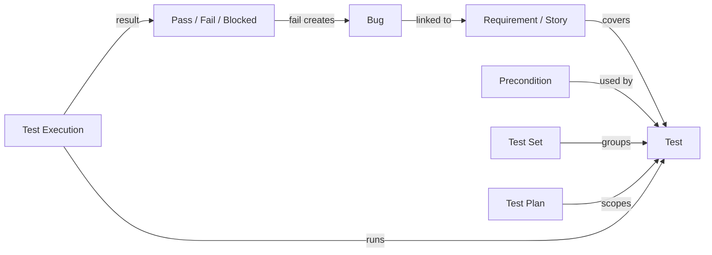
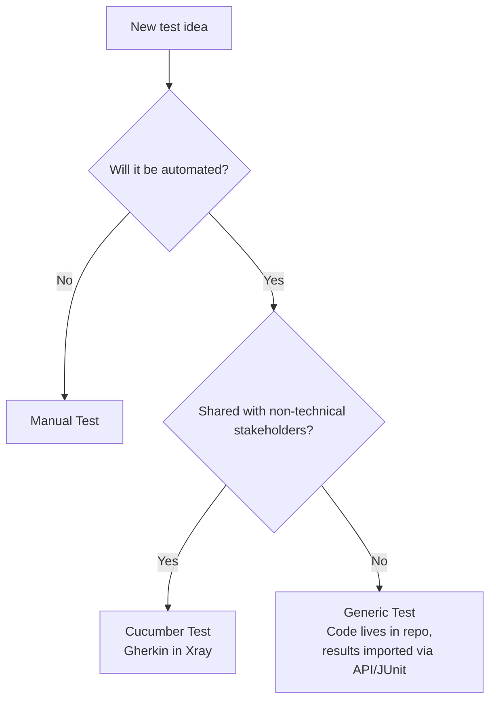
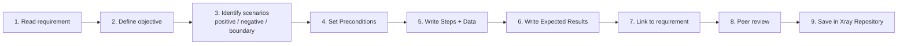
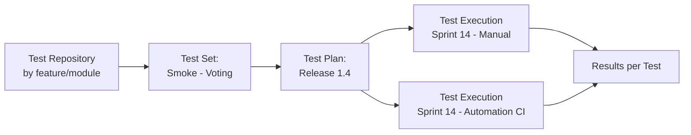
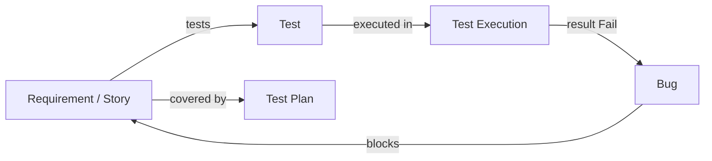

# 📝 Test Cases in Jira + Xray — A Complete Guide

> *"A great test case is one any tester can pick up, run identically, and trust the result."*

This guide is a senior-level playbook for writing **clear, reusable, and traceable test cases** in **Jira with the Xray plugin**. It covers Xray's issue model, manual vs Cucumber vs generic tests, test-step anatomy, parameterization (datasets), Test Sets / Plans / Executions, the **traceability matrix**, common anti-patterns, and a ready-to-copy template.

---

## 📚 Table of Contents

1. [🎯 Why Test Case Quality Matters](#-why-test-case-quality-matters)
2. [📦 Xray Issue Model in Jira](#-xray-issue-model-in-jira)
3. [🧩 Anatomy of a Good Test Case](#-anatomy-of-a-good-test-case)
4. [🧪 Test Types in Xray](#-test-types-in-xray)
5. [🪜 Step-by-Step — Creating a Test Case](#-step-by-step--creating-a-test-case)
6. [♻️ Designing for Reusability](#-designing-for-reusability)
7. [🔢 Parameterization & Datasets](#-parameterization--datasets)
8. [📂 Organizing with Test Sets, Plans & Executions](#-organizing-with-test-sets-plans--executions)
9. [🔗 Traceability — Requirement ↔ Test ↔ Defect](#-traceability--requirement--test--defect)
10. [📊 Useful Xray Reports](#-useful-xray-reports)
11. [🧾 Naming Conventions & Templates](#-naming-conventions--templates)
12. [⚠️ Common Anti-Patterns](#-common-anti-patterns)
13. [✅ Best Practices](#-best-practices)
14. [📋 Reviewer's Checklist](#-reviewers-checklist)
15. [📚 References](#-references)

---

## 🎯 Why Test Case Quality Matters

A well-written test case is an **executable contract** between QA, Dev, and Product. It defines what success looks like, who can verify it, and how it ties back to a requirement.

Done well, Jira + Xray gives you:

- 🧭 **Traceability** — every requirement is linked to tests; every defect to a failing test.
- 🔁 **Reusability** — one test, many executions, many cycles.
- 📊 **Live coverage** — dashboards show what's tested, what's failing, what's at risk.
- 🤝 **Shared language** — devs read tests as acceptance criteria.
- 🧪 **Audit-ready evidence** — execution history is permanent.

---

## 📦 Xray Issue Model in Jira

Xray adds several **Jira issue types** that work together. Understanding the model is half the battle.

| Issue Type          | Purpose                                                                                       |
| ------------------- | --------------------------------------------------------------------------------------------- |
| **Test**            | The actual test case (steps + expected results, or Gherkin scenario, or automation reference).|
| **Precondition**    | Reusable setup steps shared across multiple Tests.                                            |
| **Test Set**        | A *folder-like* grouping of related Tests (e.g., "Login Smoke Set").                          |
| **Test Plan**       | A planned scope of Tests for a release or milestone.                                          |
| **Test Execution**  | A run of selected Tests, recording results (Pass / Fail / Blocked / Skipped).                 |
| **Sub-Test Execution** | An execution scoped inside a Test Plan or sprint.                                         |
| **Bug** (Jira)      | Defect linked from a failing execution.                                                       |

### How they connect



> 💡 A **Test** is reusable. It is executed many times via many **Test Executions** without changing the Test itself.

📖 See also: [bugLifeCycle.md](bugLifeCycle.md) · [traceability.md](traceability.md)

---

## 🧩 Anatomy of a Good Test Case

| Section              | What it answers                                              | Example                                                       |
| -------------------- | ------------------------------------------------------------ | ------------------------------------------------------------- |
| **Summary / Title**  | What is being verified — behavior, not steps.                | *"User can cast one vote per car model"*                      |
| **Description**      | Brief context, scope, what is in/out.                        | *"Validates the POST /votes flow for authenticated users."*   |
| **Test Type**        | Manual / Cucumber / Generic (automated).                     | Manual                                                        |
| **Preconditions**    | System state before the first step.                          | User is logged in; car model exists.                          |
| **Steps**            | Numbered, deterministic actions.                             | 1. Open car page  2. Click Vote  3. Confirm dialog            |
| **Test Data**        | Inputs, ideally parameterized.                               | `{user}`, `{carId}`                                           |
| **Expected Results** | One expected outcome per step.                               | Vote count increases by 1; toast "Vote submitted".            |
| **Labels / Tags**    | `@smoke`, `@regression`, feature labels.                     | `voting`, `smoke`                                             |
| **Priority**         | Business importance.                                         | High                                                          |
| **Linked Issues**    | Requirement(s), risks, related Tests.                        | "tests" → STORY-142                                           |

### Characteristics that matter

- 🧭 **Clarity** — readable by someone new to the team.
- 🪶 **Conciseness** — only what's needed to verify the behavior.
- 🧱 **Independence** — does not depend on another test's leftover state.
- 🎯 **Specificity** — expected results are observable and unambiguous.
- ♻️ **Reusability** — generic enough to survive UI/copy changes.
- 🔗 **Traceability** — linked to a requirement and to defects when they appear.

---

## 🧪 Test Types in Xray

| Test Type    | When to use                                          | Stored as                                          |
| ------------ | ---------------------------------------------------- | -------------------------------------------------- |
| **Manual**   | Exploratory, UX, complex workflows, one-off checks.  | Step table (Action / Data / Expected Result).      |
| **Cucumber** | BDD specs co-owned with Product/Dev.                 | Gherkin (`Given/When/Then`) inside the Test issue. |
| **Generic**  | Automated tests living in code (Playwright, JUnit…). | A reference / description; results imported.       |

### Choosing the right type



### Example — Cucumber Test in Xray

```gherkin
Feature: Voting

  Scenario: Authenticated user votes for a car model
    Given I am logged in as a registered user
    And a car model "Model S" exists
    When I cast a vote for "Model S"
    Then the vote count for "Model S" increases by 1
    And I see the confirmation "Vote submitted successfully"
```

📖 See also: [pwRepoIntegration.md](pwRepoIntegration.md)

---

## 🪜 Step-by-Step — Creating a Test Case



### Worked Example — Voting Feature

| Field            | Value                                                                                |
| ---------------- | ------------------------------------------------------------------------------------ |
| **Summary**      | `[Voting] Authenticated user can vote once per car model`                            |
| **Test Type**    | Manual                                                                               |
| **Precondition** | `PRE-001 — User logged in with valid credentials and at least one car model exists`  |
| **Step 1**       | *Action:* Navigate to `/cars/{carId}`. *Data:* `carId = MODEL_S`. *Expected:* Car details page loads. |
| **Step 2**       | *Action:* Click `Vote`. *Expected:* Confirmation dialog appears.                     |
| **Step 3**       | *Action:* Click `Confirm`. *Expected:* Toast "Vote submitted"; vote count + 1.       |
| **Step 4**       | *Action:* Click `Vote` again on same car. *Expected:* Button is disabled; tooltip "Already voted". |
| **Linked to**    | Story `BUG-142` ("Users can vote for car models")                                    |
| **Labels**       | `voting`, `smoke`                                                                    |
| **Priority**     | High                                                                                 |

📖 See also: [traceability.md](traceability.md)

---

## ♻️ Designing for Reusability

A reusable test survives release notes, redesigns, and refactors.

| Technique                       | Apply when…                                          | Example                                              |
| ------------------------------- | ---------------------------------------------------- | ---------------------------------------------------- |
| **Generic wording**             | Always.                                              | "Click the *Vote* button" — not "Click the blue v2 button". |
| **Parameterized data**          | The same flow with many inputs.                      | `{user}`, `{carId}`, `{voteCount}`.                  |
| **Shared Preconditions**        | Multiple tests need the same setup.                  | One `PRE-LOGIN` reused by 30 tests.                  |
| **Atomic scope**                | The behavior is large.                               | Split "Place order" into login → add to cart → checkout. |
| **No environment hard-coding**  | Tests should run on dev/stg/prod.                    | Use `{baseUrl}`, not `https://staging.x.com`.        |
| **Behavior-focused titles**     | Always.                                              | *"Voting fails when not logged in"* vs *"Test 17"*.  |

### Wrong vs Right

❌ Brittle, single-use
```
1. Click the blue "Vote" button at top-right.
2. Wait 3 seconds.
3. Verify "You voted!" appears in green at coordinates (412, 220).
```

✅ Generic, reusable
```
1. Click the "Vote" action on the car detail page.
2. Wait for the vote confirmation to appear.
3. Verify the confirmation message text equals "Vote submitted successfully".
```

---

## 🔢 Parameterization & Datasets

Xray supports **datasets** — a table of input rows that re-run the same Test multiple times, each with different values.

| Use case                                              | How                                                       |
| ----------------------------------------------------- | --------------------------------------------------------- |
| Same flow, many input combinations                    | Add a dataset to the Test (or the Test Execution).        |
| Boundary value analysis                               | One row per boundary (min, min-1, nominal, max, max+1).   |
| Decision table coverage                               | One row per decision combination.                         |
| Localization smoke checks                             | One row per locale.                                       |

### Example — login dataset

| email                | password   | expected_outcome              |
| -------------------- | ---------- | ----------------------------- |
| `user@valid.com`     | `Pass1!`   | Dashboard loads               |
| `user@valid.com`     | `wrong`    | Error: "Invalid credentials"  |
| `(blank)`            | `Pass1!`   | Field validation: "Required"  |
| `user@valid.com`     | *(blank)*  | Field validation: "Required"  |

In the test step:
```
Action:   Submit the login form with email = "${email}" and password = "${password}".
Expected: ${expected_outcome}
```

📖 See also: [blackBoxTesting.md](blackBoxTesting.md)

---

## 📂 Organizing with Test Sets, Plans & Executions

| Concept            | Think of it as…                | Owned by              | Lives across releases? |
| ------------------ | ------------------------------ | --------------------- | ---------------------- |
| **Test Repository**| The folder tree of all Tests   | QA                    | ✅ Yes                 |
| **Test Set**       | A static playlist of Tests     | QA                    | ✅ Yes                 |
| **Test Plan**      | Scope for a release/milestone  | QA Lead / PM          | ❌ Release-scoped      |
| **Test Execution** | A single run with results      | Tester (or CI)        | ❌ Run-scoped          |



### Practical recipe

1. Organize the **Repository** by feature: `/Voting`, `/Auth`, `/Checkout`.
2. Create **Test Sets** for recurring playlists: `Smoke`, `Regression-Auth`, `Critical-Path`.
3. Build a **Test Plan** per release; add the Tests/Sets in scope.
4. For each run, create a **Test Execution** (manual or imported from CI).
5. Roll-up status on the Test Plan tells you the **release health**.

📖 See also: [testPlan.md](testPlan.md)

---

## 🔗 Traceability — Requirement ↔ Test ↔ Defect

Xray's traceability is the QA superpower: it answers "**Is this requirement actually tested? Did the tests pass? Are there open bugs?**" in one view.



### Link types you will use most

| From → To                    | Xray link              | Meaning                                          |
| ---------------------------- | ---------------------- | ------------------------------------------------ |
| Test → Story / Requirement   | *tests*                | This test validates the requirement.             |
| Bug → Test                   | *is detected by*       | This bug was found by a failing test.            |
| Test Execution → Test Plan   | (Xray native)          | Execution belongs to a release plan.             |
| Story → Test Plan            | (Xray native)          | Story is in-scope for the plan.                  |

> 💡 The **Traceability Matrix** report shows requirements as rows and test status as columns — your single source of truth for coverage.

📖 See also: [traceability.md](traceability.md) · [bugLifeCycle.md](bugLifeCycle.md)

---

## 📊 Useful Xray Reports

| Report                              | Answers                                                         |
| ----------------------------------- | --------------------------------------------------------------- |
| **Traceability Matrix**             | Which requirements are covered, by which tests, with what result.|
| **Requirements Coverage**           | Coverage % per Story/Epic.                                       |
| **Test Plans Report**               | Status of all tests in a release plan.                           |
| **Test Executions Report**          | Pass/Fail trends across runs.                                    |
| **Tests Report**                    | Which tests are flaky / never run / outdated.                    |
| **Defects per Test Execution**      | Bug yield of each run.                                           |
| **Custom Dashboard Gadgets**        | Roll-ups for QA standups and release readiness.                  |

📖 See also: [qaTestingReport.md](qaTestingReport.md)

---

## 🧾 Naming Conventions & Templates

### Title pattern

```
[Area] <subject> <verb> <expected outcome> [<condition>]
```

Examples:
- `[Auth] User logs in successfully with valid credentials`
- `[Voting] Voting is rejected when user is not authenticated`
- `[API] POST /votes returns 409 on duplicate vote`

### Test ID pattern (when not relying on Jira keys)

```
TC_<Feature>_<Scenario>_<Variant>
```
Examples: `TC_Voting_Valid`, `TC_Voting_UnauthRejected`, `TC_Voting_DuplicateConflict`.

### Manual step template

| #  | Action                                  | Test Data            | Expected Result                          |
| -- | --------------------------------------- | -------------------- | ---------------------------------------- |
| 1  | Navigate to `${baseUrl}/cars/${carId}`  | `carId = MODEL_S`    | Car details page loads, status 200.      |
| 2  | Click `Vote`                            | —                    | Confirmation dialog appears.             |
| 3  | Click `Confirm`                         | —                    | Toast `Vote submitted`; count + 1.       |

---

## ⚠️ Common Anti-Patterns

| Anti-pattern                                              | Better approach                                                  |
| --------------------------------------------------------- | ---------------------------------------------------------------- |
| One giant test that checks 20 unrelated things            | Split into atomic tests; one behavior each.                      |
| Steps that say *"Verify the page works"*                  | Replace with an observable assertion (text, state, status code). |
| Hard-coded environment URLs / IDs                         | Parameterize (`${baseUrl}`, `${carId}`).                         |
| Test depends on the previous test's data                  | Use a Precondition or fresh data setup per test.                 |
| Copy-paste of the same login steps in every test          | Extract a reusable **Precondition** (`PRE-LOGIN`).               |
| No link to a requirement / story                          | Always link Test → Story (`tests`).                              |
| Title is `Test 1`, `New Test`, `qa check`                 | Use the **behavior-focused** title pattern.                      |
| Editing the Test itself to record a run                   | Create a **Test Execution**; the Test stays clean.               |
| Closing a failing execution without a Bug                 | Link a Bug to the failing execution and the Test.                |
| Mixing manual + automated results on the same Test type   | Pick the right type (Manual / Cucumber / Generic).               |

---

## ✅ Best Practices

- 🧭 **Write the title as a behavior**, not a step list.
- 🧱 **One behavior per test** — small, atomic, independent.
- 🔗 **Always link** Test → Requirement; Bug → Test.
- ♻️ **Share Preconditions** — never copy-paste login steps.
- 🔢 **Parameterize** with datasets for combinatorial coverage.
- 📂 **Organize the Repository** by feature, not by tester or sprint.
- 🏷️ **Tag** with labels (`smoke`, `regression`, feature) so you can build Test Sets quickly.
- 🧾 **Use the standard template** — every test has the same fields filled.
- 👥 **Peer-review** new tests; treat them like production code.
- 🔁 **Keep Tests immutable across runs** — runs live in Test Executions.
- 🤖 **Automate the boring** — import CI results via Xray's REST API / JUnit upload.
- 🔍 **Audit periodically** — delete dead tests; refactor brittle ones.
- 📊 **Watch the Traceability Matrix** — gaps are your backlog.

---

## 📋 Reviewer's Checklist

Use this when reviewing a new or updated Xray Test.

- [ ] Title follows `[Area] <behavior>` pattern.
- [ ] Test Type (Manual / Cucumber / Generic) is correct.
- [ ] Description states scope and out-of-scope.
- [ ] Preconditions are listed (or a shared Precondition is linked).
- [ ] Steps are numbered, deterministic, and free of vague verbs.
- [ ] Test Data is parameterized; no real PII or secrets.
- [ ] Each step has exactly one observable Expected Result.
- [ ] Labels and Priority are set.
- [ ] Linked to a Story/Requirement via `tests`.
- [ ] Belongs to the right Test Set / Repository folder.
- [ ] No hard-coded environment URLs or user IDs.
- [ ] No dependency on the order of other tests.
- [ ] Reusable across sprints and releases.

---

## 📚 References

- Xray Documentation — [docs.getxray.app](https://docs.getxray.app/)
- Atlassian Jira Documentation — [atlassian.com/software/jira](https://www.atlassian.com/software/jira)
- ISTQB® Foundation Level Syllabus — Test design techniques and test case specification
- ISTQB® Glossary — [glossary.istqb.org](https://glossary.istqb.org/)
- Related docs: [bugLifeCycle.md](bugLifeCycle.md) · [traceability.md](traceability.md) · [testPlan.md](testPlan.md) · [qaTestingReport.md](qaTestingReport.md) · [blackBoxTesting.md](blackBoxTesting.md) · [aiPromptsForQA.md](aiPromptsForQA.md)
